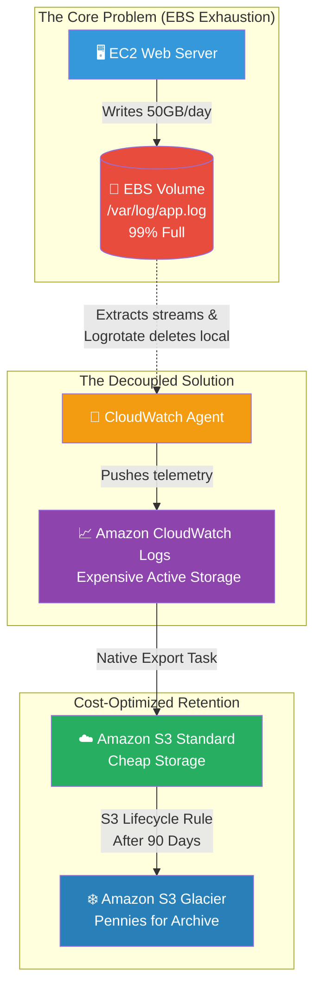

# 🚀 AWS Interview Question: EC2 Log Exhaustion

**Question 60:** *A production EC2 server frequently crashes because its internal hard drive strictly fills up to 100% capacity with massive application log files. How do you permanently automate a solution for this?*

> [!NOTE]
> This is a classic Linux SysAdmin / DevOps question. Interviewers want to verify that you understand data decoupling. Application logs should absolutely never be stored permanently on the application server's expensive block storage disk.

---

## ⏱️ The Short Answer
To permanently resolve log exhaustion, you must systematically decouple the log storage from the EC2 instance's physical EBS volume.
1. **The Extraction:** Install the **Amazon CloudWatch Agent** natively on the EC2 instance. Configure it to aggressively stream the active log files (e.g., `/var/log/nginx/access.log`) completely off the server and directly into **Amazon CloudWatch Logs**.
2. **The Cleanup:** Use native Linux **Log Rotation** (`logrotate`) on the EC2 server to automatically truncate and delete the local physical text files daily, mathematically ensuring the EBS drive never surpasses 50% capacity.
3. **The Archival:** Because storing logs indefinitely in CloudWatch is extremely expensive, you implement a secondary pipeline to export those logs into an **Amazon S3 Bucket**, accompanied by an **S3 Lifecycle Policy** to automatically transition them to deep-freeze **Amazon S3 Glacier** for cheap, long-term compliance storage.

---

## 📊 Visual Architecture Flow: The Log Management Pipeline

---

## 🏢 Real-World Production Scenario

**Scenario: The Runaway Audit Logs**
- **The Challenge:** A healthcare application generates 50 Gigabytes of JSON audit logs every single day to satisfy regulatory requirements. Within two weeks, the 500GB Amazon EBS root volume physically maxes out at 100% capacity. The operating system kernel panics, and the database crashes due to a lack of disk swap space.
- **The Architecture:** The Cloud Architect refuses to simply pay for a larger 2TB hard drive. Instead, they install the **CloudWatch Unified Agent** on the server. The agent securely intercepts the 50GB of daily logs and pushes them into an AWS CloudWatch Log Group.
- **The Execution:** Concurrently, the Architect sets a strict `logrotate` rule on the EC2 instance to utterly delete the local `.log` file the moment it hits 2GB in size. The EBS volume now perpetually hovers at a safe 15% capacity, mathematically immune to crashing.
- **The FinOps Optimization:** To prevent a massive CloudWatch bill, the Architect applies a retention policy so CloudWatch automatically exports those logs to an **S3 Bucket** after 7 days, where they are immediately pushed down into **S3 Glacier Deep Archive** to legally satisfy the 7-year HIPAA data retention requirement for literally pennies a month.

---

## 🎤 Final Interview-Ready Answer
*"A server crashing from log exhaustion means we are incorrectly using expensive Block Storage (EBS) for long-term data archiving. To permanently architect a resolution, I would completely decouple the logs from the EC2 instance. I accomplish this by installing the CloudWatch Agent to continuously stream the log directories directly into Amazon CloudWatch Logs. Simultaneously, I enforce rigorous OS-level log rotation on the EC2 instance to actively delete the physical files, mathematically eliminating the risk of EBS disk exhaustion. Once the logs successfully reside inside CloudWatch, I apply strict retention policies to export the older logs into Amazon S3, followed structurally by an S3 Lifecycle Rule that automatically drops the aging data into Amazon S3 Glacier for incredibly cheap, infinitely scalable, and legally compliant long-term cold storage."*
