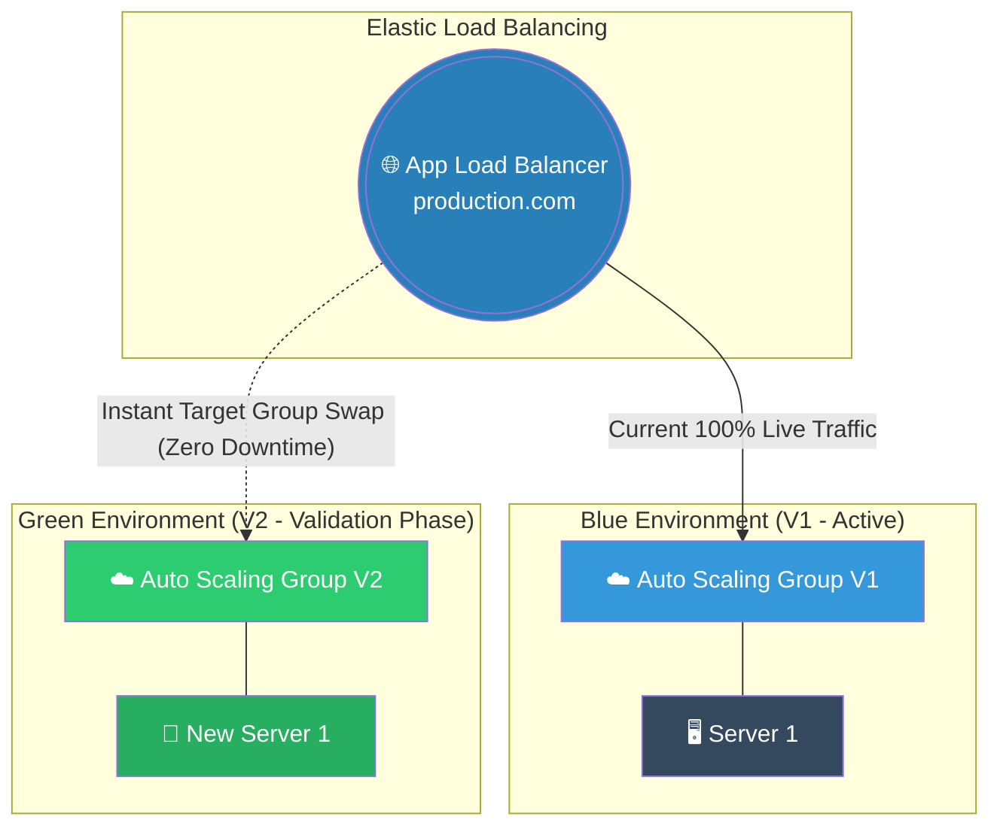

# 🚀 AWS Interview Question: Zero Downtime Deployments

**Question 62:** *Your development team releases new application code every Friday. How do you architect a deployment pipeline in AWS to ensure strict mathematically zero downtime during these updates?*

> [!NOTE]
> This is a core DevOps lifecycle question. While Question 29 touched on the *concept* of zero downtime, this question tests the *mechanism*. You must prove that you understand how an Application Load Balancer (ALB) mathematically swaps traffic between two distinct Auto Scaling Groups to hide the upgrade process from the user.

---

## ⏱️ The Short Answer
To definitively achieve zero downtime, you must completely avoid updating active live servers. Instead, you architect a **Blue-Green Deployment** inherently powered by an **Application Load Balancer (ALB)** and **Auto Scaling Groups (ASG)**.
- **The Blue Environment:** Your `v1.0` application code actively running on your current Auto Scaling Group, securely receiving 100% of the live ALB traffic.
- **The Green Environment:** You spin up a completely brand-new, totally isolated Auto Scaling Group containing the new `v2.0` application code. It sits completely idle with zero live traffic.
- **The Swap:** Once the Green environment passes all internal health checks, you instantly remap the Application Load Balancer's target group to point at the Green ASG. The transition is mathematically instantaneous, ensuring end users never experience a dropped HTTP request.

---

## 📊 Visual Architecture Flow: The Immutable Blue-Green Swap

---

## 🏢 Real-World Production Scenario

**Scenario: Escaping the "Friday Night Maintenance Window"**
- **The Challenge:** A legacy Fintech company drops its entire web portal for exactly two hours every Friday night at midnight to manually copy new PHP code onto their production EC2 instances. If the new code contains a massive syntax error, the website remains completely dead until they manually roll it back, causing catastrophic revenue loss.
- **The Solution:** The Cloud Architect completely abolishes the "Friday Night Maintenance Window" by transitioning to a heavily automated **Blue-Green Deployment**. 
- **The Execution:** On Friday morning at 10:00 AM, the Architect initiates the deployment pipeline. AWS organically spins up a completely identical "Green" Auto Scaling Group containing the new PHP code. Because the Live ALB is still pointing strictly at the "Blue" ASG, actual customers notice nothing. The QA team privately tests the Green ASG directly.
- **The Zero-Risk Pivot:** Once QA mathematically approves the new code, the Architect explicitly clicks `Swap Target Groups` on the ALB. Live traffic instantly begins routing purely to the Green servers.
- **The Rollback:** Ten minutes later, a critical bug is discovered. Because the old Blue ASG was not physically deleted yet, the Architect clicks `Swap Target Groups` again to instantly fail back to the safe `v1.0` code within 5 seconds, resulting in pure zero downtime.

---

## 🎤 Final Interview-Ready Answer
*"To guarantee absolute zero downtime deployments, I strictly utilize immutable Blue-Green architectures powered by an Application Load Balancer and Auto Scaling Groups. I consider updating live code directly on active servers to be a massive anti-pattern. Instead, when a new release is pushed, I provision a completely separate 'Green' Auto Scaling Group running the new application version natively behind the scenes. While the 'Blue' environment handles 100% of live user traffic, we privately validate the Green environment. When we are ready to execute the cutover, we simply instantly repoint the Application Load Balancer's target group rules from Blue to Green. By physically decoupling the active servers from the new code release, we logically guarantee the users never experience a severed connection, and we retain the ability to instantly roll back to the previously stable Blue environment if a logical bug is rapidly detected."*
