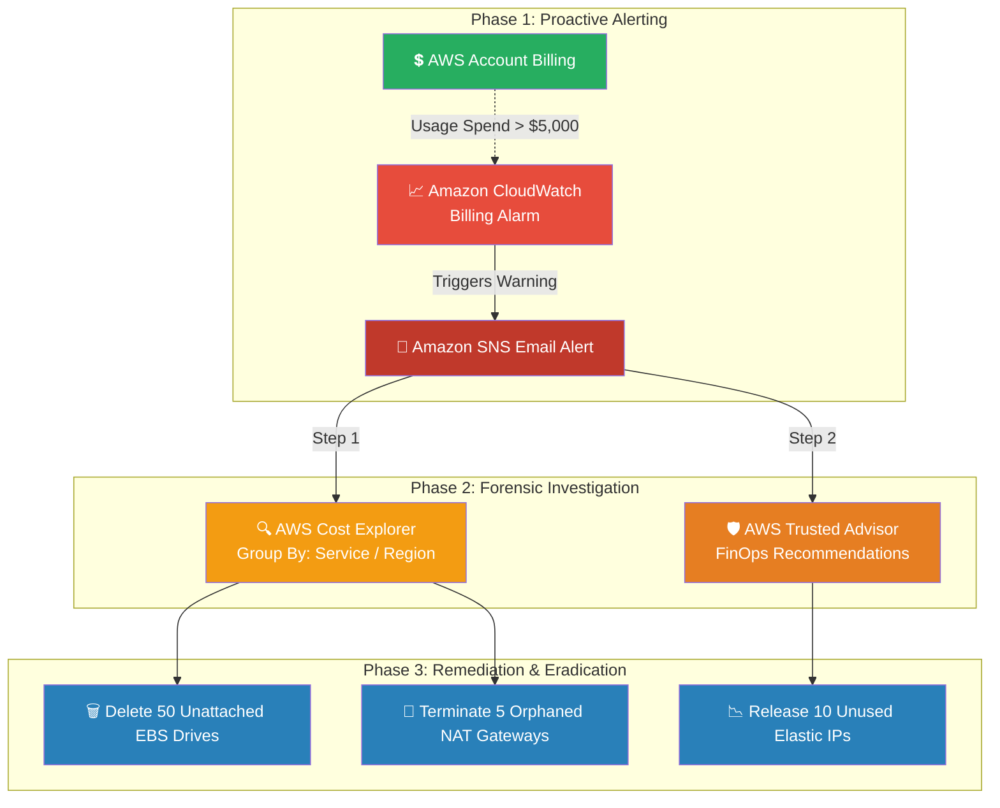

# 🚀 AWS Interview Question: Investigating Billing Spikes

**Question 63:** *You notice a massive, unexpected 500% spike in your monthly AWS bill. As an Architect, what is your exact methodology for investigating and preventing this from happening again?*

> [!NOTE]
> This is a mandatory **AWS FinOps (Cloud Financial Management)** question. Interviewers use this to identify candidates who simply deploy resources versus Senior Architects who actually comprehend the financial liability of what they build. Throwing the phrase "Unattached EBS Volumes" into your answer is a huge green flag.

---

## ⏱️ The Short Answer
If a massive billing spike occurs, you must immediately pivot from standard development into a structured FinOps investigation.
1. **The Investigation:** Immediately open **AWS Cost Explorer**. Filter the spending chart logically by *Service*, *Region*, and *Resource Tags* to pinpoint exactly which specific service triggered the massive charge.
2. **The Cleanup:** Based on the Cost Explorer results, aggressively hunt down and manually terminate unutilized "zombie" resources. The most notorious culprits are typically forgotten **Unattached EBS Volumes**, idle NAT Gateways, and forgotten Elastic IPs.
3. **The Prevention:** You must immediately configure **Amazon CloudWatch Billing Alarms** (or AWS Budgets) to proactively trigger an Amazon SNS Email alert the very moment your estimated monthly bill crosses a predefined mathematical threshold, entirely preventing month-end billing surprises forever.

---

## 📊 Visual Architecture Flow: The FinOps Control Pipeline

---

## 🏢 Real-World Production Scenario

**Scenario: The Cryptic $10,000 Bill**
- **The Shock:** A small startup usually pays $2,000 a month for AWS. On the first of the month, the CEO receives an invoice for $12,000 and demands an immediate explanation from the engineering team.
- **The Investigation:** The Cloud Architect logs into **AWS Cost Explorer** and changes the filtering view to `Group By: Service`. The dashboard instantly visually exposes that `$8,000` was exclusively spent on the `Amazon EC2-Other` category. Digging deeper via `Group By: Region`, they find the spend is uniquely isolated to the `eu-central-1` (Frankfurt) region—a region the startup literally does not operate in.
- **The Root Cause:** A junior developer had spun up thirty massive `m5.4xlarge` EC2 instances in Germany two weeks ago to run an experimental load test. The developer later deleted the 30 EC2 servers, but absolutely forgot to check the box to delete the attached EBS hard drives. Thirty massive 1-Terabyte EBS volumes sat completely unattached, secretly billing the company thousands of dollars.
- **The Eradication:** The Architect urgently navigates to Frankfurt and deletes all thirty unattached volumes. Crucially, they write an **AWS Budget** alert configured to instantly send a Slack message and Email if the monthly forecasted spend ever mathematically breaks $2,500 again.

---

## 🎤 Final Interview-Ready Answer
*"If an unexpected billing spike occurs, my immediate protocol is to halt development and dive into AWS Cost Explorer. I utilize the Cost Explorer filtering tools—specifically 'Group By Service' and 'Group By Region'—to categorically isolate exactly which underlying resource caused the anomaly. Historically, these massive spikes are caused by 'zombie' infrastructure, most notably Unattached EBS Volumes left behind when EC2 instances are terminated, or orphaned Sandbox NAT Gateways racking up hourly baseline charges. After executing a manual cleanup to stop the bleeding, I fundamentally guarantee it never happens again by deploying hard AWS CloudWatch Billing Alarms and AWS Budgets, explicitly configured to trigger an immediate Amazon SNS notification the very second our forecasted daily spend breaches our established FinOps baselines."*
