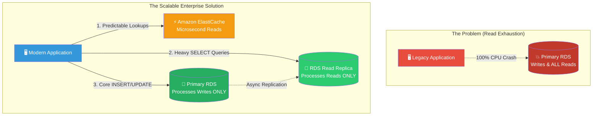

# 🚀 AWS Interview Question: Mitigating Slow Database Reads

**Question 65:** *Your primary Amazon RDS database is hitting 100% CPU utilization strictly because of a massive influx of "Read" queries from the application. How do you architecturally scale the data layer to resolve this?*

> [!NOTE]
> This is a crucial Database Scaling question. The key is understanding that "Scaling Up" (buying a bigger DB) is a temporary junior fix. "Scaling Out" (offloading the reads entirely to Replicas and Caches) is the permanent Senior Architect solution.

---

## ⏱️ The Short Answer
If a relational database is struggling under massive read pressure, you must completely stop sending every single query to the primary instance. You architecturally offload the reads using two distinct layers:
1. **Amazon RDS Read Replicas:** You explicitly provision one or more Read Replicas dynamically linked to the primary database. The application code is updated to route all heavy ``SELECT`` (analytics/reporting) queries physically to the Replica, saving the Primary instances purely for crucial ``INSERT/UPDATE/DELETE`` (write) transactions.
2. **Amazon ElastiCache (Redis/Memcached):** You inject an in-memory caching layer directly in front of the database. For highly repetitive, predictable data (like a User Profile or a Product Catalog), the application first checks ElastiCache. If the data is found (a Cache Hit), it is returned in microseconds, completely bypassing the RDS database entirely.

---

## 📊 Visual Architecture Flow: Offloading the Primary DB

---

## 🏢 Real-World Production Scenario

**Scenario: The BI Reporting Dashboard**
- **The Challenge:** A company runs an internal CRM portal on a single primary MySQL RDS instance. Every morning at 9:00 AM, the Business Intelligence (BI) team logs in and runs massive analytical reports calculating the previous week's sales. These heavy `SELECT` queries consume 99% of the database CPU, causing the website to completely freeze for actual sales representatives trying to input new data.
- **The Read Replica Solution:** The Cloud Architect logically clicks `Create Read Replica` on the primary instance. RDS automatically provisions a secondary MySQL database and constantly orchestrates asynchronous replication in the background to keep it updated. The Architect modifies the BI Dashboard's connection string to point strictly to the new Read Replica. The website immediately unfreezes, as the sales reps are now exclusively using the Primary DB, while the BI team is hammering the completely decoupled Replica.
- **The Caching Solution:** To further optimize the CRM, the architect deploys **Amazon ElastiCache for Redis**. Highly static data—like the dropdown list of fixed 'Country Codes' or standard 'Product Categories'—is cached directly into Redis. The CRM pulls this static list in 1 millisecond straight from RAM, dropping the overall database query load by another 30%.

---

## 🎤 Final Interview-Ready Answer
*"When a primary database is exhausted specifically by read traffic, 'Vertical Scaling' (increasing the instance size) is generally an inefficient anti-pattern. Instead, I architecturally 'Scale Out' to permanently offload the primary database CPU. First, I provision Amazon RDS Read Replicas. I logically decouple the application's connection logic, explicitly routing heavy, analytical 'SELECT' queries to the Read Replica, reserving the Primary instance strictly for mission-critical 'Write' transactions. Second, I implement an in-memory caching layer using Amazon ElastiCache (Redis). By caching predictable, frequently accessed datasets (like leaderboards or catalogs) directly in RAM, the application achieves microsecond retrieval times while simultaneously shielding the relational database from thousands of completely redundant read requests."*
