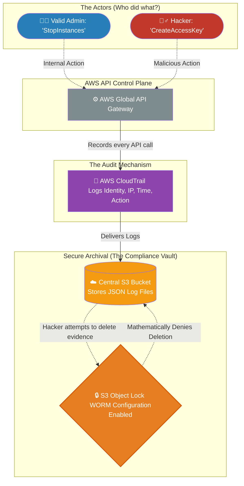

# 🚀 AWS Interview Question: Compliance Auditing & Log Immutability

**Question 66:** *A government auditor mandates a strict, unalterable trail of every single action performed inside your AWS Account to satisfy compliance requirements. How do you architect this?*

> [!NOTE]
> This is a high-level Compliance Architecture question. Anyone can say "turn on CloudTrail," but Senior Architects know that simply logging the data is useless if a rogue admin can just delete the logs to cover their tracks. You must explicitly mention **S3 MFA Delete** or **S3 Object Lock** to prove you understand true *immutability*.

---

## ⏱️ The Short Answer
To definitively satisfy strict government or financial compliance audits without using third-party tools, you must architect an irrefutable AWS API audit trail.
1. **The Telemetry Engine:** You globally enable **AWS CloudTrail**. CloudTrail mechanically records absolutely every API call made inside your AWS Account (who made the call, from what IP address, at what exact millisecond, and what resource they altered).
2. **The Secure Archival:** You configure CloudTrail to continuously export these massive JSON log files into a dedicated, centralized **Amazon S3 Bucket**.
3. **The Compliance Immutability Check:** To mathematically prevent a rogue administrator or a successful hacker from deleting those logs to cover their tracks, you enable **S3 MFA Delete** (meaning a human must physically type a 6-digit hardware token code to delete a file) or **S3 Object Lock** (WORM configuration: Write-Once-Read-Many, meaning the file mathematically cannot be deleted by anyone, not even the root user, for a predefined number of years).

---

## 📊 Visual Architecture Flow: The Immutable Audit Trail

---

## 🏢 Real-World Production Scenario

**Scenario: The Cryptomining Sabotage Investigation**
- **The Incident:** An enterprise company discovers that over the weekend, someone spun up fifty `g4dn.xlarge` GPU instances to mine cryptocurrency, and then aggressively deleted the instances on Sunday night to cover it up. The instances are completely physically gone.
- **The Investigation:** The Lead Security Architect accesses the **AWS CloudTrail** console. They run an Athena query against the S3 CloudTrail logs for the specific `RunInstances` API event. Within 30 seconds, CloudTrail explicitly reveals that an IAM User named `bob.smith` executed the command on Saturday at 2:00 AM from a Russian IP Address.
- **The Hacker's Failing Move:** The logs also reveal that the hacker logged into `bob.smith`'s console and frantically tried to execute the `DeleteBucket` command on the S3 bucket holding the CloudTrail logs. 
- **The Architect's Victory:** The API call completely failed with an `AccessDenied` error. Because the Cloud Architect had previously enabled **S3 Object Lock (Compliance Mode)** on the bucket, AWS mathematically blocked the hacker from deleting the evidence, allowing the Security team to perfectly trace the rogue IP address and legally prosecute the breach.

---

## 🎤 Final Interview-Ready Answer
*"To architect a legally compliant, enterprise-grade audit trail, I globally enable AWS CloudTrail across all regions. CloudTrail mechanically captures the exact 'Who, What, When, and Where' of every single API call executed within the AWS environment. Standard logging, however, fails strict compliance audits if the logs can simply be deleted by a compromised Administrator account. Therefore, I configure CloudTrail to drop the JSON logs securely into a highly restricted, centralized Amazon S3 bucket. Crucially, I enforce absolute immutability on that bucket by enabling S3 Object Lock in Compliance Mode, or S3 MFA Delete. This mathematically guarantees Write-Once-Read-Many (WORM) physics—ensuring that absolutely no one, not even a hacker who successfully compromised the Root Account, can ever delete or alter the audit evidence."*
