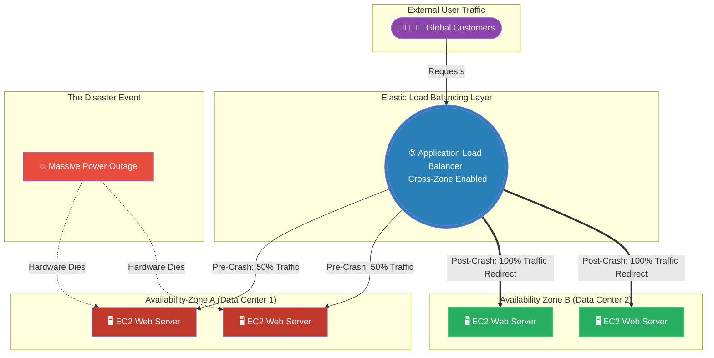

# 🚀 AWS Interview Question: High Availability Across AZs

**Question 67:** *A business-critical web application must absolutely remain online even if an entire AWS data center loses power or physical connectivity. How do you architect this infrastructure?*

> [!NOTE]
> This is a foundational Systems Architecture question. "High Availability" inherently means eliminating Single Points of Failure (SPOFs) at the physical level. Interviewers expect you to clearly explain the mathematical relationship between an Elastic Load Balancer and multiple independent Availability Zones.

---

## ⏱️ The Short Answer
To definitively achieve High Availability (HA) against a data center failure, you must permanently decouple your application from a single physical location.
1. **The Physical Distribution:** Instead of launching all Amazon EC2 instances inside a single Availability Zone (e.g., `us-east-1a`), you explicitly distribute the EC2 servers evenly across at least two independent Availability Zones (e.g., `us-east-1a` and `us-east-1b`).
2. **The Auto-Routing Engine:** You deploy an **Application Load Balancer (ALB)** with Cross-Zone Load Balancing enabled natively across the two subnets.
3. **The Self-Healing Mechanism:** The ALB continuously sends health-check pings to every EC2 instance. If AZ-A suffers a massive power failure, the ALB instantly detects the crashed servers, seamlessly stops sending HTTP requests to the dead zone, and forcefully routes 100% of the live user traffic strictly to the surviving EC2 instances safely located in AZ-B.

---

## 📊 Visual Architecture Flow: Multi-AZ Fault Tolerance

---

## 🏢 Real-World Production Scenario

**Scenario: The Flooded Data Center**
- **The Setup:** A logistics company hosts a massive global package tracking application. To prevent downtime, the Cloud Architect configures an Auto Scaling Group constrained to launch a minimum of 4 instances. Critically, instead of putting them all in a single subnet, the Architect explicitly selects two subnets: one mathematically mapped to Availability Zone A, and one mapped to Availability Zone B.
- **The Event:** A massive, unpredicted hurricane strikes the region. The AWS data center physically hosting `Availability Zone A` suffers severe floor flooding and the backup diesel generators fail. AZ-A goes completely offline globally. 
- **The Execution:** Because the logistics application was deployed precisely across two AZs, the two EC2 servers sitting safely in `Availability Zone B` (which is located miles away on a completely different power grid) remain blindly online.
- **The Result:** The Application Load Balancer's health checks fail for AZ-A. It mathematically severs routing to the flooded data center within 10 seconds, and seamlessly funnels millions of tracking requests directly to AZ-B without dropping a single customer's webpage. The Auto Scaling Group then actively detects the two dead instances and spins up two brand-new replacements safely inside AZ-B to handle the increased load.

---

## 🎤 Final Interview-Ready Answer
*"To genuinely guarantee High Availability for a business-critical application, the architecture must completely eliminate physical Single Points of Failure. I rigidly enforce a Multi-AZ framework by explicitly deploying my EC2 Auto Scaling Groups to explicitly span across at least two independent Availability Zones. I encapsulate these instances directly behind an Application Load Balancer with Cross-Zone Load Balancing strictly enabled. Because AWS Availability Zones are physically separated data centers utilizing completely independent power grids and distinct flood plains, this architecture ensures that if one data center suffers a catastrophic natural disaster or power failure, the Application Load Balancer will passively detect the missing servers and actively re-route 100% of global user traffic smoothly to the completely unaffected, surviving servers in the secondary Availability Zone, ensuring true zero-downtime resilience."*
