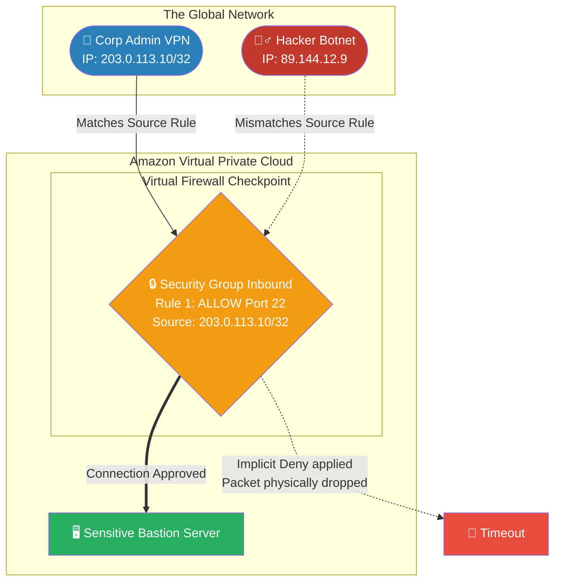

# 🚀 AWS Interview Question: Restricting IP Access to EC2

**Question 68:** *Your organization requires that an internal EC2 admin server is strictly accessible over SSH exclusively from the corporate office's physical IP address. Every other IP on the planet must be blocked. How do you construct this network boundary?*

> [!NOTE]
> This is a core Foundation Network Security question. The interviewer is testing your understanding of **Security Groups** as virtual, stateful firewalls. Saying "block other IPs" is actually technically wrong—Security Groups operate on an "Implicit Deny" model. You only explicitly declare what is *Allowed*.

---

## ⏱️ The Short Answer
To definitively whitelist a specific IP address while blocking the rest of the world, you must utilize an **AWS Security Group** attached directly to the EC2 instance's Network Interface. 
- **The Statefulness:** Security Groups act as stateful virtual firewalls that control inbound and outbound traffic at the instance level.
- **The Rule:** By AWS default design, Security Groups operate on an **"Implicit Deny"** principle. This means if a rule does not explicitly exist, the traffic is instantly dropped. 
- **The Execution:** Therefore, you simply create a single Inbound Rule stating: `ALLOW | TCP | Port 22 | Source: 203.0.113.10/32` (Where the `/32` CIDR mathematically forces an exact, single-IP match). Because no other rules exist, every other server on the internet is implicitly denied access.

---

## 📊 Visual Architecture Flow: The Security Group Checkpoint

---

## 🏢 Real-World Production Scenario

**Scenario: Bastion Protocol**
- **The Challenge:** A healthcare company deploys a heavily secured database inside a Private Subnet. To manage the database, they require a public-facing "Bastion Host" (Jump Server). Because the Bastion sits in the Public Subnet with a public IP, within five minutes of launching, Chinese and Russian botnets begin violently attempting to brute-force the SSH password via port 22, severely maxing out the Bastion's CPU. 
- **The Architect's Pivot:** The Cloud Architect does not attempt to manually define rules blocking individual hacker IPs, as that is an infinite "whack-a-mole" anti-pattern. Instead, they edit the Bastion's **Security Group**.
- **The Rule Set:** They wipe the default `0.0.0.0/0` (Allow from Anywhere) inbound rule. They replace it with exactly one rule: `ALLOW Port 22 from 192.0.2.55/32` (The physical IP of the company's regional VPN server).
- **The Result:** The botnet traffic is completely mitigated. When hacker IPs attempt to request an SSH connection handshake, the Security Group recognizes their IP does not identically match `192.0.2.55/32`. The Security Group invokes `Implicit Deny`, mathematically dropping the malicious network packets directly at the AWS hypervisor level before they even reach the Bastion's physical CPU.

---

## 🎤 Final Interview-Ready Answer
*"To strictly enforce that only a predetermined set of IP addresses can physically access an EC2 server, I exclusively construct the network boundary using AWS Security Groups. Security Groups function as instance-level, stateful virtual firewalls that fundamentally operate strictly on an 'Implicit Deny' principle—meaning all inbound traffic is universally dropped by default unless explicitly permitted. I would simply strip away any default 'Allow All' rules, and inject one single inbound rule that explicitly 'Allows' the target port—such as SSH Port 22—and define the Source constraint purely as the rigid CIDR block of the whitelisted corporate IP. Because of the Implicit Deny architecture, no other action is required; any malicious connection attempt from an unlisted IP will be seamlessly dropped by the AWS hypervisor before it ever burdens the instance's OS or CPU."*
