# 🚀 AWS Interview Question: Unlimited File Storage

**Question 69:** *Your web application allows users to upload thousands of high-definition video files daily. You possess absolutely no idea how much total storage you will need month-to-month. How do you architect the file storage to handle this permanently without ever crashing?*

> [!NOTE]
> This is a core Cloud Architecture question differentiating Block Storage from Object Storage. The interviewer is testing if you understand that Amazon EBS has a hard, physical gigabyte limit that you must manually manage, whereas Amazon S3 natively scales to infinity without human intervention.

---

## ⏱️ The Short Answer
If an application requires mathematically unlimited storage capacity, it is a catastrophic architectural anti-pattern to store those files directly on an EC2 instance's attached hard drive (Amazon EBS). You must entirely decouple the upload logic and pipe the files directly into **Amazon S3 (Simple Storage Service)**.
- **Amazon EBS (Fixed Limit):** Block storage fundamentally requires a predefined physical size limit (e.g., 500GB). When the local disk hits 100%, the entire server immediately kernel-panics and crashes.
- **Amazon S3 (Infinite Scale):** Object storage possesses absolutely no volume cap. It organically and instantly scales to accommodate everything from a single 10-Kilobyte text file to literally tens of Exabytes of video data, meaning the concept of "running out of disk space" mathematically ceases to exist.

---

## 📊 Visual Architecture Flow: Fixed vs. Infinite Storage

```mermaid
graph TD
    subgraph "The Anti-Pattern (Manual Capacity Limits)"
        EC2_Bad[🖥️ Legacy Video App]
        EBS[(💽 Amazon EBS Drive <br/> Provisioned Size: 1 Terabyte)]
        EC2_Bad -->|Saves MP4| EBS
        EBS -. "Users upload 1.1 Terabytes... <br/> Drive hits 100% capacity" .-> Crash[💥 Server Kernel Panic]
    end
    
    subgraph "The Enterprise Standard (Auto-Scaling Storage)"
        EC2_Good[🖥️ Modern Video App]
        S3[☁️ Amazon S3 Bucket <br/> Infinite Object Storage]
        EC2_Good -->|API 'PUT' Request| S3
        S3 -. "Users upload 1 Exabyte... <br/> Bucket organically absorbs it" .-> Success[✅ Zero Server Impact]
    end
    
    style EC2_Bad fill:#e74c3c,color:#fff
    style EBS fill:#c0392b,color:#fff
    style Crash fill:#c0392b,color:#fff
    style EC2_Good fill:#3498db,color:#fff
    style S3 fill:#27ae60,stroke:#2ecc71,stroke-width:2px,color:#fff
    style Success fill:#27ae60,color:#fff
```

---

## 🏢 Real-World Production Scenario

**Scenario: The Viral Marketing Campaign**
- **The Challenge:** A company launches a global marketing contest requiring users to upload 4K audition tapes in exchange for a prize. The legacy application natively saves these massive 2GB video files directly to the EC2 server's 500GB attached EBS drive in the `/var/uploads` folder.
- **The Disaster:** The marketing campaign goes viral overnight. By 3:00 AM, hundreds of users simultaneously upload 4K videos. The 500GB EBS drive hits exactly 100% capacity within 10 minutes. Because the operating system physically has zero free bytes left to allocate memory swaps or system logs, the entire Linux server completely locks up and crashes violently, killing the entire marketing domain.
- **The Architectural Fix:** The Cloud Architect permanently resolves this fatal flaw. They configure an **Amazon S3 Bucket**. They rewrite the application’s backend API so that when a user clicks "Upload", the file is completely intercepted and streamed via a direct `PUT` API request seamlessly into the S3 bucket.
- **The Result:** The next night, thousands more users upload videos. The total data volume crosses 8 Terabytes. The underlying EC2 server remains at a serene 15% physical disk capacity because S3 perfectly absorbed the completely boundless, infinitely scaling video data directly on the backend.

---

## 🎤 Final Interview-Ready Answer
*"When handling continuous, unpredictable file uploads like high-definition videos, utilizing an Amazon EC2 instance's attached EBS volume is a critical architectural anti-pattern. Amazon EBS is block storage, meaning it explicitly requires you to provision a hard, finite storage limit. If user uploads accidentally consume 100% of that fixed space, the server's OS crashes fatally. To seamlessly handle mathematically unlimited storage requirements, I strictly decouple the media layer entirely by configuring the application to stream all uploads natively into an Amazon S3 bucket. Because Amazon S3 operates as a fully abstracted Object Storage service, it completely lacks a total volume constraint. It organically and instantly scales to mechanically absorb Exabytes of continuous data, permanently eliminating any possibility of disk capacity exhaustion while successfully offloading the massive I/O burden entirely away from our core application CPU."*
