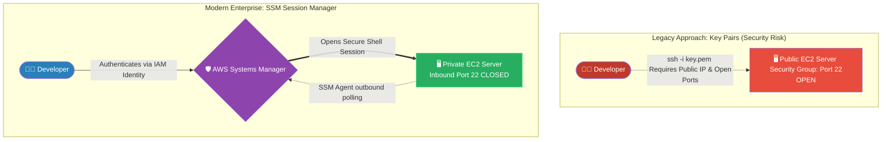

# 🚀 AWS Interview Question: EC2 Authentication (Key Pairs vs. SSM)

**Question 71:** *How do you securely authenticate into a Linux EC2 instance?*

> [!NOTE]
> This question appears similar to Question 50, but as an Architect, you should dynamically pivot here. While traditional "Key Pairs" are the textbook answer, mentioning **AWS Systems Manager (SSM) Session Manager** as the modern, secure replacement completely elevates your answer to a Senior level.

---

## ⏱️ The Short Answer
To definitively secure access to a Linux EC2 instance, you must explicitly disable traditional password logins and enforce cryptographic or IAM-based authentication. 
1. **The Legacy Standard (Key Pairs):** You utilize an **AWS Key Pair**—an asymmetric cryptographic lock where AWS stores the *Public Key* natively inside the EC2 OS, and the Administrator utilizes the matching *Private Key* (`.pem` file) to initiate an SSH handshake over Port 22.
2. **The Modern Standard (SSM Session Manager):** In modern enterprise environments, Key Pairs are considered a security liability because they can be stolen or lost. Instead, you utilize **AWS Systems Manager (SSM)**. SSM entirely removes the need for `.pem` files or opening inbound Port 22. It authenticates developers directly through their core AWS IAM identities and opens a secure terminal shell directly within the browser or CLI.

---

## 📊 Visual Architecture Flow: Eliminating SSH Ports

---

## 🏢 Real-World Production Scenario

**Scenario: The Stolen Laptop**
- **The Vulnerability:** A DevOps engineer historically manages the company's EC2 web servers using a highly-privileged `production-key.pem` SSH file saved locally on their MacBook. While traveling, the engineer's laptop is physically stolen. Because the `.pem` file grants universal root access to the EC2 instances, the entire company's infrastructure is immediately compromised.
- **The Modern Cloud Pivot:** The Lead Cloud Architect completely bans the use of EC2 Key Pairs globally. They explicitly delete all `.pem` files from AWS, and rigorously modify the EC2 Security Groups to completely permanently block all inbound traffic on Port 22 (SSH).
- **The SSM Implementation:** Instead, the Architect enforces **AWS Systems Manager (SSM) Session Manager**. Now, when the engineer needs terminal access, they must log into the AWS Console using their corporate SSO, successfully pass a biometric Multi-Factor Authentication (MFA) challenge, and click "Start Session."
- **The Result:** The EC2 servers mathematically lack an open SSH port, making them 100% immune to external botnet brute-force scans. Furthermore, because access is now tied strictly to Identity (IAM) rather than a physical file (.pem), losing a laptop poses zero infrastructural risk.

---

## 🎤 Final Interview-Ready Answer
*"To securely authenticate into an EC2 instance, the fundamental baseline is explicitly disabling password authentication and strictly enforcing AWS Key Pairs. A Key Pair requires the administrator to possess a highly secure Private Key to initiate a cryptographic SSH handshake on Port 22. However, in modern enterprise architectures, I actively consider physical Key Pairs to be a critical security liability and an anti-pattern. Instead, I architect connection protocols exclusively around AWS Systems Manager (SSM) Session Manager. SSM entirely eliminates the need to manage sensitive '.pem' files or leave inbound SSH ports publicly exposed on the Security Group. By utilizing the SSM Agent, authentication is seamlessly shifted to the user's core IAM Identity, allowing us to enforce strict MFA, centrally log every terminal keystroke in CloudTrail, and achieve true Zero-Trust instance access."*
