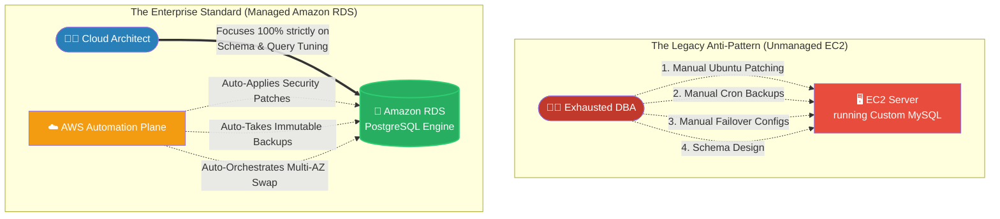

# 🚀 AWS Interview Question: Amazon RDS Overview

**Question 73:** *What exactly is Amazon RDS, and architecturally, why would a company choose to use it instead of just installing MySQL on a standard EC2 instance?*

> [!NOTE]
> This is a core "Managed vs Unmanaged" Cloud paradigm question. The interviewer isn’t just asking if you know what the acronym means—they are aggressively testing if you understand the reduction of operational overhead (the "Shared Responsibility Model").

---

## ⏱️ The Short Answer
Amazon RDS (Relational Database Service) is a fully managed cloud database platform that fundamentally removes the grueling operational burden of database administration. It natively supports six core engines: **MySQL, PostgreSQL, MariaDB, Oracle, SQL Server,** and **Amazon Aurora**.

If you install a database manually on an EC2 instance, you are physically responsible for provisioning the storage, applying weekly Linux kernel security patches, writing Bash scripts to take nightly backups, and manually configuring cross-zone failovers. By utilizing **Amazon RDS**, AWS assumes 100% of that administrative burden. AWS natively automates the OS patching, executes automated daily snapshots, and orchestrates seamless Multi-AZ High Availability out of the box, allowing your engineers to focus entirely on application query optimization rather than underlying server maintenance.

---

## 📊 Visual Architecture Flow: Unmanaged vs. Managed

---

## 🏢 Real-World Production Scenario

**Scenario: The End of the "Sunday Maintenance Window"**
- **The Challenge:** A retail company runs a massive custom SQL Server database strictly on a fleet of Windows EC2 instances. Every single Sunday at 2:00 AM, a Database Administrator (DBA) is forced to wake up, manually take the database offline, install the latest Windows OS security patches, test the backups using a custom PowerShell script, and pray the application comes back online before the 6:00 AM Black Friday rush.
- **The Execution:** The Cloud Architect completely abolishes this grueling manual process by migrating the data into **Amazon RDS for SQL Server**. 
- **The Result:** The Architect simply defines a "Maintenance Window" inside the AWS console. Now, at 2:00 AM on Sundays, the RDS automation plane wakes up, seamlessly applies the underlying Windows hypervisor patches to the Standby replica, instantly fails over the DNS connections via **Multi-AZ**, and patches the old primary—all resulting in less than 60 seconds of downtime. The DBA gets to sleep through the night, and the business saves thousands of dollars in manual overtime pay while structurally ensuring 100% compliance with security patching standards.

---

## 🎤 Final Interview-Ready Answer
*"Amazon RDS is a fully managed cloud service for relational databases supporting engines like PostgreSQL, MySQL, and Aurora. Architecturally, selecting RDS over manually managing databases on EC2 instances represents a fundamental shift in the Shared Responsibility Model. If you host a database on EC2, your engineering team is completely burdened with 'undifferentiated heavy lifting'—such as manual OS patching, configuring cron jobs for backups, and painstakingly designing manual replication failovers. By shifting to Amazon RDS, AWS completely absorbs that entire operational burden. AWS natively automates the underlying host patching, guarantees point-in-time recovery via automated snapshots, and achieves immediate High Availability with a single click via Multi-AZ deployments. This allows my engineering team to stop managing servers and focus 100% of their time on explicitly optimizing the database schema and application queries to drive business value."*
