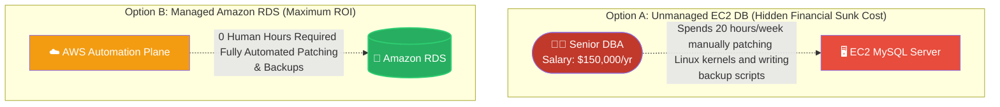

# 🚀 AWS Interview Question: EC2 Database vs. Managed RDS

**Question 74:** *Why shouldn't you just install MySQL directly on a standard EC2 instance? Why do Cloud Architects heavily advocate for paying the premium for Amazon RDS?*

> [!NOTE]
> This question acts as a direct follow-up to Question 73. While Q73 asked "What is RDS," this question actively tests your business acumen. You must articulate the **"Hidden Cost of Ownership"**—proving that an unmanaged EC2 database actually costs a business significantly more money in Database Administrator (DBA) salaries than the RDS service premium.

---

## ⏱️ The Short Answer
Installing a relational database natively on an EC2 instance is fundamentally an architectural anti-pattern for modern cloud applications due to the massive operational overhead. 
While an EC2 instance may theoretically appear cheaper on the monthly AWS invoice, it requires immense hidden manual labor. With an EC2 database, your engineering team is actively responsible for:
- Writing custom cron-job scripts to take nightly snapshots.
- Manually patching the Linux operating system to prevent security CVE vulnerabilities.
- Painstakingly configuring complex asynchronous replication to secondary instances for High Availability.

**Amazon RDS** completely eliminates this burden. AWS fully manages the underlying operating system, automatically executes and stores daily backups, and natively orchestrates Multi-AZ failovers with a single click, allowing your entire engineering team to focus solely on schema optimization and product development.

---

## 📊 Visual Architecture Flow: The Hidden Cost Analysis

---

## 🏢 Real-World Production Scenario

**Scenario: The Manual Failover Nightmare**
- **The Setup:** A legacy startup runs their primary production PostgreSQL database manually on a massive `$800/month` EC2 instance to "save money" over RDS.
- **The Event:** At 3:00 AM on a Saturday, the underlying AWS hardware hosting that specific EC2 instance suffers a critical disk failure. The EC2 database instantly dies. 
- **The Incident Response:** The lead Database Administrator is paged awake. Because there is no automated failover, the website is completely returning a fatal `502 Bad Gateway` error to all customers. The DBA furiously logs into a secondary backup EC2 instance, manually runs a massive data-import script from the previous night's EBS snapshot, and painstakingly updates the application's configuration files to point to the new IP address. The process takes **4 hours**. The company loses tens of thousands of dollars in revenue.
- **The Cloud Architect's Fix:** The next week, the Architect completely rips the database off EC2 and migrates it to **Amazon RDS Multi-AZ**. Six months later, another hardware failure occurs. This time, RDS detects the crash, instantly promotes the synchronous hidden Standby replica, seamlessly flips the internal DNS CNAME record, and the website fully recovers autonomously within **60 seconds**, while the DBA soundly sleeps through the night. 

---

## 🎤 Final Interview-Ready Answer
*"I strictly avoid hosting relational databases directly on EC2 instances because it violates the core cloud principle of offloading 'undifferentiated heavy lifting.' While an unmanaged EC2 server might look superficially cheaper on a billing invoice, the true Total Cost of Ownership (TCO) is astronomically higher. My engineering team would be forced to waste countless expensive hours manually patching Linux kernels, writing complex cron jobs for EBS snapshots, and manually orchestrating cross-AZ replication. By utilizing Amazon RDS, we explicitly pay AWS to absorb 100% of that administrative burden. RDS inherently provides automated host replacement, guaranteed point-in-time recovery, and native Multi-AZ synchronous failovers out of the box. This fundamentally guarantees enterprise-grade High Availability and Disaster Recovery while structurally freeing my engineers to focus strictly on accelerating product features rather than executing manual server maintenance."*
