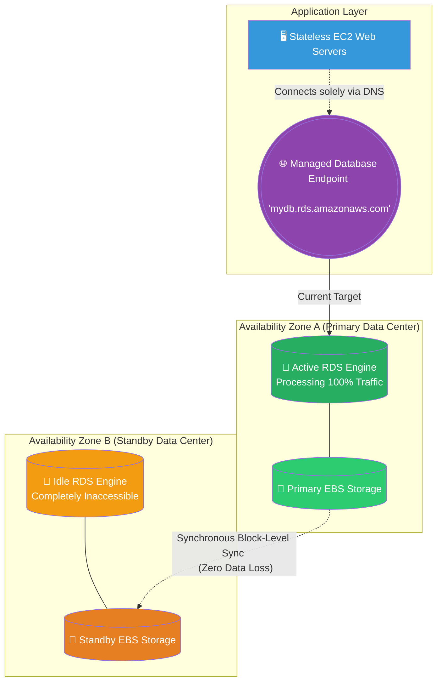

# 🚀 AWS Interview Question: RDS Multi-AZ Mechanics

**Question 75:** *What exactly is Amazon RDS Multi-AZ, and how does the underlying mechanical failover process actually work during a data center crash?*

> [!NOTE]
> This is a deep-dive Database Architecture question. Knowing the name of the feature isn't enough; you must explicitly use the phrase **"Synchronous Block-Level Replication"** to prove you understand *how* the data replicates, and clarify that the Standby instance cannot be used for reading data.

---

## ⏱️ The Short Answer
Amazon RDS Multi-AZ is a managed High Availability (HA) and Disaster Recovery feature strictly designed to protect a relational database from physical hardware failures. 
- **The Setup:** When enabled, AWS provisions a "Primary" database instance in one Availability Zone, and a completely hidden "Standby" instance in a completely different Availability Zone.
- **The Mechanics:** Every time the Primary database commits a transaction to its EBS hard drive, that exact bit of data is **synchronously replicated** at the block level across the AWS network to the Standby instance's hard drive before acknowledging the write to the application.
- **The Failover:** If the Primary hardware crashes, AWS automatically detects the outage. It organically promotes the Standby instance to become the new Primary, and dynamically updates the database's internal DNS `CNAME` record to point to the new IP address. The application seamlessly reconnects within 1-2 minutes with absolutely zero data loss.

---

## 📊 Visual Architecture Flow: Synchronous Replication

---

## 🏢 Real-World Production Scenario

**Scenario: The Junior Developer's Misunderstanding**
- **The Problem:** A company’s primary RDS PostgreSQL database hits 100% CPU capacity because the Business Intelligence team is running massive, aggressive analytics queries. 
- **The Mistake:** A junior developer sees the CPU spike and immediately clicks the `Enable Multi-AZ` button in the console, assuming the new "Standby" instance will help load-balance and absorb the heavy read queries. 
- **The Reality Check:** The Lead Cloud Architect corrects the junior developer: **Multi-AZ is strictly for Disaster Recovery, not Performance Scaling.** The Standby instance created by Multi-AZ is entirely physically locked and inaccessible to the application; it cannot be used to read data. In fact, because Multi-AZ enforces *Synchronous* replication (waiting for the data to copy to the other zone before completing a write), enabling it actually slightly *increases* write-latency. 
- **The Architect's Pivot:** The Architect leaves Multi-AZ enabled to protect against hardware crashes, but actively provisions an **RDS Read Replica**. Unlike the Multi-AZ Standby, the Read Replica is openly accessible and uses *Asynchronous* replication, successfully allowing the BI team to offload their heavy analytics queries without locking up the primary application.

---

## 🎤 Final Interview-Ready Answer
*"Amazon RDS Multi-AZ is a native High Availability architecture designed explicitly to eliminate database downtime during infrastructure failures. When enabled, AWS provisions an active Primary instance and a passive Standby instance in completely isolated Availability Zones. Critically, AWS orchestrates Synchronous Block-Level Replication between the two underlying EBS volumes; this means a write transaction is only considered 'complete' when it is safely physically stored in both data centers simultaneously, guaranteeing zero data loss. If the primary instance's underlying hardware irrevocably crashes, the AWS control plane automatically promotes the Standby instance and seamlessly swaps the database's DNS CNAME record to point directly to the newly promoted IP. This flawlessly restores database connectivity to our stateless web application within 60 to 120 seconds, requiring absolutely zero manual intervention from our operations team."*
