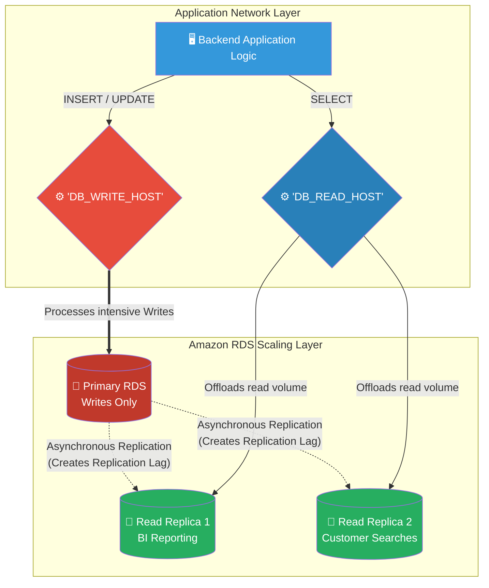

# 🚀 AWS Interview Question: RDS Read Replicas

**Question 76:** *What exactly are Amazon RDS Read Replicas, and from an application code perspective, how does your engineering team actually implement them to scale a database?*

> [!NOTE]
> This is an advanced Application Architecture question. Many candidates know the definition of a Read Replica, but fail to explain *how they are actually used*. To sound like a Senior Architect, you must explicitly mention editing the software's **Database Connection Strings** to actively route `SELECT` queries away from the Primary instance.

---

## ⏱️ The Short Answer
Amazon RDS Read Replicas are highly scalable, read-only copies of your Primary RDS database used strictly to mathematically offload "Read" (`SELECT`) queries. 
- **The Mechanics:** Unlike the synchronous hidden backups of Multi-AZ, Read Replicas utilize **Asynchronous Replication**. This means the Primary database writes the data instantly, and then quietly streams that data to the Replicas in the background. Because it is asynchronous, there is often a tiny "Replication Lag" (measured in milliseconds) before the data appears on the Replica.
- **The Implementation:** AWS does not magically route queries for you. To actually use a Read Replica, your application code must be physically updated to contain **two distinct database connection strings**: one string explicitly mapped to the Primary Database for `INSERT/UPDATE/DELETE` transactions, and a second string mapped strictly to the Replica's DNS endpoint for all `SELECT` queries.

---

## 📊 Visual Architecture Flow: The Connection String Split

---

## 🏢 Real-World Production Scenario

**Scenario: The Heavy BI Reporting Collision**
- **The Application:** An enterprise SaaS company hosts a centralized CRM. The core PostgreSQL CRM database handles 10,000 live data entry updates per minute from sales agents (`INSERT/UPDATE`).
- **The Collision:** The accounting team requires a massive Business Intelligence (BI) report generated every day at noon. This report requires a complex, 15-minute `SELECT` query joining ten massive tables. When the accountant clicks "Generate" at 12:00 PM, the Primary database CPU rockets to 100%, causing the sales agents' data entries to time out and fail.
- **The Read Replica Solution:** The Cloud Architect logically clicks `Create Read Replica`. AWS provisions a read-only PostgreSQL instance and continuously feeds it asynchronous data updates.
- **The Active Implementation:** The Architect opens the BI Tool's configuration settings. They actively strip out the Primary Database's connection string, and paste in the brand-new DNS endpoint of the **Read Replica**. 
- **The Result:** The next day at noon, the accountant clicks "Generate". The massive 15-minute query runs directly against the physical CPU of the Read Replica. The Primary database remains completely unaffected, easily processing the 10,000 live sales transactions per minute. 

---

## 🎤 Final Interview-Ready Answer
*"Amazon RDS Read Replicas are explicitly designed to horizontally scale 'read-heavy' database workloads. Architecturally, AWS achieves this by utilizing Asynchronous Replication, continuously streaming background data changes from the Primary instance to one or multiple Replicas. However, AWS does not natively route this traffic; my engineering team must implement the structural routing in the application layer. We split our database logic into two explicit connection strings: we route all 'Write' transactions (INSERT, UPDATE) strictly to the Primary DNS endpoint, and we route all 'Read' requests (SELECT) strictly to the Replica DNS endpoints. This mechanically isolates heavy, analytical Business Intelligence queries away from the Primary CPU, guaranteeing that massive read spikes will never inadvertently throttle or crash active transactional workflows."*
