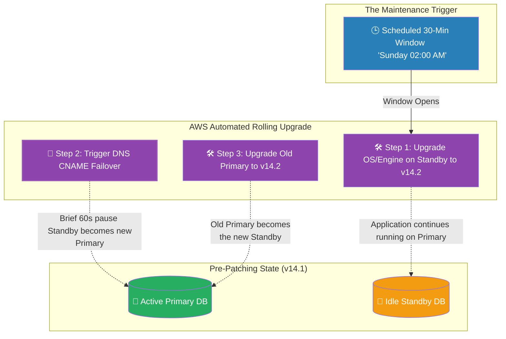

# 🚀 AWS Interview Question: RDS Maintenance Windows

**Question 77:** *What is an Amazon RDS Maintenance Window, and how do you ensure that scheduled database patching does not cause massive outages for your live application?*

> [!NOTE]
> This is a key Database Operations question. Simply answering "it's when AWS updates the database" is inadequate. An Architect must explain *how* AWS executes the update. The golden answer inextricably links the **Maintenance Window** with the **Multi-AZ** failover sequence to demonstrate near zero-downtime patching.

---

## ⏱️ The Short Answer
Amazon RDS is a managed service, which fundamentally means AWS assumes responsibility for applying security patches to the underlying OS and executing minor database engine upgrades. However, you retain control of *when* that happens by defining an **RDS Maintenance Window**.
- **The Definition:** The Maintenance Window is a mandatory 30-minute block of time you select (e.g., Sunday at 2:00 AM UTC) where AWS is explicitly authorized to briefly take the database offline to apply system patches or hardware modifications.
- **The Zero-Downtime Trick:** If you have **RDS Multi-AZ** enabled, AWS performs the patching invisibly via a rolling upgrade. AWS forcefully patches the passive Standby instance first. Once the Standby is updated, AWS triggers a seamless Multi-AZ failover (moving traffic to the newly patched instance), and then subsequently patches the old Primary instance. This intelligent orchestration reduces potential hours of patching downtime into a localized 60-second database reboot lag.

---

## 📊 Visual Architecture Flow: The Rolling Patch Sequence

---

## 🏢 Real-World Production Scenario

**Scenario: Escaping the Black Friday Disruption**
- **The Configuration:** A global e-commerce brand operates a massive PostgreSQL database on Amazon RDS. By default, AWS had randomly assigned their RDS Maintenance Window to occur on *Friday at 10:00 AM GMT*.
- **The Crisis Avoidance:** The Cloud Architect immediately flags this as a catastrophic risk. If AWS forces a database engine patch during the Friday lunch hour, the accompanying failover reboot would drop thousands of live customer shopping carts. Furthermore, Black Friday operates all weekend.
- **The Optimization:** The Architect explicitly updates the RDS configuration to move the Maintenance Window to *Sunday at 3:00 AM GMT*, statistically identifying it as the absolute lowest traffic period of the entire week.
- **The Seamless Execution:** Months later, AWS discovers a critical underlying Linux kernel vulnerability and flags the RDS instance for a mandatory OS update. When 3:00 AM hits on Sunday, AWS automatically executes the patch sequence. Because the database is configured in a Multi-AZ cluster, AWS patches the Standby replica first, flips the DNS to promote it, and then patches the old Primary. The handful of night-owl customers browsing the site simply experience a website freeze that lasts for approximately 45 seconds, perfectly neutralizing a massive security flaw without triggering an operational incident.

---

## 🎤 Final Interview-Ready Answer
*"An Amazon RDS Maintenance Window is a specifically designated, recurring 30-minute weekly timeframe where AWS is officially authorized to perform managed infrastructural updates, such as applying underlying Linux hypervisor security patches or executing minor database engine upgrades. Architecturally, I dynamically schedule this window to align strictly with the business's absolute lowest traffic period—typically early Sunday morning—to completely mitigate business impact. Furthermore, I ensure the database is explicitly deployed in a Multi-AZ configuration. When deployed in Multi-AZ, AWS executes Maintenance Windows as a rolling upgrade: it patches the idle Standby replica first, orchestrates a rapid DNS failover to make the patched Standby the new Primary, and subsequently patches the old Primary. This massively condenses what used to be hours of manual DBA downtime into a seamless, 60-second autonomous failover."*
