# 🚀 AWS Interview Question: Resolving RDS Storage Exhaustion

**Question 78:** *Your production Amazon RDS database is rapidly running out of storage space. In the legacy world, upgrading a hard drive requires completely turning off the server. How do you resolve this in AWS without causing any application downtime?*

> [!NOTE]
> This is a critical Cloud Infrastructure Operations question. The interviewer wants you to explicitly mention two things: that AWS Storage modifications happen **dynamically without downtime** (thanks to Amazon EBS Elastic Volumes), and that manually clicking "Modify" is the junior way. The Senior Architect way is enabling **RDS Storage Auto Scaling**.

---

## ⏱️ The Short Answer
In Amazon RDS, relational database storage exhaustion does not equal database death. You solve it dynamically, and you can fully automate it.
1. **The Manual Solution (Zero Downtime):** Because Amazon RDS utilizes underlying Amazon EBS *Elastic Volumes*, you can simply click "Modify" in the RDS console and type in a larger number (e.g., changing 200GB to 500GB). AWS dynamically resizes the physical block storage entirely in the background while the database remains perfectly online actively serving customer queries.
2. **The Automated Enterprise Solution:** To permanently ensure a database never runs out of space, you explicitly check the box for **RDS Storage Auto Scaling**. You define a Maximum Storage Limit (e.g., 2 Terabytes). When Amazon CloudWatch detects the database has less than 10% free space remaining, AWS automatically provisions more storage in 5GB (or 10%) increments, entirely organically without alerting a human operator.

---

## 📊 Visual Architecture Flow: Storage Auto Scaling

```mermaid
graph TD
    subgraph "The Legacy Problem (Outage Required)"
        OnPrem[🖥️ On-Prem Database]
        Drive[(💽 Physical SAS Drive)]
        OnPrem -. "1. Shutdown Server <br/> 2. Unplug old drive <br/> 3. Copy data to 4TB Drive <br/> 4. Restart Server" .-> Drive
    end
    
    subgraph "The Cloud Solution (Zero-Downtime Scaling)"
        CW[📉 CloudWatch Metric: <br/> 'FreeStorageSpace < 10%']
        RDS[(💽 Amazon RDS PostgreSQL <br/> Active Queries: 50,000/sec)]
        EBS[(💾 Attached EBS Volume <br/> Current: 200GB)]
        
        CW -->|Triggers Auto Scaling Policy| RDS
        RDS -. "API Call: ModifyVolume <br/> Modifies Block Storage on-the-fly" .-> EBS
        EBS -. "Instantly Promotes" .-> New[(💾 New Capacity: 250GB)]
    end
    
    style OnPrem fill:#c0392b,color:#fff
    style Drive fill:#e74c3c,color:#fff
    style CW fill:#f39c12,color:#fff
    style RDS fill:#2980b9,color:#fff
    style EBS fill:#27ae60,color:#fff
    style New fill:#2ecc71,color:#fff
```

---

## 🏢 Real-World Production Scenario

**Scenario: The Holiday Log Tsunami**
- **The Application:** An e-commerce company has a centralized RDS MySQL database initially provisioned with exactly `200GB` of storage. To save money, the budgeters refused to provision 2 Terabytes on Day 1.
- **The Event:** During the Thanksgiving holiday weekend, the site experiences an unprecedented, massive massive surge in user registrations. Millions of new User Profile rows are continuously `INSERT`ed into the database. By Saturday morning, the 200GB drive shrinks to exactly `19.5GB` of free space remaining.
- **The Invisible Fix:** Because the Cloud Architect had smartly checked the **"Enable Storage Auto Scaling"** box and set a maximum threshold of `1,000GB`, no pager alerts trigger and no humans are woken up. AWS organically detects the threshold breach. Behind the scenes, the hypervisor seamlessly expands the underlying EBS volume to `220GB`. 
- **The Result:** The millions of users continue registering accounts without ever experiencing a single failed query or dropped connection. The company dynamically scaled the storage exactly as they needed it, perfectly maximizing their financial efficiency without risking a catastrophic "Disk Full" database crash.

---

## 🎤 Final Interview-Ready Answer
*"To resolve an RDS storage capacity issue, I fully leverage the native elasticity of AWS block storage. In a legacy bare-metal environment, upgrading a hard drive demands taking the physical database offline for hours. However, because Amazon RDS is built on top of EBS Elastic Volumes, modifying the allocated storage is a zero-downtime operation; you simply issue an API call to increase the volume size, and the database remains 100% fundamentally functional during the optimization phase. To elevate this into a true enterprise architecture, I strictly enable 'RDS Storage Auto Scaling.' This allows AWS to organically monitor CloudWatch metrics. The moment free storage drops beneath the 10% threshold, AWS mechanically provisions additional volume increments without human intervention, mathematically guaranteeing the database will never crash from disk exhaustion while simultaneously preventing us from heavily over-provisioning expensive, unused terabytes on Day One."*
