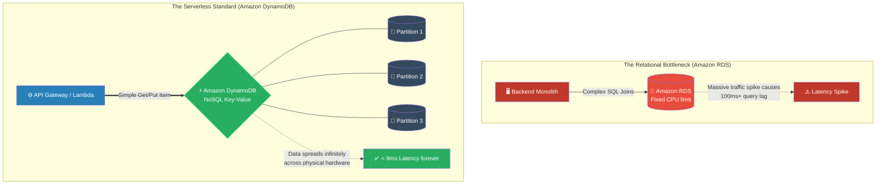

# 🚀 AWS Interview Question: Amazon DynamoDB Overview

**Question 79:** *What is Amazon DynamoDB, and what are the specific architectural reasons you would choose to use it over a standard relational database like Amazon RDS?*

> [!NOTE]
> This is a core Data Architecture question. Interviewers use this to see if you understand the fundamental trade-off between standard Relational SQL databases (rigid schemas, complex joins) and NoSQL (flexible schemas, extreme performance). You must mention **"Single-Digit Millisecond Latency"** and **"Serverless"** to score perfectly.

---

## ⏱️ The Short Answer
Amazon DynamoDB is AWS's flagship, fully managed, **Serverless NoSQL Key-Value database**. Unlike traditional Amazon RDS databases which rely on structured SQL tables and rigid relationships, DynamoDB stores data as unstructured JavaScript Object Notation (JSON) documents.
- **The Performance:** DynamoDB mathematically guarantees consistent, **single-digit millisecond response times** at any scale, whether you are querying a database with 10 records or 10 billion records. 
- **The Scalability:** Because it is Serverless, there are absolutely no underlying EC2 instances to provision, patch, or upgrade. DynamoDB horizontally autoscales your data infinitely across thousands of hidden physical partitions under the hood without ever experiencing downtime. It is explicitly designed for massive, high-velocity workloads like web session management, shopping carts, and gaming leaderboards where pure speed heavily outweighs complex `JOIN` capabilities.

---

## 📊 Visual Architecture Flow: Relational vs. NoSQL

---

## 🏢 Real-World Production Scenario

**Scenario: The Global Gaming Leaderboard**
- **The Legacy Architecture:** A massive multiplayer online (MMO) game company hosted their "Global Player Leaderboard" on a standard Amazon RDS MySQL database. When the game launched, three million players logged in simultaneously. 
- **The Meltdown:** Every time a player scored a point, the game executed a complex SQL `UPDATE`. Three million simultaneous SQL queries instantly maxed out the primary RDS instance's CPU. The database locked up, and players began experiencing severe 5-second in-game lag spikes.
- **The Cloud Architect's Fix:** The Architect completely rips the leaderboard tracking out of the relational database and migrates it to **Amazon DynamoDB**. They design a simple NoSQL table using `PlayerID` as the Partition Key.
- **The Result:** The next weekend, five million players log in. Because DynamoDB is serverless, the AWS control plane organically shards the scoreboard data horizontally across hundreds of physical SSD partitions in the background. The game code retrieves a player's rank using a simple `GetItem` API call. Whether there are ten players or ten million players online, DynamoDB returns the score in exactly **4 milliseconds**, permanently eliminating in-game lag.

---

## 🎤 Final Interview-Ready Answer
*"Amazon DynamoDB is AWS's fully managed, serverless NoSQL Key-Value database. I specifically architect solutions around DynamoDB—rather than Amazon RDS—when the primary engineering constraint is hyper-scale performance rather than relational complexity. Because DynamoDB abandons structured schemas and complex SQL 'JOIN' operations, it can horizontally partition data across thousands of physical storage nodes under the hood. This architecture mechanically guarantees single-digit millisecond latency at literally any scale. Furthermore, because it operates as a fully Serverless API, it completely eliminates database provisioning, operating system patching, and storage capacity limits. For high-velocity, simple-query workflows like global gaming leaderboards, real-time IoT telemetry, or high-traffic e-commerce shopping carts, DynamoDB is the definitive enterprise standard."*
