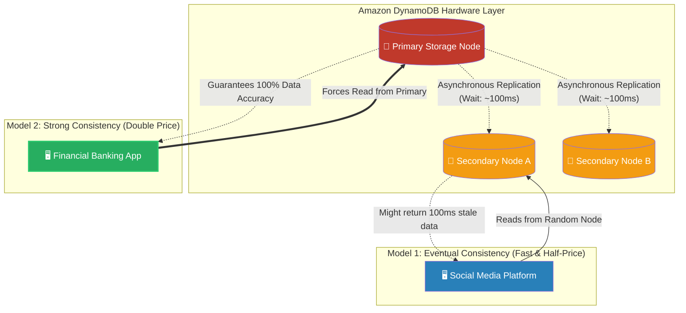

# 🚀 AWS Interview Question: DynamoDB Consistency Models

**Question 80:** *Under the hood, Amazon DynamoDB replicates your data across three different physical facilities. Because of this, when you read data, you must choose a "Consistency Model." What are the two models, and when do you explicitly use each?*

> [!NOTE]
> This is a deep-dive Cloud Data Architecture question. Junior engineers don't know that "Strongly Consistent" reads cost exactly twice as much as "Eventually Consistent" reads. Mentioning this financial penalty immediately proves you design systems with Cost Optimization in mind.

---

## ⏱️ The Short Answer
Because DynamoDB natively replicates your data across three distinct Availability Zones for durability, there is a microscopic delay (often under 100 milliseconds) for all three servers to synchronize. Therefore, AWS forces you to architecturally choose how you want to read that data:
1. **Eventually Consistent Reads (The Default):** When your application requests data, DynamoDB asks a random storage node for the answer. It is incredibly fast and cheap, but there is a tiny mathematical chance you receive "stale" data (data that hasn't finished synchronizing from a write that happened 10 milliseconds ago).
2. **Strongly Consistent Reads:** You must actively program this into your application's API call (`ConsistentRead = true`). When requested, DynamoDB mathematically guarantees the data returned is the absolute most up-to-date version. However, because DynamoDB has to work harder to verify the synchronization, it draws double the Read Capacity Units (RCUs), meaning it is exactly **twice as expensive** and slightly slower.

---

## 📊 Visual Architecture Flow: Eventual vs. Strong

---

## 🏢 Real-World Production Scenario

**Scenario: Designing the Hybrid Finance Application**
- **The Challenge:** A massive FinTech startup is building its core banking platform exclusively on DynamoDB. The application has two main features: displaying the user's "Profile Picture," and displaying the user's "Checking Account Balance." The CTO demands 100% accuracy, so a junior developer hardcodes every single API call to use **Strongly Consistent Reads**.
- **The Problem:** The startup's AWS bill skyrockets to $10,000 a month purely from DynamoDB Read Capacity Unit (RCU) charges.
- **The Architect's Fix:** The Cloud Architect investigates and restructures the application code. They leave the `GetAccountBalance` API query set to **Strongly Consistent**. If a user deposits $500, they must conceptually see that $500 the exact millisecond they refresh the page. Strong Consistency guarantees this financial accuracy.
- **The Cost Optimization:** However, the Architect fundamentally rewrites the `GetProfilePicture` query to use the default **Eventually Consistent Reads**. If a user uploads a new profile picture, it doesn't matter if it takes an extra 100 milliseconds for the new picture to load on their screen. By relaxing the consistency model for non-critical visual data, the Architect instantly cuts the application's DynamoDB monthly bill exactly in half without violating any financial regulatory constraints.

---

## 🎤 Final Interview-Ready Answer
*"When reading data from Amazon DynamoDB, the architecture mandates choosing between Eventual and Strong Consistency due to the underlying asynchronous replication across three distinct Availability Zones. By default, DynamoDB utilizes 'Eventually Consistent' reads. This maximizes performance and minimizes cost, but introduces a microscopic risk of retrieving slightly stale data. To completely mitigate this risk for mission-critical workflows—such as querying a banking transaction immediately after a deposit—I explicitly configure the API call to execute a 'Strongly Consistent' read. This mathematically guarantees the application retrieves the most recently committed, up-to-date data. However, as an Architect, I use Strong Consistency sparingly. Because it forces the database to rigorously verify synchronization, it explicitly consumes double the Read Capacity Units (RCUs), directly doubling the operational cost. Therefore, I restrict Strong Consistency strictly to critical financial data paths, leaving auxiliary data on Eventual Consistency to aggressively optimize the monthly infrastructure bill."*
