# 🚀 AWS Interview Question: DynamoDB Queries, Scans, & GSIs

**Question 81:** *How do you specifically retrieve data rapidly from Amazon DynamoDB, and what is the architectural difference between a 'Query', a 'Scan', and a 'Global Secondary Index (GSI)'?*

> [!NOTE]
> This question acts to weed out engineers who try to treat DynamoDB like a SQL Database. If you tell an interviewer you use 'Scans' to find data, you will immediately fail the interview. You must explicitly demonstrate why **Scans** are toxic to efficiency, and why **Queries** combined with **Global Secondary Indexes (GSIs)** are the absolute enterprise standard.

---

## ⏱️ The Short Answer
Because DynamoDB is a NoSQL database, you cannot execute arbitrary SQL `SELECT * WHERE...` commands. Instead, you extract data utilizing specific API functions:
1. **The Query API (The Right Way):** A `Query` operates purely on the table's Primary Key. Because DynamoDB mathematically hashes the Primary Key to identify exactly which physical SSD server holds the data, a Query directly fetches the exact item instantly in under 10 milliseconds, regardless of table size.
2. **The Scan API (The Anti-Pattern):** A `Scan` physically sweeps and reads *every single row* in the entire DynamoDB table start-to-finish just to find your data. If your table has 10 million rows, a Scan physically reads 10 million rows, consuming massive amounts of server capacity (RCUs) and causing catastrophic read-latency.
3. **Global Secondary Indexes (The Solution):** If you need to "Query" a table by an attribute that is *not* the Primary Key (e.g., finding a user by their `EmailAddress` when the Primary Key is `StudentID`), you must never use a Scan. Instead, you explicitly create a **Global Secondary Index (GSI)**. AWS natively builds a hidden, shadow-copy of your table specifically re-partitioned by `EmailAddress`, allowing you to execute blazing-fast 5-millisecond `Queries` against it.

---

## 📊 Visual Architecture Flow: Queries vs. Scans

```mermaid
graph TD
    subgraph "The Anti-Pattern (Scan)"
        Op1[⚠️ Scan API Request <br/> 'Find Email = john@aws.com']
        DDB1[(🗃️ Users Table <br/> 1 Million Rows)]
        
        Op1 -. "Physically sweeps 1 Million rows <br/> just to locate 1 string" .-> DDB1
        DDB1 -. "Cost: 1,000 RCUs <br/> Time: 4.5 Seconds" .-> Fail[💥 Massive Latency Spike]
    end
    
    subgraph "The Enterprise Standard (Query + GSI)"
        Op2[✅ Query API Request <br/> 'Get Email = john@aws.com']
        GSI[(🗂️ Global Secondary Index <br/> Partition Key = Email)]
        
        Op2 -->|Hashes exact string| GSI
        GSI ==>|Instantly extracts 1 specific row <br/> out of 1 Million| Pass[⚡ Cost: 1 RCU <br/> Time: 4 Milliseconds]
    end
    
    style Op1 fill:#c0392b,color:#fff
    style DDB1 fill:#e74c3c,color:#fff
    style Fail fill:#e74c3c,color:#fff
    
    style Op2 fill:#2980b9,color:#fff
    style GSI fill:#27ae60,stroke:#2ecc71,stroke-width:2px,color:#fff
    style Pass fill:#2ecc71,color:#fff
```

---

## 🏢 Real-World Production Scenario

**Scenario: The Slow E-Commerce Lookup**
- **The Application:** A retail startup builds an "Order Lookup" portal powered by DynamoDB. The Primary Partition Key for the central table is the `OrderID`. However, customer support agents frequently have to search for orders using the customer's `PhoneNumber`.
- **The Junior Mistake:** Because `PhoneNumber` is not the Primary Key, the junior engineer builds the web portal to execute a DynamoDB **Scan** operation. 
- **The Financial Meltdown:** As the company grows, the `Orders` table reaches 50 Gigabytes. Now, every single time a support agent searches for a phone number, DynamoDB physically reads 50 Gigabytes of data all at once to find the phone number. The API latency spikes to 15 seconds, and the monthly AWS bill jumps by $3,000 due to Read Capacity Unit (RCU) exhaustion.
- **The Senior Architect's Fix:** The Architect immediately bans the `Scan` API in the codebase. They edit the DynamoDB table and append a **Global Secondary Index (GSI)** with `PhoneNumber` explicitly set as the new Partition Key. Within minutes, AWS autonomously synchronizes a shadow-copy of the database. The web portal is updated to execute a **Query** strictly against the new GSI. 
- **The Result:** The support agent searches for a phone number. The GSI hashes the number and instantly locates the single matching order in 6 milliseconds, consuming exactly 1 RCU. The latency vanishes and the AWS bill immediately drops back to normal.

---

## 🎤 Final Interview-Ready Answer
*"Because DynamoDB achieves horizontal scale by physically partitioning data, understanding the difference between Queries and Scans is structurally vital. The 'Query' API is the absolute standard; it utilizes the Primary Partition Key to mathematically locate the exact physical server holding the data, achieving 100% predictable single-digit millisecond latency regardless of table size. Conversely, the 'Scan' API is a critical anti-pattern for live applications; it blindly sweeps the entire database, pulling massive amounts of Read Capacity Units (RCUs) and causing severe query bottlenecks. If a business requirement mandates looking up data by a non-primary attribute—such as searching for a user by their Email Address instead of their original Account ID—I strictly architect a Global Secondary Index (GSI). A GSI natively provisions a synchronized, re-partitioned schema copy in the background, allowing my application to seamlessly execute high-performance 'Queries' against the new attribute without ever resorting to expensive, system-crippling table Scans."*
