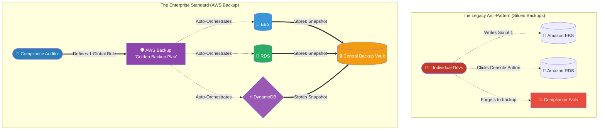

# 🚀 AWS Interview Question: AWS Backup Overview

**Question 82:** *Your enterprise utilizes Amazon EBS, Amazon RDS, Amazon EFS, and Amazon DynamoDB across 50 different AWS Accounts. How do you architecturally guarantee and mathematically enforce that every single piece of data is backed up daily to satisfy government compliance?*

> [!NOTE]
> This is a high-level Enterprise Governance question. Interviewers use this to identify candidates who have operated in massive, multi-account corporate environments. The key is contrasting the chaotic "Decentralized" approach (writing custom scripts for every service) versus the unified "Centralized" approach (**AWS Backup**).

---

## ⏱️ The Short Answer
To definitively satisfy enterprise governance across dozens of disparate services and accounts, you must deploy **AWS Backup**.
- **The Problem:** In a massive enterprise, relying on individual developers to manually configure backup settings inside the RDS console, then go write a cron-job script for EBS volumes, and then manually configure point-in-time recovery for DynamoDB is operationally catastrophic and impossible to audit.
- **The Solution:** AWS Backup acts as a centralized, unified data protection orchestrator. You define a universal "Backup Plan" (a mathematical policy stating: *"Backup everything every day at 2:00 AM, and retain it for 30 days"*). You apply this single policy across all underlying services simultaneously. It natively spans Amazon EC2, EBS, RDS, EFS, and DynamoDB, forcefully dragging all snapshots into a centralized, highly secure **Backup Vault**.

---

## 📊 Visual Architecture Flow: Decentralized Chaos vs. Centralized Policy

---

## 🏢 Real-World Production Scenario

**Scenario: The Global Ransomware Defense**
- **The Challenge:** A multinational healthcare corporation operates 50 different AWS accounts via AWS Organizations. The Chief Information Security Officer (CISO) is terrified of a global ransomware attack. The CISO mandates that absolutely every database and hard drive across all 50 accounts must be backed up locally, and a secondary copy must be stored in a completely isolated, locked AWS account.
- **The Execution:** The Cloud Architect utilizes **AWS Backup** paired with **AWS Organizations**. The Architect authors a single, global "Cross-Account Backup Plan."
- **The Automation:** When the policy activates at midnight, AWS Backup simultaneously sweeps through all 50 accounts. It natively triggers EBS snapshots from the EC2 web servers, database snapshots from the RDS instances, and document backups from DocumentDB. 
- **The Vault Lock:** AWS Backup then autonomically copies those snapshots from the 50 production accounts perfectly into a centralized "Central Security Account." The Architect applies an **AWS Backup Vault Lock** to this central vault.
- **The Result:** The Vault Lock guarantees mathematical WORM (Write-Once-Read-Many) compliance. Even if a ransomware syndicate manages to breach and completely destroy all 50 production AWS accounts, they are physically and mathematically denied the IAM permissions required to delete the backups held inside the locked vault, guaranteeing the healthcare company can completely rebuild their infrastructure the next day.

---

## 🎤 Final Interview-Ready Answer
*"To mandate strict enterprise data compliance across multiple accounts and disparate storage services, building custom, decentralized backup scripts for EC2, RDS, and DynamoDB is a massive operational liability. Instead, I architect a unified data protection strategy using AWS Backup. AWS Backup is a centralized management orchestrator that allows me to define a 'Golden Backup Plan'—dictating exact backup schedules, cross-region copying, and strict lifecycle retention metrics. I logically apply this single policy across our entire AWS infrastructure. It autonomously aggregates snapshots from EBS volumes, EFS file systems, and RDS databases, funneling them rigidly into a highly-secured Central Backup Vault. By enforcing an AWS Backup Vault Lock on that central vault, we securely achieve mathematical WORM (Write-Once-Read-Many) immutability, shielding the enterprise entirely against catastrophic ransomware attacks while effortlessly satisfying global government compliance audits."*
