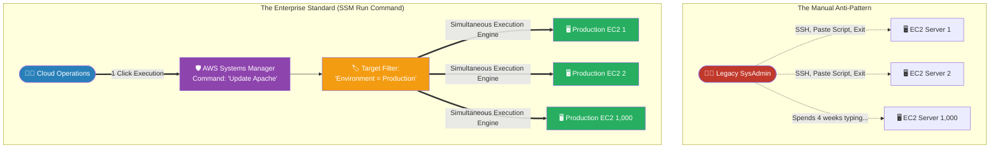

# 🚀 AWS Interview Question: AWS Systems Manager (SSM)

**Question 84:** *What exactly is AWS Systems Manager (SSM), and why is it considered a mandatory service when a company scales from running 10 EC2 instances to running 1,000 EC2 instances?*

> [!NOTE]
> This is a senior-level Fleet Management question. While Question 71 discussed how SSM *Session Manager* acts as a secure SSH replacement for logging into a single server, you must expand your answer here. You must explain how SSM's **Run Command** and **Patch Manager** allow you to mechanically control and update thousands of servers simultaneously.

---

## ⏱️ The Short Answer
Managing a few servers manually is easy, but manually installing software on 1,000 servers simultaneously is mathematically impossible. **AWS Systems Manager (SSM)** is the centralized operational hub for enterprise fleet management.
- **SSM Session Manager:** Replaces legacy SSH Key Pairs, allowing secure, IAM-authenticated terminal access to completely private servers without opening Port 22.
- **SSM Run Command:** Completely eliminates the need to physically log into a server to execute scripts. You can issue a single bash command (e.g., `yum install nginx`) and SSM will seamlessly execute it across 1,000 target servers simultaneously.
- **SSM Patch Manager:** Fully automates enterprise compliance. It dynamically scans the entire fleet, identifies missing security patches, and bulk-updates the operating systems safely across hundreds of isolated AWS accounts, providing a unified dashboard of fleet health.

---

## 📊 Visual Architecture Flow: Fleet Execution

---

## 🏢 Real-World Production Scenario

**Scenario: The Zero-Day Vulnerability**
- **The Threat:** At 4:00 PM on a Friday, the global cyber-security community announces a massive "Zero-Day" Linux vulnerability (e.g., Log4j). Every single Linux server on the planet must have a security patch installed immediately, or they will be hacked by midnight. 
- **The Legacy Nightmare:** The company has 800 EC2 instances running in private subnets with no internet access. The legacy SysAdmin team mathematically estimates it will take 36 continuous hours to manually VPN into each of the 800 servers, download the patch, execute it, and reboot the machine.
- **The Architect's Execution:** The Cloud Architect bypasses the manual process entirely using **AWS Systems Manager (SSM) Run Command**. Because every EC2 instance already has the lightweight `SSM Agent` installed, the Architect simply opens the SSM Console. They select the `AWS-RunShellScript` document. They type the unified bash command: `yum update -y && reboot`. 
- **The Target:** Instead of selecting individual server IDs, they tell SSM to target every single resource globally containing the tag `OS=Linux`. 
- **The Result:** The Architect clicks Execute. SSM autonomously reaches directly into the OS of all 800 completely private servers simultaneously, runs the command, and reboots them. The massive global vulnerability is fully neutralized across the entire enterprise in exactly **4 minutes**, not 36 hours.

---

## 🎤 Final Interview-Ready Answer
*"AWS Systems Manager (SSM) is fundamentally an enterprise fleet-management orchestration tool. While many developers only know SSM for its 'Session Manager' capability—which brilliantly allows strict IAM-based terminal access to extremely private EC2 servers without exposing inbound SSH ports—SSM's true enterprise value lies in its mass automation capabilities. For example, using SSM 'Run Command' and 'Patch Manager', I can completely eliminate the operational anti-pattern of manually logging into servers to execute updates. If a critical zero-day vulnerability occurs, I can literally type a single bash script into SSM, target thousands of EC2 instances dynamically using Resource Tags, and AWS will safely, simultaneously execute that script entirely across the global fleet in minutes. SSM transforms infrastructure operations from managing individual 'pets' to programmatically maintaining massive, stateless 'cattle'."*
