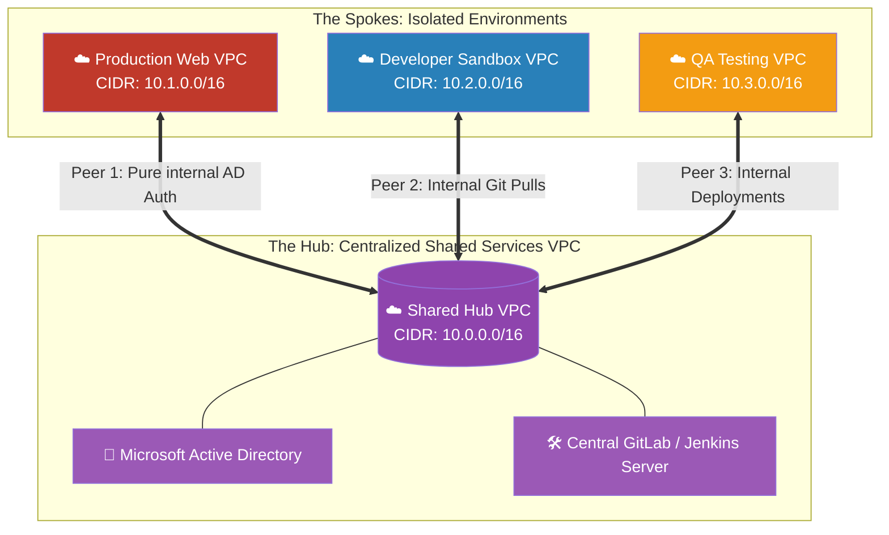

# 🚀 AWS Interview Question: The Architectural Aim of VPC Peering

**Question 86:** *From a macro-architectural perspective, what is the exact business and security aim of utilizing VPC Peering? Why not simply let your VPCs communicate with each other over the public internet?*

> [!NOTE]
> This question directly builds on Question 85. While Q85 asked *how* peering works mechanically (non-transitive routing, CIDR limits), this question tests *why* an Architect deploys it. You must explicitly introduce the enterprise concept of the **"Shared Services VPC Architecture"** to prove you design cloud topologies with cost and security logic.

---

## ⏱️ The Short Answer
The fundamental aim of VPC Peering is to explicitly prevent internal corporate network traffic from ever leaking onto the public internet, and strategically eliminating the immense financial costs associated with AWS NAT Gateways and Egress charges. 
- **The Security Aim:** Peering mathematically links two completely isolated environments using pure internal private IPs. The traffic flows solely over the physical AWS intra-datacenter fiber optics, making the connection categorically immune to public DDoS attacks, internet routing latency, or external packet sniffing.
- **The Architectural Aim:** Peering is the foundational building block for the **"Shared Services VPC Pattern."** Instead of repeatedly deploying redundant infrastructure (like Active Directory servers) into every single new VPC you create, you deploy them once in a centralized "Hub" VPC, and dynamically peer all peripheral "Spoke" VPCs back to the secure hub.

---

## 📊 Visual Architecture Flow: The Shared Services Model

---

## 🏢 Real-World Production Scenario

**Scenario: The Active Directory Centralization**
- **The Anti-Pattern:** A massive media company runs 15 distinct AWS VPCs for their various subsidiaries. Because corporate policy mandates that every server natively authenticates against Microsoft Active Directory (AD), the legacy cloud engineers deployed two highly available AD domain controllers into *every single VPC*. They are paying to run 30 total Active Directory servers, bleeding over $15,000 a month purely in redundant EC2 operational costs. 
- **The Architect's Pivot:** The Senior Cloud Architect is hired and immediately initiates a cost-optimization overhaul. They create a brand new, highly secured 16th VPC known explicitly as the **"Shared Services VPC."** 
- **The Execution:** The Architect builds one single, robust Active Directory cluster inside this central VPC. They meticulously configure 15 **VPC Peering Connections**, linking every subsidiary's VPC directly back to the new Hub. 
- **The Result:** The Architect manually updates the Route Tables and DNS settings across all 15 subsidiary VPCs to funnel ID authentication packets directly over the private peering connections to the Hub. Once the Private DNS seamlessly resolves, the Architect permanently deletes the 30 redundant AD servers. The company's compliance is mathematically improved because the public internet is completely bypassed, and the monthly AWS bill drops by $15,000.

---

## 🎤 Final Interview-Ready Answer
*"The overarching aim of VPC Peering is to construct a completely borderless internal corporate network that inherently bypasses the public internet. From a security perspective, peering mathematically restricts communication purely to private IP addresses routed over the underlying AWS physical backbone, achieving strict compliance and nullifying public egress data transfer costs. Architecturally, the most critical aim of VPC Peering is enabling the enterprise 'Shared Services' pattern. Instead of redundantly provisioning identical management tools—such as Microsoft Active Directory, centralized Jenkins CI/CD servers, or corporate GitLab repositories—inside every single isolated Production and Development VPC, I deploy those tools exactly once in a highly-secured, centralized Shared Services 'Hub' VPC. I then utilize VPC Peering to privately connect all isolated 'Spoke' VPCs directly to the Hub. This completely eliminates infrastructural redundancy, drastically reduces monthly EC2 costs, and vastly converges security management into a singular target environment."*
