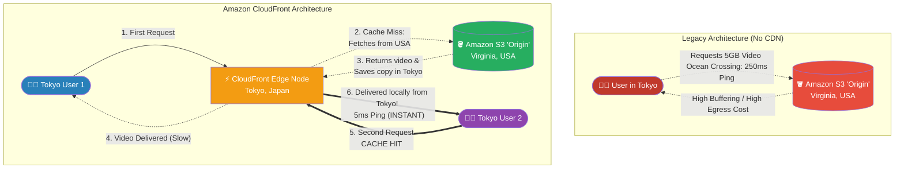

# 🚀 AWS Interview Question: Amazon CloudFront CDN

**Question 89:** *What exactly is Amazon CloudFront, and mechanically, how does a Content Delivery Network (CDN) actually reduce latency for a global user base?*

> [!NOTE]
> This is a foundational Global Architecture question. To sound like an Architect rather than just a developer, you must clearly articulate the mechanical difference between an **Origin Server** (where the data lives) and an **Edge Location** (where the data is cached), and explicitly explain the concept of a *"Cache Miss."*

---

## ⏱️ The Short Answer
Amazon CloudFront is a highly scalable, globally distributed Content Delivery Network (CDN). Its primary mathematical purpose is to aggressively reduce internet latency by caching static assets physically closer to the end user.
- **The Origin:** In AWS, your actual data (like a 5GB 4K Video file) usually lives in an "Origin Server" (e.g., an S3 Bucket located in Northern Virginia). If a user in Tokyo requests that video, the network packets must literally travel under the ocean, resulting in 250ms of severe lag.
- **The Edge Location Cache:** CloudFront solves this by utilizing hundreds of local "Edge Facilities" worldwide. When the *first* user in Tokyo requests the video, they experience a **"Cache Miss"**—CloudFront has to fetch it from Virginia. However, CloudFront cleverly saves a copy of that video on the Tokyo Edge server. 
- **The Cache Hit:** When the *second* user in Tokyo requests the exact same video, they experience a **"Cache Hit."** CloudFront intercepts the request and instantly delivers the local copy from the Tokyo server in under 10 milliseconds, completely bypassing the grueling trip to Virginia.

---

## 📊 Visual Architecture Flow: The Cache Mechanics

---

## 🏢 Real-World Production Scenario

**Scenario: The Viral Movie Trailer**
- **The Application:** A global entertainment company hosts the exclusive 4K movie trailer for the biggest blockbuster of the year. The 500MB video file is physically hosted in an Amazon S3 bucket located entirely in `us-east-1` (Virginia). 
- **The Origin Overload:** The trailer goes viral globally. One million fans in Europe attempt to stream the 500MB video simultaneously. The S3 Origin bucket in Virginia is suddenly slammed with 500 Petabytes of outbound web traffic. The trans-atlantic fiber cables physically choke, users experience infinite loading screens, and the company is billed $40,000 for massive S3 outbound data transfer egress.
- **The CloudFront Fix:** The Cloud Architect immediately deploys an **Amazon CloudFront Distribution** in front of the S3 bucket.
- **The Resolution:** With CloudFront enabled, when European fans request the video, they are mathematically routed to local AWS Edge Facilities in London, Paris, and Frankfurt. Those local servers fetch the video *exactly once* from Virginia, cache it, and then instantly serve the video locally to the remaining 999,999 European fans. The video streams flawlessly in 4K with zero buffering. Furthermore, because CloudFront absorbed 99.9% of the traffic, the massive S3 egress bill is completely eliminated.

---

## 🎤 Final Interview-Ready Answer
*"Amazon CloudFront is AWS's natively integrated Content Delivery Network (CDN) designed explicitly to minimize global application latency and shield origin servers from massive traffic spikes. Architecturally, if I am hosting heavy static media—like massive images, frontend JavaScript bundles, or 4K video streams—in an origin S3 bucket, I will instantly mandate a CloudFront Distribution to sit in front of it. CloudFront organically intercepts global user requests and routes them to the nearest physical AWS Edge Location. If the Edge Location does not hold the asset, it registers a 'Cache Miss', fetches it from the origin, and caches it locally based on Time-To-Live (TTL) headers. Subsequent users in that geographical perimeter will register a 'Cache Hit', retrieving the massive asset locally with single-digit millisecond latency. This fundamentally delivers a flawless end-user experience while simultaneously crushing expensive cross-region S3 egress data-transfer costs."*
