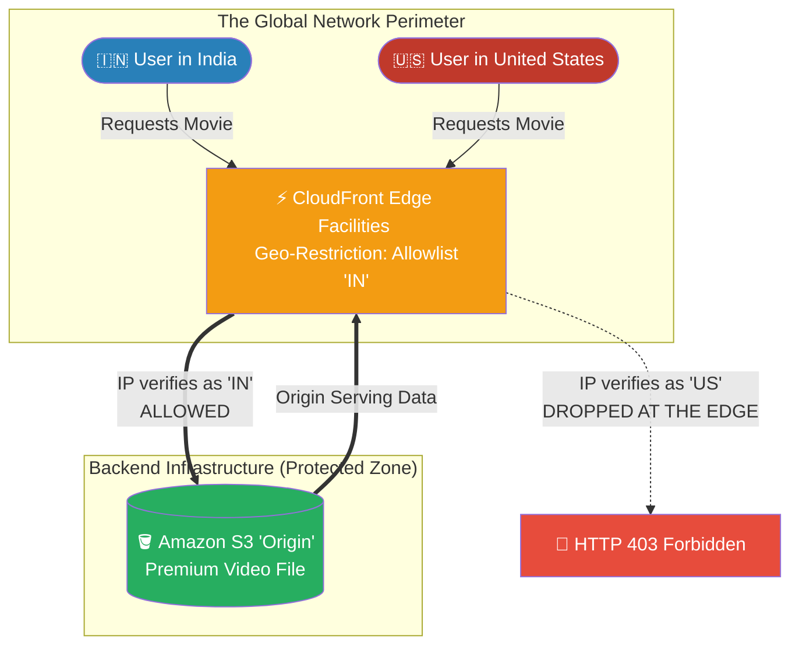

# 🚀 AWS Interview Question: CloudFront Geo-Restriction

**Question 90:** *What is Amazon CloudFront Geo-Restriction (Geo-Targeting)? Since Route 53 already has Geolocation Routing, why would you ever need to use CloudFront to block users based on their physical location?*

> [!NOTE]
> This is a high-level Cloud Edge Security question. If you only say "it blocks users based on their country," the interviewer will assume you don't know the difference between Route 53 and CloudFront. You win this question by explicitly detailing that it is infinitely cheaper and safer to drop illegal traffic at the **Edge Network** (CloudFront) rather than letting those packets reach your VPC.

---

## ⏱️ The Short Answer
Amazon CloudFront Geo-Restriction is a security and compliance feature that allows you to mathematically enforce a physical geographic whitelist or blacklist on your media content.
- **The Execution Layer:** While Route 53 operates at the DNS level (telling traffic *where* to go), CloudFront Geo-Restriction operates at the **Edge Layer** (deciding *if* the traffic is allowed to download the file). 
- **The Edge Advantage:** By enforcing geographic blacklists directly on the CloudFront CDN, illegal or out-of-bounds traffic is immediately dropped and presented with an HTTP 403 (Access Denied) error the millisecond it hits the local Edge facility. Because the traffic was blocked at the perimeter of the AWS global network, those hostile or unlicensed requests never physically reach your Application Load Balancers or S3 Origins. This saves your backend infrastructure from processing millions of unauthenticated requests, drastically reducing compute costs.

---

## 📊 Visual Architecture Flow: The CloudFront Edge Shield

---

## 🏢 Real-World Production Scenario

**Scenario: The Regional Bollywood Release**
- **The Challenge:** A massive global streaming service acquires the exclusive digital rights to a highly anticipated Bollywood movie. However, their legal contract strictly dictates they are *only* legally permitted to stream the movie to viewers physically residing inside the borders of India. 
- **The Anti-Pattern:** A developer considers handling the location validation entirely within the Node.js backend application code inside the VPC. 
- **The Financial Vulnerability:** The Cloud Architect immediately objects. If millions of customers from the United States attempt to access the movie, the Node.js servers will have to manually process every single request just to say "No." The company would be paying thousands of dollars in EC2 compute charges just to reject traffic.
- **The CloudFront Execution:** The Architect instead enables **CloudFront Geo-Restriction**. They configure the Distribution strictly with an "Allowlist" targeting the country code `IN` (India). 
- **The Result:** The moment the movie launches, a cluster of users in New York tries to stream the video. Their request travels 5 milliseconds to the physical CloudFront facility in Manhattan. The Edge node instantly identifies the US IP addresses and harshly drops the request with a 403 Error. The American traffic never even touches the company's VPC, completely shielding the backend EC2 instances from the barrage and entirely neutralizing the compute costs.

---

## 🎤 Final Interview-Ready Answer
*"Amazon CloudFront Geo-Restriction allows enterprises to establish strict, perimeter-level geographical whitelists and blacklists for their static and media assets. While Route 53 Geolocation is excellent for routing valid traffic to different localized web servers, CloudFront Geo-Restriction is architecturally superior for aggressively blocking fundamentally invalid or unlicensed traffic. By enforcing boundary rules directly at the CDN Edge Layer, AWS identifies out-of-bounds IP addresses and immediately terminates the connections via HTTP 403 responses before the packets ever traverse the AWS backbone into your Virtual Private Cloud (VPC). In scenarios like legally restricting a video stream exclusively to a singular country, deploying the block at CloudFront physically shields your Application Load Balancers and Origin Servers from processing millions of unauthenticated requests, categorically eliminating redundant EC2 compute overhead and maximizing backend security."*
