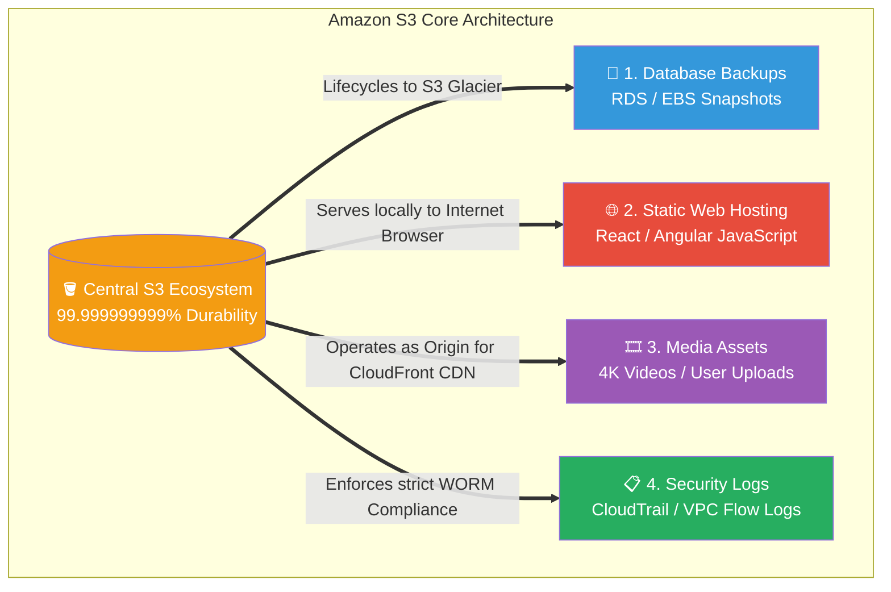

# 🚀 AWS Interview Question: Amazon S3 Use Cases

**Question 93:** *Amazon S3 is arguably the most utilized service in the entire AWS ecosystem. As a Cloud Architect, what are the four primary architectural baseline use-cases for an S3 Bucket?*

> [!NOTE]
> This is a foundational Cloud Storage question. Interviewers use this to verify you didn't just memorize "S3 equals storage." You must explicitly break the service down into its **Four enterprise pillars**: Backups, Static Hosting, Media, and Logs. 

---

## ⏱️ The Short Answer
Amazon S3 (Simple Storage Service) is an infinitely scalable, serverless object storage architecture. While a legacy file server is constrained by a finite hard drive, S3 can intelligently handle Petabytes of unstructured data. In an enterprise environment, S3 is strictly divided into four distinct architectural use-cases:
1. **Backups & Disaster Recovery:** The ultimate safety vault. S3 seamlessly transitions massive database dumps (RDS, DynamoDB) and EBS snapshots into cheap, long-term cold storage like *S3 Glacier Deep Archive*.
2. **Static Web Hosting:** The serverless frontend. S3 natively hosts entire Single Page Applications (SPAs) built in React, Vue, or Angular without requiring a single EC2 web server, reducing frontend compute costs to zero.
3. **Media & Asset Storage:** The origin network. S3 stores heavy, unstructured user-uploaded data like 4K videos, profile pictures, and PDF invoices, acting as the foundational Origin Server that sits safely behind a CloudFront CDN.
4. **Immutable Security Logging:** The compliance auditor. S3 acts as the central, un-deletable aggregator for all AWS CloudTrail network audits, VPC Flow Logs, and Application Load Balancer (ALB) access logs, heavily utilizing S3 Object Lock to prevent hacking and tampering.

---

## 📊 Visual Architecture Flow: The 4 Pillars of S3

---

## 🏢 Real-World Production Scenario

**Scenario: The "Serverless First" Startup**
- **The Challenge:** A social media startup is launching a photosharing app. Their budget is incredibly tight. The junior developer proposes provisioning ten EC2 Linux servers to host the React UI Frontend, ten more EC2 servers to physically store the uploaded JPEG images, and buying expensive third-party SIEM software to store their server logs.
- **The Architect's Pivot:** The Cloud Architect physically rejects this monolithic, expensive design. They state: *"Compute is wildly expensive; Storage is practically free. We will utilize an **S3-First** architecture."*
- **The Optimization:** The Architect completely deletes the frontend EC2 servers; they dump the compiled React code into an S3 bucket and flip the `Enable Static Website Hosting` switch, dropping frontend compute costs to exactly $0.00. 
- **The Execution:** Next, instead of using EC2 hard drives, all user-uploaded profile pictures are programmatically streamed via the AWS SDK directly into a highly-secured "Media" S3 bucket. Finally, the Architect configures AWS CloudTrail to stream every single API audit log automatically into a locked "Logs" S3 bucket. 
- **The Result:** The startup successfully hosts its frontend, scales its media storage infinitely for millions of users, and maintains a perfect, immutable security audit trail—all fundamentally powered by Amazon S3, fundamentally saving the company $10,000 a month in structural server costs.

---

## 🎤 Final Interview-Ready Answer
*"Amazon S3 is the foundational bedrock of infinitely scalable cloud object storage, driving four deeply distinct architectural use cases. First, for **Disaster Recovery**, it acts as the ultimate backup vault, natively integrating with S3 Lifecycle Policies to aggressively transition database dumps into cheap Glacier storage. Second, for **Compute Optimization**, it natively executes Static Website Hosting, allowing us to serve entire React or Angular frontends serverlessly without maintaining a single EC2 web server. Third, as an **Asset Origin**, it infinitely absorbs raw, unstructured media like user-uploaded videos or images behind a CloudFront CDN. Finally, for **Enterprise Security Compliance**, S3 functions as our centralized, immutable data lake; by aggregating all CloudTrail, VPC, and ALB logs into a locked bucket utilizing S3 Object Lock, we guarantee strict Write-Once-Read-Many (WORM) compliance, providing an un-hackable audit trail for our security operators."*
