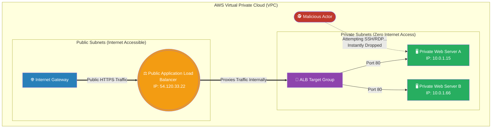

# 🚀 AWS Interview Question: Public ALBs & Private Subnets

**Question 94:** *If your EC2 web servers are securely locked inside a Private Subnet and completely lack Public IP addresses, how is it physically possible for a customer on the public internet to view your website?*

> [!NOTE]
> This is a mandatory Cloud Networking Architecture question. It explicitly tests if you understand the boundary between **Public and Private Subnets**, and how an **Application Load Balancer (ALB)** mechanically bridges that security gap using Target Groups. 

---

## ⏱️ The Short Answer
To securely expose private web servers to the world without exposing them to hackers, you must architecturally decouple the Load Balancer from the Compute layer through cross-subnet routing.
- **The Public Subnet:** You provision an Internet-Facing Application Load Balancer (ALB) and place it strictly inside the Public Subnet. Because it sits in the public zone, AWS automatically assigns it Public IP addresses and connects it to the Internet Gateway.
- **The Private Subnet:** You place all of your EC2 web servers deep inside the Private Subnet. They possess zero public IP addresses and are physically inaccessible from the internet.
- **The Bridge:** You create an **ALB Target Group** containing your private EC2 instances. When a customer browses your website, they actually connect to the public ALB. The ALB terminates their connection, encrypts the request, and proxies the traffic across the VPC boundary straight into the Target Group, seamlessly delivering the web page while the underlying servers remain perfectly hidden.

---

## 📊 Visual Architecture Flow: The ALB Security Bridge

---

## 🏢 Real-World Production Scenario

**Scenario: The Hardened E-Commerce Perimeter**
- **The Anti-Pattern:** A startup builds an e-commerce platform. The junior developer provisions 10 EC2 instances running the Node.js website and attaches a Public IP to every single machine. Because the machines are publicly exposed to the internet, unauthorized bots continuously ping the servers, scanning Port 22 (SSH) trying to violently brute-force admin passwords.
- **The Architect's Resolution:** A Senior Cloud Architect discovers the vulnerability and immediately rebuilds the VPC topology. They forcibly strip every single Public IP address off the 10 EC2 web servers, pushing them strictly into a **Private Subnet** with no internet gateway route. 
- **The Safe Exposure:** The Architect provisions exactly one **Internet-Facing ALB**, drops it into the Public Subnet, and links it to securely proxy traffic into the private EC2 Target Group. 
- **The Result:** The global customer base seamlessly browses the e-commerce store by visiting the ALB's DNS name. Meanwhile, the malicious bots attempt to scan the underlying EC2 instances, but find nothing. Because the web servers literally do not possess public addresses, they are mathematically invisible to the outside world, completely sterilizing the brute-force attack vectors while preserving 100% of legitimate client traffic.

---

## 🎤 Final Interview-Ready Answer
*"A fundamental pillar of AWS security is ensuring that compute infrastructure never directly touches the public internet. To securely serve web traffic to isolated EC2 web servers hosted inside a Private Subnet, I architect an Application Load Balancer (ALB) proxy configuration. First, I provision an Internet-Facing ALB and deploy it exclusively into the Public Subnets, allowing it to organically receive traffic from the Internet Gateway. Second, I logically group my private EC2 instances into an ALB Target Group. When external TCP/HTTPS traffic hits the ALB, the Load Balancer natively terminates the connection. It acts as a secure proxy, forwarding the HTTP packets deeply across the internal VPC perimeter directly to the Target Group residing in the Private Subnet. This architecture flawlessly delivers the web application to the end user while ensuring the underlying compute nodes remain completely immune to public port scanning and brute-force attacks."*
