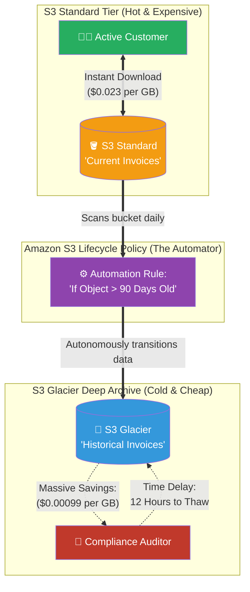

# 🚀 AWS Interview Question: S3 Standard vs. S3 Glacier

**Question 96:** *What is the architectural and financial difference between Amazon S3 Standard and Amazon S3 Glacier? How do you ensure your company isn't bleeding money storing legacy data?*

> [!NOTE]
> This is a critical Cloud FinOps (Financial Operations) question. If you state that S3 and Glacier are two completely disconnected services, you miss the mark. A Cloud Architect immediately explains that Glacier is simply a "Storage Tier" inside S3, and explicitly mentions **"S3 Lifecycle Policies"** as the automated mechanism to drive costs down.

---

## ⏱️ The Short Answer
Amazon S3 Standard and Amazon S3 Glacier are fundamentally variations of the exact same object storage platform, but they are architecturally partitioned to serve opposite ends of the data-access spectrum:
- **S3 Standard (Hot Storage):** Designed for active, frequent data access. If an application requests a file, S3 Standard guarantees instantaneous retrieval with single-digit millisecond latency. Because the data is kept digitally "hot" and ready, it is the most expensive storage tier.
- **S3 Glacier (Cold Archiving):** Designed exclusively for long-term, dormant data retention (like retaining legal documents for 7 years). Glacier is incredibly cheap—often 1/10th the cost of Standard. However, the architectural tradeoff is the **Retrieval Delay**. When you request a file from Glacier, it takes anywhere from 5 minutes to 12 hours to physically "thaw" the file before you can download it.

---

## 📊 Visual Architecture Flow: Automated FinOps Lifecycle

---

## 🏢 Real-World Production Scenario

**Scenario: The 7-Year Healthcare Audit**
- **The Challenge:** A massive healthcare provider must legally store hundreds of millions of patient X-Ray image files for exactly 7 years to satisfy the HIPAA regulatory audit framework. X-Rays are massive files. 
- **The Financial Hemorrhage:** A junior developer dumps every single X-Ray directly into `S3 Standard`. Because old X-Rays are rarely ever looked at again once a patient leaves the hospital, the company is actively paying $30,000 a month simply to hold millions of files that no one is even actively clicking on.
- **The Architect's Resolution:** The Cloud Architect logs into the bucket and creates an **S3 Lifecycle Policy**. 
- **The Automated Flow:** The Architect writes a rule: *"If a file has not been accessed in 30 days, transition it to S3 Standard-IA (Infrequent Access). If the file hits 90 days, transition it to S3 Glacier Deep Archive. At exactly 2,555 days (7 years), permanently delete it."*
- **The Result:** The very next day, the lifecycle rule organically flushes millions of dormant 90-day-old X-Rays directly into S3 Glacier. If the government ever initiates a random legal audit, the hospital accepts the 12-hour "Glacier Thawing Delay" to retrieve the specific files. In the meantime, the company's monthly AWS storage bill permanently plummets from $30,000 down to roughly $2,000 without requiring anyone to manually move files ever again.

---

## 🎤 Final Interview-Ready Answer
*"Amazon S3 Standard and Amazon Glacier operate on opposite sides of the storage cost-performance matrix. S3 Standard is designed for 'Hot' data, guaranteeing instantaneous millisecond retrieval for highly active applications at a premium storage price. S3 Glacier is an ultra-low-cost, 'Cold' storage tier explicitly architected for long-term compliance archiving, sacrificing retrieval speed—often requiring hours to 'thaw' data—in exchange for massive cost reductions. As an Architect, I never manually move data between these tiers. Instead, I implement native 'S3 Lifecycle Policies'. By configuring an automated lifecycle rule, AWS autonomously monitors the bucket; if objects age past a defined threshold—say, 90 days without being actively accessed—AWS systematically transitions them directly into Glacier Deep Archive. This seamlessly constructs a fully automated, FinOps-optimized data pipeline that mathematically ensures the enterprise never overpays for dormant, legacy storage."*
