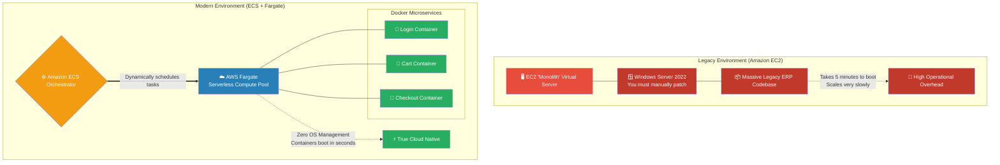

# 🚀 AWS Interview Question: EC2 vs. ECS & Fargate

**Question 98:** *From an architectural perspective, what is the exact operational difference between deploying an application on Amazon EC2 versus Amazon ECS? Why are modern startups overwhelmingly abandoning EC2 in favor of ECS?*

> [!NOTE]
> This is a premier Compute & Container Orchestration question. The secret to a perfect answer is to never just mention "ECS". An enterprise Cloud Architect explicitly groups **ECS** with **AWS Fargate** to demonstrate they understand *Serverless Containerization*, fundamentally contrasting it against the heavy, manual OS management required by legacy EC2.

---

## ⏱️ The Short Answer
Amazon EC2 (Elastic Compute Cloud) and Amazon ECS (Elastic Container Service) represent two completely different eras of software deployment: **Monolithic Infrastructure** versus **Cloud-Native Containerization**.
- **Amazon EC2 (Infrastructure as a Service):** You are renting a raw, empty virtual machine. You are 100% responsible for installing the Operating System (Windows/Linux), applying security patches, manually installing application dependencies (like Java or Python), and deploying your raw code. It is heavily utilized for massive, monolithic legacy applications.
- **Amazon ECS + Fargate (Container Orchestration):** ECS is AWS's native Docker orchestration engine. Instead of dealing with raw Operating Systems, you package your code and its dependencies perfectly inside isolated **Docker Containers**. When paired with **AWS Fargate** (the Serverless compute engine for ECS), you completely abandon managing underlying servers. You simply hand AWS the Docker Container, and Fargate dynamically provisions the exact CPU and RAM required to run it, instantly eliminating all OS patching and Server Maintenance from your DevOps workload.

---

## 📊 Visual Architecture Flow: Monolith vs. Microservice

---

| Feature | EC2 | ECS | ECS + Fargate |
| Type | Virtual Server | Container Orchestration | Serverless Container Orchestration |
| OS Management | You manage | Managed by AWS (if Fargate) | Managed by AWS |
| Use Case | Traditional apps | Microservices / Containers | Microservices / Containers |
| Scaling | Auto Scaling Group | Service auto scaling | Service auto scaling |
| Deployment | AMI based | Docker container based | Docker container based |

---

## 🏢 Real-World Production Scenario

**Scenario 1: The Legacy EC2 Mandate**
- **The Application:** An enterprise corporation runs a 15-year-old, globally critical ERP system. The application is a massive monolith uniquely hardcoded in C# that absolutely requires a massive, persistent `Windows Server 2016` operating system to function. It cannot be containerized. 
- **The Architect's Execution:** The Cloud Architect physically cannot use ECS or Lambda for this. They deploy an **Auto Scaling Group of Amazon EC2 instances** running identical Windows AMIs, accepting the heavy operational burden of manually executing Microsoft security patches every Tuesday because the architectural constraints demand bare-metal-style virtualization.

**Scenario 2: The Modern Startup Migration**
- **The Application:** A modern startup is designing a new e-commerce microservices platform. The developers have split the application into 10 distinct, lightweight components (Login Service, Recommendation Engine, Payment Gateway). 
- **The Architect's Execution:** The Architect strictly bans Amazon EC2 from the CI/CD pipeline. Instead, they require the developers to build a `Dockerfile` for each microservice. They deploy **Amazon ECS** configured with the **AWS Fargate** capacity provider. 
- **The Result:** The developers push their code via GitHub Actions. ECS grabs the 10 Docker containers and autonomously hands them to Fargate. Fargate instantly spins up isolated compute environments to run the containers. The startup successfully deploys complex architecture 10x faster because the DevOps team never once had to SSH into a Linux server, run `yum update`, or troubleshoot underlying OS dependencies.

---

## 🎤 Final Interview-Ready Answer
*"Amazon EC2 and Amazon ECS satisfy fundamentally opposing architectural paradigms. EC2 is raw 'Infrastructure-as-a-Service'; you are renting a blank virtual machine. It is structurally required when hosting massive, legacy monolithic applications that demand direct control over specific operating systems, like a heavy Windows Server environment. However, this incurs massive operational overhead because the engineering team assumes 100% responsibility for OS patching and maintenance. 
Conversely, Amazon ECS is AWS's native Docker orchestration platform, explicitly built for modern Microservice architectures. When I deploy ECS, I strictly pair it with 'AWS Fargate', which is a Serverless container compute engine. Under the ECS+Fargate model, my team entirely abandons hardware and OS management. We simply package our microservices into isolated Docker containers, hand them to the ECS control plane, and Fargate dynamically provisions the exact granular compute necessary to execute them. By stripping away underlying OS maintenance, ECS vastly accelerates CI/CD deployment elasticity and is the definitive standard for cloud-native engineering."*
