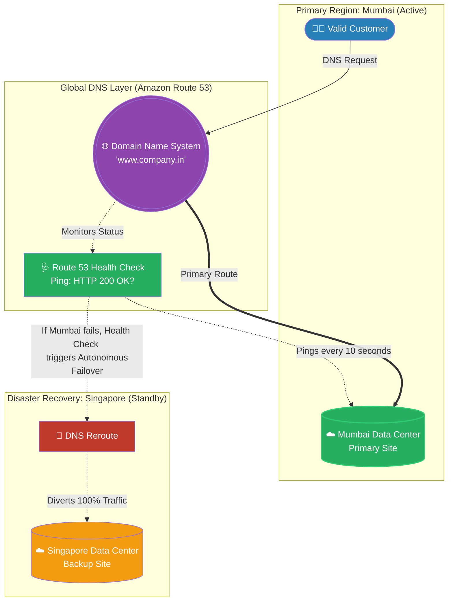

# 🚀 AWS Interview Question: DNS & Route 53 Failover

**Question 99:** *What is the Domain Name System (DNS), and in a production AWS environment, how do you utilize DNS to achieve Automatic Disaster Recovery?*

> [!NOTE]
> This is a critical Cloud Resiliency question. A junior developer defines DNS merely as an "address book." A Senior Architect defines DNS (via Amazon Route 53) as a **Global Traffic Orchestrator** capable of autonomous failover using continuous Health Checks.

---

## ⏱️ The Short Answer
At its core, the **Domain Name System (DNS)** is the address book of the internet. Because humans cannot easily memorize IP addresses, DNS seamlessly translates human-readable domain names (e.g., `www.google.com`) into computer-readable IP addresses (e.g., `142.250.190.46`). 

In the AWS ecosystem, DNS is fully managed by **Amazon Route 53**. However, AWS transforms DNS into a highly intelligent routing engine. Beyond basic Domain-to-IP mapping, Route 53 handles:
- **Health Checks:** Continuously pinging your servers to verify they haven't crashed.
- **Failover Routing:** Automatically redirecting traffic to a backup site if the primary site crashes.
- **Latency & Geo-Routing:** Directing users to specific global data centers based on proximity or legal compliance.

---

## 📊 Visual Architecture Flow: Autonomous DNS Failover

---

## 🏢 Real-World Production Scenario

**Scenario: The Regional Mumbai Blackout**
- **The Application:** An Indian FinTech startup hosts its primary banking portal in the AWS Mumbai region using Latency-Based Routing. To legally satisfy the central bank's "Disaster Recovery" regulations, the Architect provisions an identical, secondary setup in the AWS Singapore region. 
- **The Automation Layer:** The Cloud Architect configures an **Amazon Route 53 Health Check** to actively ping the Mumbai Application Load Balancer every 10 seconds. The Architect creates a **Failover Routing Policy**: *Primary = Mumbai, Secondary = Singapore.*
- **The Disaster:** A catastrophic power grid failure completely brings down the AWS Mumbai data center. Millions of Indian banking customers suddenly cannot reach the primary servers.
- **The Autonomous Resolution:** Within 30 seconds, the Route 53 Health Check registers three consecutive failed pings and officially declares Mumbai "Unhealthy." Without requiring a single human engineer to wake up or type a command, Route 53 actively recalculates the global DNS mapping. The DNS record instantly shifts, completely diverting all 100% of the live Indian web traffic to the backup Application Load Balancers residing securely in Singapore. 
- **The Result:** The customers experience a momentary 30-second website hiccup before immediately continuing their banking transactions, achieving perfect high availability and autonomous Disaster Recovery.

---

## 🎤 Final Interview-Ready Answer
*"Fundamentally, DNS allows users to access distributed applications using human-readable domain names rather than complex IP strings. However, in an enterprise AWS environment, we elevate DNS from a simple address book into an active, autonomous traffic orchestrator using Amazon Route 53. Route 53 provides highly advanced routing logic—such as Latency, Geolocation, and Failover routing. If a critical architectural requirement demands multi-region Disaster Recovery, I actively pair a Route 53 Failover Policy with continuous Route 53 Health Checks. Under this configuration, if our primary data center in Mumbai experiences a catastrophic failure, the Health Check registers the outage and Route 53 autonomously alters the global DNS resolution paths. It instantly and seamlessly reroutes 100% of our customer traffic to a secondary standby region like Singapore, mechanically ensuring strict High Availability and minimizing downtime to mere seconds without any manual engineering intervention."*
