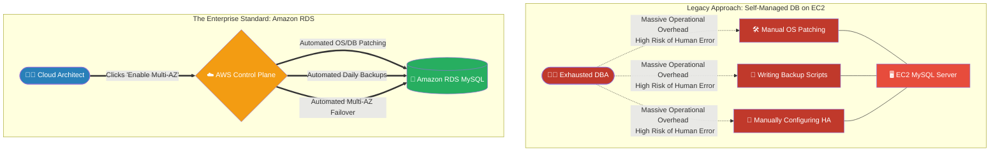

# 🚀 AWS Interview Question: EC2 Database vs. Amazon RDS

**Question 100:** *Technically, you can install any database engine (MySQL, PostgreSQL) directly onto an EC2 virtual machine. Why is this considered an architectural anti-pattern for production, and why do enterprises overwhelmingly mandate the use of Amazon RDS?*

> [!NOTE]
> This is a premier **Shared Responsibility Model** question. The interviewer is testing if you understand "Operational Overhead." You must explain that installing a database on EC2 forces your team to become full-time Database Administrators (DBAs), whereas Amazon RDS outsources all of that miserable maintenance directly to AWS.

---

## ⏱️ The Short Answer
While self-managing a database on Amazon EC2 provides absolute control over the underlying operating system, it introduces a catastrophic amount of **Operational Overhead** and human-error risk.
If you deploy a database on EC2, your engineering team is 100% manually responsible for:
- Executing underlying Linux/Windows OS security patches.
- Executing minor database engine version upgrades.
- Writing custom cron-job scripts for daily backups.
- Manually configuring complex active-passive High Availability (HA) replication.
- Manually writing failover scripts if the primary server crashes.

**Amazon RDS (Relational Database Service)** is a Fully Managed Service. AWS contractually assumes the burden for all of the above. By simply clicking a button, AWS autonomously handles OS patching, automated point-in-time backups, Storage Auto-Scaling, and configures autonomous Multi-AZ failovers, freeing your engineers to focus entirely on writing application code rather than babysitting database infrastructure.

---

## 📊 Visual Architecture Flow: Operational Overhead

---

## ⚖️ Feature Comparison Matrix

| Feature | Self-Managed EC2 Database | Fully Managed Amazon RDS |
| :--- | :--- | :--- |
| **OS & DB Patching** | ❌ Manual (Requires SSH) | ✅ Automatic (Maintenance Window) |
| **Backups** | ❌ Manual Cron Scripts | ✅ Automated Point-In-Time |
| **High Availability** | ❌ Complex Manual Replication | ✅ 1-Click Multi-AZ |
| **Failover Handling** | ❌ Manual Intervention Required | ✅ Autonomous DNS Swap (60s) |
| **Storage Scaling** | ❌ Manual Volume Resizing | ✅ Autonomous Storage Auto-Scaling |

---

## 🏢 Real-World Production Scenario

**Scenario: The E-Commerce Disaster**
- **The Legacy Architecture:** A startup deploys 10 Application load-balanced Web Servers connected to a single, giant MySQL database manually hosted on an Amazon EC2 instance. 
- **The Disaster:** A massive marketing campaign drives unprecedented traffic. The EC2 Database's EBS volume hits 100% capacity. Because it's an EC2 instance, it doesn't have Storage Auto-Scaling. The database violently crashes. Furthermore, because there is no Multi-AZ configured, there is no standby server. The entire e-commerce site goes completely offline for 3 hours while an engineer desperately SSH's into a broken server trying to expand the hard drive, resulting in a ₹20 Lakh revenue loss.
- **The Architect's Resolution:** The Cloud Architect permanently bans EC2 databases. They migrate the data to **Amazon RDS**.
- **The Result:** The Architect checks two boxes in the RDS UI: `Enable Multi-AZ` and `Enable Storage Auto-Scaling`. The next time traffic spikes and the disk fills up, AWS autonomously expands the storage volume with zero downtime. If the primary hardware ever outright fails, AWS natively orchestrates a seamless failover to the Multi-AZ standby replica within 60 seconds. The website remains flawlessly online, and manual database management is eliminated forever.

---

## 🎤 Final Interview-Ready Answer
*"Deploying a production database onto a raw Amazon EC2 instance is fundamentally an architectural anti-pattern due to the catastrophic operational overhead it introduces. If you use EC2, your engineering team assumes 100% of the DBA responsibilities—from manual Linux kernel patching and writing complex cron-driven backup scripts, to architecting highly-available active-passive replication. This vastly increases the surface area for human error and catastrophic downtime. Instead, I heavily mandate the use of Amazon RDS. Because it is a Fully Managed Service, the AWS control plane completely abstracts away the administrative burden. AWS natively handles OS patching, enforces automated point-in-time disaster recovery backups, organically expands disk size via Storage Auto-Scaling, and perfectly orchestrates zero-touch Multi-AZ failovers. Moving from EC2 to RDS transitions the team from maintaining fragile infrastructure to actually focusing on business-critical application logic."*

---

> [!CAUTION]
> **When would an Architect actually use EC2 for a Database?**
> You should only ever use EC2 if your enterprise requires a highly obscure, unsupported database engine (e.g., IBM Db2), if your company is trapped in a strict vendor licensing legacy contract that prevents cloud-managed services, or if you require bleeding-edge, bare-metal-level OS performance tuning that RDS physically restricts access to.
