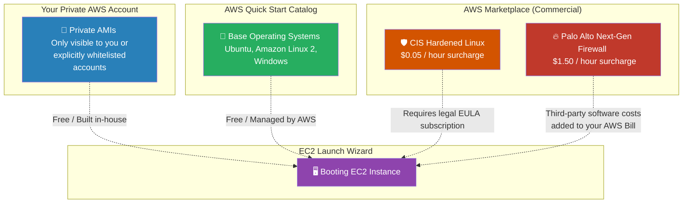

# 🚀 AWS Interview Cheat Sheet: AMI CATALOG & MARKETPLACE (Q445–Q450)

*This master reference sheet covers the AWS AMI Marketplace—a commercial hub where enterprises purchase pre-hardened, licensed software (like Cisco Firewalls or CIS-compliant OS instances) directly baked into immutable Amazon Machine Images.*

---

## 📊 The Master AMI Ecosystem Architecture

---

## 4️⃣4️⃣5️⃣ Q445: What is the AWS AMI Marketplace?
- **Short Answer:** The AWS AMI Marketplace is a massive commercial e-commerce storefront fully integrated into the EC2 console. It allows third-party software vendors (like Cisco, Splunk, or Fortinet) to sell perfectly pre-configured, heavily licensed applications embedded directly into an AMI. 
- **Production Scenario:** Instead of manually booting a blank Linux server and spending 3 days installing and licensing an enterprise VPN concentrator, a Network Architect literally clicks "Launch" on an OpenVPN Marketplace AMI and the server is fully operational globally within 90 seconds.

## 4️⃣4️⃣6️⃣ Q446: What should you do if you encounter issues with an AMI from the AWS AMI Marketplace?
- **Short Answer:** Because Marketplace AMIs are legally owned and maintained by the third-party software vendor (not AWS), you must bypass standard AWS Support and directly contact the publisher's internal support team. If their custom OS kernel panics, AWS Support legally cannot log into their proprietary software to fix it.

## 4️⃣4️⃣7️⃣ Q447: Can you launch an instance from a private AMI in the AWS AMI Marketplace?
- **Short Answer:** *CRITICAL ARCHITECTURAL CORRECTION:* **No, because "Private AMIs" fundamentally do not exist inside the Marketplace.** 
- **Interview Edge:** *"The drafted answer contained a massive AWS sharing myth stating Private AMIs cannot be shared. That is false. You CAN natively share a Private AMI securely with another AWS Account ID. However, the Marketplace itself is exclusively a **Public Global Storefront**. You cannot put a 'Private' AMI into the Marketplace. If you want to share an AMI privately with a partner, you do it via IAM Image Permissions, bypassing the Marketplace entirely."*

## 4️⃣4️⃣8️⃣ Q448: What is the process for publishing an AMI to the AWS AMI Marketplace?
- **Short Answer:** Becoming an official seller requires structural vetting. You must harden the AMI securely (e.g., completely deleting all internal root passwords, SSH keys, and logging data), package the billing mechanisms mathematically inside the payload (e.g., defining if you charge users By-The-Hour, or By-The-Month), and submit it directly to AWS for rigorous security and compliance approval.

## 4️⃣4️⃣9️⃣ Q449: How can you troubleshoot an issue with an AMI from the AWS AMI Marketplace that is causing instances to crash or freeze?
- **Short Answer:** 
  1) **Instance Checks:** Utilize AWS CloudWatch to verify if it is a standard hypervisor hardware failure vs a software application freeze.
  2) **Boot Log Retrieval:** Pull the literal System Log from the EC2 console directly (which grabs the Linux/Windows kernel boot dump) to see exactly where the startup script mathematically failed. 
  3) **Support Pipeline:** If the AMI is completely corrupted out of the box, abandon the launch and physically escalate the kernel dump to the AMI publisher's Enterprise Support.

## 4️⃣5️⃣0️⃣ Q450: What should you do if you encounter security vulnerabilities in an AMI from the AWS AMI Marketplace?
- **Short Answer:** If you discover a Zero-Day vulnerability in a Marketplace AMI (e.g., the Log4j vulnerability), you instantly terminate the compromised instances natively. You then formally report the CVE structurally to the Third-Party Publisher's security team so they are mechanically forced to patch their root software and publish a newly versioned, secure AMI into the Amazon Catalog.
