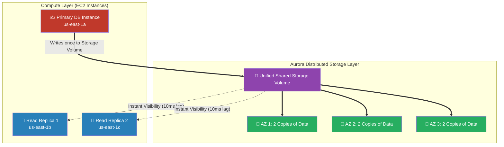

# 🚀 AWS Interview Cheat Sheet: AMAZON AURORA (Q761–Q780)

*This master reference sheet initiates Phase 16: Advanced Databases. It focuses on Amazon Aurora, AWS's flagship cloud-native relational database engineered to out-perform standard RDS MySQL by 5x.*

---

## 📊 The Master Aurora Storage Architecture

---

## 7️⃣6️⃣1️⃣ & Q762: What is AWS Aurora and how does it fundamentally differ from standard RDS?
- **Short Answer:** Aurora is an enterprise-grade relational database compatible with MySQL and PostgreSQL. 
- **Interview Edge:** *"The absolute architectural difference is the **Decoupled Storage Layer**. In standard RDS, every DB instance has its own physical EBS drive. In Aurora, Compute and Storage are completely separated. Aurora utilizes a mathematically massive, unified, distributed storage volume that automatically replicates data exactly 6 times across 3 Availability Zones. This allows Read Replicas to possess less than 10ms of replication lag because they do not copy data—they all literally just read from the exact same shared hard drive."*

## 7️⃣7️⃣5️⃣ Q775: What is Aurora Backtrack?
- **Short Answer:** This is a killer feature unique exclusively to Aurora MySQL. If a junior developer accidentally drops a critical production table, restoring a standard RDS database from a physical snapshot takes hours of downtime. **Aurora Backtrack** allows an Architect to physically "rewind" the database cluster mathematically second-by-second (e.g., reverting the entire cluster specifically to 5 minutes ago) completely instantaneously, without requiring any physical data restoration.

## 7️⃣6️⃣5️⃣ & Q777 & Q778: What is Aurora Serverless (v1 vs v2)?
- **Short Answer:** Instead of provisioning an inflexible `db.r5.xlarge` instance, Aurora Serverless automatically scales Compute capacity entirely based on live CPU demand using Aurora Capacity Units (ACUs).
- **Interview Edge:** *"An Architect must distinguish between v1 and v2 natively. Serverless v1 had brutal 'Cold Starts' taking up to 30 seconds to wake up a paused database. **Serverless v2** mathematically eliminated cold starts; it scales compute capacity instantly in a fraction of a second and fully supports Multi-AZ deployments, Global Databases, and Read Replicas, making it completely viable for tier-1 production workloads."*

## 7️⃣6️⃣6️⃣ Q766: Can you use AWS Aurora with Amazon RDS Proxy?
- **Short Answer:** Yes. Serverless applications (AWS Lambda) spin up thousands of micro-containers per second. If thousands of Lambdas natively open separate direct TCP connections to Aurora, it will physically exhaust the database's connection pool limits, crashing the DB. **RDS Proxy** sits cleanly between them, intelligently pooling and sharing a small cluster of connections mathematically across thousands of Lambdas.

## 7️⃣6️⃣7️⃣ Q767: What is an Aurora Global Database?
- **Short Answer:** A single Aurora Database forcefully spanning multiple AWS Regions natively. 
- **Production Scenario:** A Lead Architect deploys a Primary cluster in New York and a Secondary cluster in Tokyo. The Tokyo database replicates mechanically perfectly with typical latency mathematically under **1 second** natively via the AWS physical global backbone. If New York burns down, Tokyo can mechanically be promoted to the Primary Write node in less than 1 minute.

## 7️⃣6️⃣9️⃣ & Q773 & Q774: What are Aurora Read Replicas and how do they scale?
- **Short Answer:** standard MySQL natively only allows 5 Read Replicas. Because Aurora utilizes a shared storage volume, you can attach mathematically up to **15 Aurora Read Replicas**. An Architect then provisions an **Auto Scaling Policy** directly on the cluster to dynamically boot up new Read Replicas automatically when CPU utilization hits 70%.

## 7️⃣6️⃣3️⃣ & Q779 & Q780: How does Aurora integrate with Microservices (ECS/EKS)?
- **Short Answer:** By mapping ECS Fargate tasks to strike a custom **Aurora Reader Endpoint**. 
- **Architectural Action:** In standard RDS, the application has to load-balance traffic manually. Aurora natively provides a single DNS string called the `Reader Endpoint` that mechanically intelligently load-balances SQL `SELECT` queries perfectly across the 15 Read Replicas, distributing the workload evenly for the microservices.

## 7️⃣6️⃣4️⃣ Q764: How can you migrate an existing database to AWS Aurora?
- **Short Answer:** An Architect utilizes the **AWS Schema Conversion Tool (SCT)** combined physically with the **AWS Database Migration Service (DMS)**. DMS logically streams data from the legacy on-premises database directly into Aurora continuously without taking the legacy system offline, enabling a zero-downtime cutover.

## 7️⃣7️⃣6️⃣ & Q770: How can you secure your Aurora database?
- **Short Answer:** 
  1) **At Rest:** Transparent Data Encryption (TDE) via AWS KMS.
  2) **In Transit:** Enforce SSL/TLS connections natively.
  3) **Authentication:** Instead of relying on vulnerable hardcoded MySQL passwords, an Architect implements **IAM Database Authentication**, dynamically requiring EC2/Lambda instances to log into Aurora structurally using temporary 15-minute AWS IAM tokens.

## 7️⃣6️⃣8️⃣ & Q772: How can you troubleshoot performance issues in AWS Aurora?
- **Short Answer:** While CloudWatch monitors CPU, it cannot natively look "inside" the database engine. An Architect strictly provisions **RDS Performance Insights**. This dashboard visually maps out precisely which specific SQL query (e.g., `SELECT * FROM users JOIN orders`) is mathematically bottlenecking the CPU and exactly which physical database lock is causing the latency.

## 7️⃣7️⃣1️⃣ Q771: How can you backup and restore data in AWS Aurora?
- **Short Answer:** Aurora completely revolutionizes backups. In standard RDS, taking a snapshot locks I/O and heavily degrades database performance. Because Aurora Compute and Storage are explicitly physically decoupled, Aurora mechanically quietly streams hundreds of gigabytes of backup data continuously to Amazon S3 entirely from the Storage Layer without the Compute Compute Node ever noticing, mathematically guaranteeing zero performance penalty.
