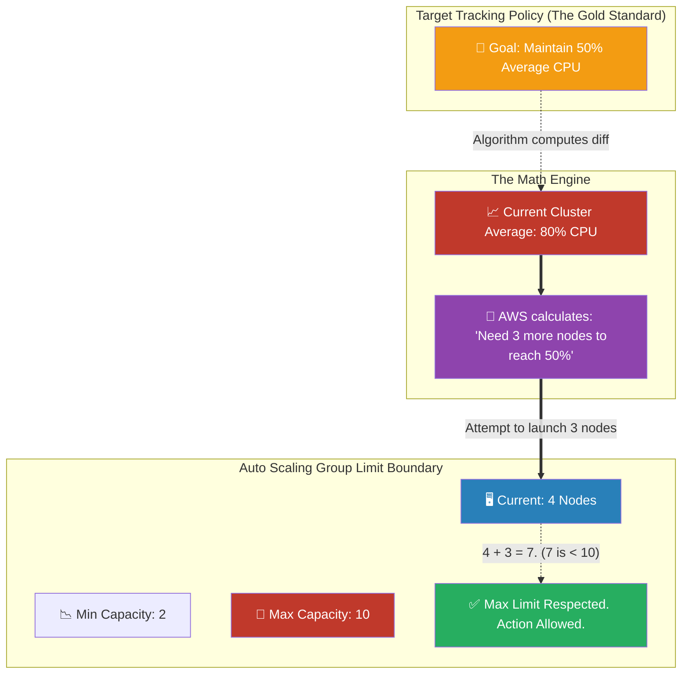

# 🚀 AWS Interview Cheat Sheet: ASG SCALING POLICIES (Q534–Q539)

*This master reference sheet covers the behavioral math and computational logic that drives Amazon EC2 Auto Scaling Groups (ASG)—focusing specifically on scaling algorithms and load balancer injection.*

---

## 📊 The Master ASG Target Tracking Architecture

---

## 5️⃣3️⃣4️⃣ & Q536: What is an Auto Scaling group in AWS and how does it work with EC2?
- **Short Answer:** An Auto Scaling Group (ASG) is a highly logical computational container in AWS that binds multiple Amazon EC2 instances together. It mathematically guarantees that a specific exact volume of computing power is executing at any given chronological second.
- **Architectural Flow:** When the CloudWatch metrics fundamentally register that the application is suffocating (e.g., CPU > 85%), Auto Scaling autonomously invokes the EC2 `RunInstances` API to spin up brand new clones using a stored Launch Template, gracefully absorbing the massive internet traffic spike.

## 5️⃣3️⃣5️⃣ Q535: What are the minimum and maximum limits of an Auto Scaling group?
- **Short Answer:** 
  - **Minimum Limit:** The unbreakable physical floor limit. Even if the website has absolutely zero human visitors and 0% CPU utilization, the ASG mathematically refuses to terminate servers below this count. (This guarantees rapid recovery time if traffic returns).
  - **Maximum Limit:** The financial "kill switch". No matter how violent a DDOS attack is, the ASG will completely pause all scaling actions once it hits this exact limit to mathematically cap the company's AWS invoice.

## 5️⃣3️⃣7️⃣ Q537: What are the different types of scaling policies available in Auto Scaling?
- **Short Answer:** 
  1) **Target Tracking Policy:** *The absolute industry best practice.* You simply state "Keep my average CPU at 50%". AWS does all of the brutal calculus in the background to dynamically add or delete the exact number of nodes required to hold that percentage.
  2) **Step Scaling:** You manually define strict mathematical tiers (e.g., If CPU is 60-70%, add 1 node. If CPU is 70-90%, add 3 nodes. If CPU > 90%, add 5 nodes).
  3) **Simple Scaling:** The legacy algorithm. You trigger an alarm, it adds a node, and then it rigidly locks the entire ASG for a 300-second "Cooldown" period.
- **Interview Edge:** *"A Lead Architect explicitly avoids Simple Scaling because the inflexible 300-second cooldown period will mathematically allow a website to crash during an explosive, sudden viral traffic spike. Target Tracking or Step Scaling are the only viable Enterprise answers."*

## 5️⃣3️⃣8️⃣ Q538: How does Auto Scaling work with Elastic Load Balancing?
- **Short Answer:** By natively coupling the two architectures. When you engineer the ASG, you statically bind the Application Load Balancer's **Target Group ARN** directly into the ASG configuration definition. 
- **Production Scenario:** When a massive Black Friday spike occurs, the ASG boots 12 new EC2 instances. Crucially, the ASG automatically executes an API call to natively securely push those 12 new Private IP addresses dynamically into the Target Group registry so the ELB frontline begins mathematically splitting internet traffic to them immediately.

## 5️⃣3️⃣9️⃣ Q539: What happens when an Auto Scaling group reaches its maximum limit?
- **Short Answer:** The ASG violently halts further deployment. 
- **Interview Edge:** *"If an ASG hits its maximum limit, CloudWatch metric alarms will continue universally screaming that the CPU is at 99%. However, the ASG completely mathematically ignores the alarms. No additional instances will be constructed. The existing servers will likely buckle and crash under the HTTP weight, dropping user requests, until the traffic organically subsides or a DevOps engineer manually edits the API to increase the Max Capacity limit parameter."*
