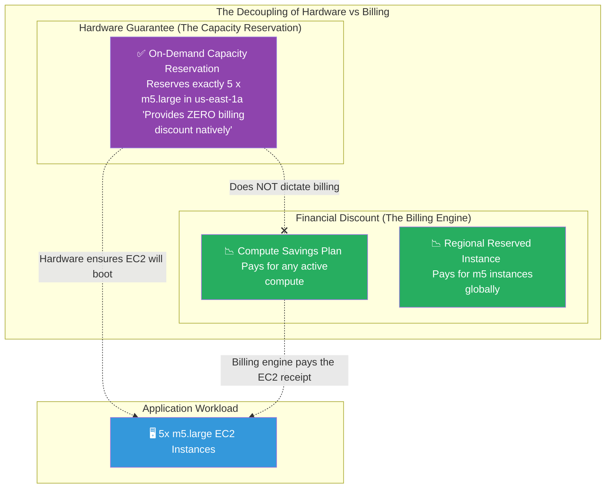

# 🚀 AWS Interview Cheat Sheet: CAPACITY RESERVATIONS (Q396–Q405)

*This master reference sheet covers On-Demand Capacity Reservations, a critical AWS compute capability that mechanically physically segregates hardware capacity independently of rigid financial billing contracts.*

---

## 📊 The Master Capacity Reservation Architecture

---

## 3️⃣9️⃣6️⃣ Q396: What are EC2 Capacity Reservations?
- **Short Answer:** On-Demand Capacity Reservations physically cordon off precise hardware capacity inside a specific AWS Availability Zone to guarantee your servers can mechanically boot. 
- **Interview Edge:** *"The most critical thing to state in an interview is that a Capacity Reservation natively provides absolutely **ZERO billing discount** and requires **ZERO term commitment**. You can reserve capacity for just 10 minutes, boot your servers, run a test, and cancel the reservation instantly. You strictly pay the standard On-Demand rate for the reserved hours."*

## 3️⃣9️⃣7️⃣ Q397: What are some use cases for EC2 Capacity Reservations?
- **Short Answer:** 
  1) **Disaster Recovery (DR):** In a massive regional outage, 10,000 companies simultaneously scramble to boot instances in a backup region (e.g., `us-west-2`), frequently exhausting the datacenter's physical silicon. Holding a static Capacity Reservation mechanically guarantees AWS has held hardware strictly for your DR failover.
  2) **Product Launches:** A gaming company guaranteeing massive server availability precisely for a 48-hour global game launch weekend.

## 3️⃣9️⃣8️⃣ Q398: How do you create an EC2 Capacity Reservation?
- **Short Answer:** You navigate to **EC2 -> Capacity Reservations -> Create**. You structurally specify the Instance Type (e.g., `m5.large`), the exact Availability Zone (`us-east-1a`), and the Instance Count you need securely held.
- **Production Scenario:** You can optionally define an explicit End Date (e.g., "Release this capacity on Monday"), or set it to run structurally "indefinitely" until a DevOps engineer manually terminates it via the API.

## 3️⃣9️⃣9️⃣ Q399: How can you monitor your EC2 Capacity Reservations?
- **Short Answer:** You utilize Amazon CloudWatch to track the **InstanceCount** metrics structurally tied to the reservation. The CloudWatch dashboard visually confirms if your developers are actually booting EC2 instances *into* your reserved hardware pool, or if the expensive AWS capacity is violently sitting fully empty.

## 4️⃣0️⃣0️⃣ Q400: How can you optimize the use of EC2 Capacity Reservations?
- **Short Answer:** The cardinal sin of a Capacity Reservation is leaving it empty. You pay the exact same On-Demand hourly rate for the capacity whether you utilize 100% of it or 0% of it. FinOps teams leverage AWS Cost Explorer to ruthlessly track "Unused Reservation Hours" and forcefully delete any reservations abandoned by engineering teams.

## 4️⃣0️⃣1️⃣ Q401: Can you modify the instance type of a Capacity Reservation after it has been created?
- **Short Answer:** No. Because the reservation intrinsically carves out very specific physical hardware boundaries, you mathematically cannot mutate an `m5` reservation into a `c5` reservation. You must actively cancel the `m5` contract and provision a brand new API request for the `c5` physical pool.

## 4️⃣0️⃣2️⃣ Q402: Can you modify the duration of a Capacity Reservation after it has been created?
- **Short Answer:** Yes. You are legally allowed to actively change the End Date. If it was set to expire on Friday, you can manipulate the API to dynamically extend the capacity hold fundamentally indefinitely.

## 4️⃣0️⃣3️⃣ Q403: Can you use other pricing models with EC2 Capacity Reservations?
- **Short Answer:** Absolutely. This is the hallmark of modern AWS Enterprise architecture. You decouple the hardware lock from the financial invoice. You utilize the **Capacity Reservation** simply to guarantee the servers physically exist and boot successfully. You then purchase **Savings Plans** or **Regional Reserved Instances** to autonomously apply the 72% discount down onto that active running hardware.

## 4️⃣0️⃣4️⃣ Q404: Can you share EC2 Capacity Reservations with other AWS accounts?
- **Short Answer:** Yes. This is a crucial enterprise hub-and-spoke pattern. The centralized FinOps 'Payer Account' buys massive Capacity Reservations to secure global server blocks, and functionally shares them outward using **AWS Resource Access Manager (RAM)** so the internal developer accounts can structurally boot their EC2 instances safely into that central pool.

## 4️⃣0️⃣5️⃣ Q405: Can you launch instances outside of a Capacity Reservation?
- **Short Answer:** Yes. When configuring the reservation, you dictate the "Instance eligibility". 
  1) **Open:** Any perfectly matching EC2 instance mathematically launched in the account will automatically snap into the reserved pool blindly.
  2) **Targeted:** Your EC2 instances legally *must* explicitly state the exact `Capacity Reservation ID` in their Launch Template to be allowed inside the pool; otherwise, they boot outside the reservation organically.
