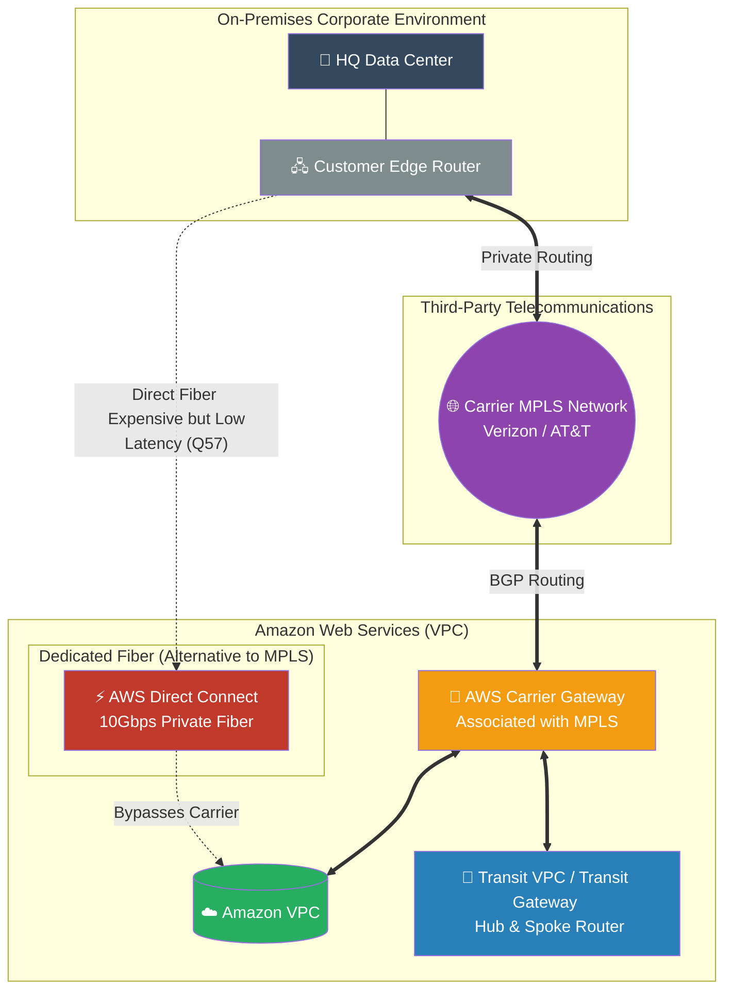

# 🚀 AWS Interview Cheat Sheet: CARRIER GATEWAYS (Q55–Q59)

*This master reference sheet details the architectural implementation of AWS Carrier Gateways, specifically focusing on integrating on-premises environments into AWS via telecom MPLS networks rather than relying on the public internet.*

---

## 📊 The Master Hybrid Connectivity Architecture

---

## 5️⃣5️⃣ Q55: What is an AWS Carrier Gateway?
- **Short Answer:** An AWS Carrier Gateway is specialized networking infrastructure that allows an enterprise to establish a dedicated, private connection from their on-premises network directly into an AWS VPC by routing traffic securely over a third-party telecommunications provider's MPLS (Multiprotocol Label Switching) network.
- **Production Scenario:** A global retail chain already has an existing contract with AT&T mapping all their physical stores onto an AT&T MPLS network. Instead of building brand-new VPNs over the internet, the Architect simply extends the AT&T MPLS cloud directly into AWS using a Carrier Gateway.
- **Interview Edge:** *"Carrier Gateways are essentially 'Bring Your Own Network'. They allow massive enterprises to leverage their existing, massive investments in ISP-provided MPLS networks rather than ripping and replacing routing infrastructure."*

## 5️⃣6️⃣ Q56: What are some practical use cases for AWS Carrier Gateway?
- **Short Answer:** It is primarily utilized when a company needs strict, private connectivity to AWS (bypassing the chaotic public internet) but already possesses a massive footprint on a telecom MPLS network. It is also highly effective when aggregating traffic from hundreds of physical branch offices locally before funneling that traffic privately into AWS storage (like S3).
- **Production Scenario:** A hospital network with 500 remote clinics needs to upload highly sensitive HIPAA patient records to Amazon S3. Sending it over the open internet via standard VPNs poses latency and security risks. Using their existing Verizon MPLS connected to a Carrier Gateway ensures the data never touches the open web.
- **Interview Edge:** *"The primary enterprise driver here is latency predictability. The public internet fluctuates wildly. Utilizing an MPLS Carrier Gateway provides a Service Level Agreement (SLA) from the telco, guaranteeing consistent, private bandwidth."*

## 5️⃣7️⃣ Q57: How does AWS Carrier Gateway differ from AWS Direct Connect?
- **Short Answer:** **Direct Connect (DX)** is a dedicated, physical fiber-optic cable legally owned by AWS or a direct DX partner that plugs straight from your data center into an AWS facility (providing massive bandwidth up to 100Gbps). **Carrier Gateway** routes your traffic through a third-party ISP's shared MPLS cloud. DX is vastly faster and has lower latency, but is structurally more expensive and requires massive physical provisioning.
- **Production Scenario:** If a high-frequency trading firm needs microsecond latency to Wall Street, the Architect mandates **Direct Connect**. If a paper company with 200 distributed supply-chain offices just needs consistent internal network routing, the Architect utilizes their existing **MPLS Carrier Gateway**.
- **Interview Edge:** *"Direct Connect is Layer-1/Layer-2 physical fiber. Carrier Gateways are Layer-3 logical routing over an ISP's managed network. Direct Connect guarantees raw speed; Carrier Gateways guarantee ISP topology integration."*

## 5️⃣8️⃣ Q58: How do you configure an AWS Carrier Gateway?
- **Short Answer:** It is a hybrid physical/cloud configuration. 1) On-Prem: Configure a virtual interface on the customer router. 2) ISP: Connect the router to the telecom MPLS cloud. 3) AWS: Create the Carrier Gateway in the VPC console and bind it to the virtual interface. 4) Routing: Establish BGP (Border Gateway Protocol) routing to organically advertise the VPC CIDRs into the MPLS network.
- **Production Scenario:** A Network Engineer and a Cloud Architect orchestrate a joint deployment: The Network Engineer configures the Cisco routers on-prem to talk to AT&T, while the Cloud Architect builds the Carrier Gateway in AWS and accepts the AT&T BGP routes into the Route Table.
- **Interview Edge:** *"Configuring a Carrier Gateway is rarely done exclusively in the AWS Console. It heavily requires active coordination with the third-party ISP to establish BGP route propagation, ensuring AWS and the local network learn each other's IP blocks dynamically."*

## 5️⃣9️⃣ Q59: What is the difference between a transit VPC and an AWS Carrier Gateway?
- **Short Answer:** A **Carrier Gateway** is the physical ingress 'door' connecting the Telecom MPLS network to AWS. A **Transit VPC** (often superseded today by the AWS Transit Gateway) is the internal 'hub' router *inside* AWS that connects multiple VPCs together.
- **Production Scenario:** A massive enterprise has 50 different AWS VPCs. Instead of connecting the Carrier Gateway 50 separate times, the Architect connects the Carrier Gateway *once* into the central Transit VPC. The Transit VPC then acts as a central hub, spider-webbing the on-premise traffic out to all 50 internally peered VPCs.
- **Interview Edge:** *"You don't choose between them; you stack them. The Carrier Gateway solves the 'On-Prem to AWS' connection. The Transit VPC solves the 'AWS to AWS' multi-account routing. Together, they form a global Hub-and-Spoke enterprise topology."*
