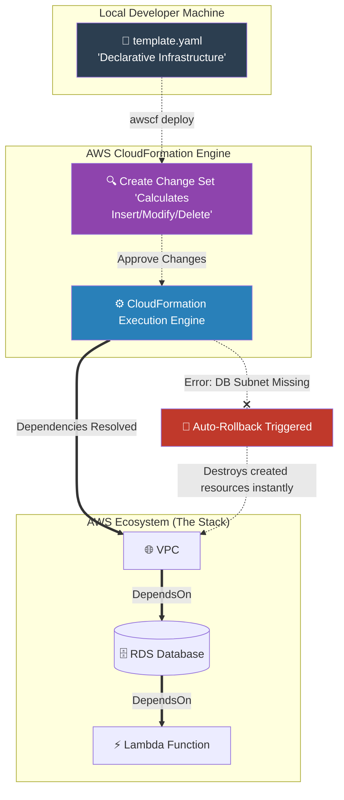

# 🚀 AWS Interview Cheat Sheet: AWS CLOUDFORMATION (Q583–Q606)

*This master reference sheet marks Phase 10: Infrastructure as Code (IaC), covering AWS CloudFormation templates, drift detection, and advanced stack troubleshooting mechanics.*

---

## 📊 The Master IaC Deployment Architecture



---

## 5️⃣8️⃣3️⃣ & Q591: What is AWS CloudFormation?
- **Short Answer:** AWS CloudFormation is a declarative Infrastructure as Code (IaC) service. Instead of manually clicking through the AWS Console, you author a JSON or YAML file completely defining your architecture (VPCs, EC2s, Security Groups). CloudFormation reads the file, calculates the exact mathematical dependency order, and builds the entire environment autonomously. 

## 5️⃣9️⃣2️⃣ & Q596: How do you integrate CloudFormation with CI/CD?
- **Short Answer:** Instead of manually uploading templates, an Architect integrates CloudFormation strictly into **AWS CodePipeline**. When a developer commits a change to the `template.yaml` in GitHub, AWS CodeBuild automatically runs `cfn-lint` to syntax-check the file, and then CodeDeploy mechanically triggers CloudFormation to execute a "Change Set" directly against the production environment.

## 5️⃣9️⃣4️⃣ Q594: How can you use CloudFormation to manage complex application configurations?
- **Short Answer:** Utilizing **Nested Stacks**. If you have a massive monolithic template with 600 resources, you mathematically break it down into modular templates (e.g., `vpc.yaml`, `database.yaml`, `security.yaml`). You then create a single Master Stack that explicitly calls those individual templates as nested resources, massively increasing reusability.

## 5️⃣9️⃣5️⃣ Q595: How do you manage AWS resources in multiple regions using CloudFormation?
- **Short Answer:** *CRITICAL ARCHITECTURAL TERM:* **AWS CloudFormation StackSets.**
- **Interview Edge:** *"The drafted answer claims you simply deploy separate stacks. The true enterprise answer is using **StackSets**. A StackSet allows a Lead Architect to deploy exactly one single CloudFormation template simultaneously across 15 different AWS Regions and 50 different AWS Accounts with a single API call, guaranteeing perfect baseline standardization for global enterprise infrastructure."*

## 5️⃣9️⃣8️⃣ & Q588 & Q600: How do you troubleshoot failed stack creations and updates?
- **Short Answer:** CloudFormation operates natively under ACID principles. If a stack has 50 resources, and resource #49 fails to create (e.g., due to an IAM permission error), CloudFormation legally enforces a **Rollback**. It automatically and safely destroys all 48 previously created resources to aggressively prevent "orphaned" or partial infrastructure. You troubleshoot by investigating the `Events` tab in the CFN Console to locate the exact logical ID that triggered the red `CREATE_FAILED` status.

## 6️⃣0️⃣1️⃣ Q601: What steps do you take to troubleshoot a stack stuck in UPDATE_ROLLBACK_FAILED?
- **Short Answer:** This is one of the most terrifying states in AWS. It means the stack failed to update, tried to automatically roll back, and mathematically failed to roll back! (Usually because someone manually deleted a security group by hand in the console instead of using code). 
- **Interview Edge:** *"To unstuck a stack in `UPDATE_ROLLBACK_FAILED`, you must execute the **ContinueUpdateRollback** API command and explicitly physically type in the Logical ID of the broken resource to "Skip" it. This mathematically forces CloudFormation to ignore the broken resource and finish rolling back the rest of the application so the stack becomes usable again."*

## 5️⃣9️⃣9️⃣ Q599: How do you handle a stack deletion that is stuck in progress?
- **Short Answer:** Usually caused by a massive resource (like an RDS database or an S3 bucket with millions of objects) timing out. To force the deletion of the stack, you re-execute the Stack Delete command but specify the failing resource to be **Retained**. This legally allows the CloudFormation stack to successfully delete itself from the console, leaving the stubborn S3 bucket behind for manual deletion later.

## 6️⃣0️⃣2️⃣ Q602: How can you troubleshoot a CloudFormation stack drift detection that is failing?
- **Short Answer:** **Drift Detection** mathematically compares the physical reality of the AWS account against the YAML template. If someone manually opens SG Port 22 in the AWS Console, the stack officially registers as "Drifted". If Drift Detection fails, it is almost exclusively because the specific resource type (e.g., some obscure API Gateway V2 setting) is not natively supported by the CloudFormation Drift mathematical engine yet.

---
## 💡 Essential CloudFormation YAML Syntax Examples (Q603–Q606)

*Note: For interviews, you do not need to memorize exact YAML syntax, but you MUST know the core properties required to boot a resource.*

### Q603: EC2 Instance YAML
You must specify the `InstanceType` and the `ImageId` (AMI).
```yaml
Resources:
  MyWebServer:
    Type: AWS::EC2::Instance
    Properties:
      InstanceType: t3.micro
      ImageId: ami-0abcdef1234567890
      SubnetId: subnet-123456
```

### Q604: S3 Bucket YAML
**Security Override Note:** In 2026, granting `AccessControl: PublicRead` directly in CloudFormation will mechanically fail in almost all enterprise AWS accounts due to the global "S3 Block Public Access" security enforcement.
```yaml
Resources:
  MyDataBucket:
    Type: AWS::S3::Bucket
    Properties:
      BucketName: my-company-internal-data-bucket
```

### Q605: AWS Lambda YAML
You must specify the `Runtime`, `Timeout`, `Handler`, and the `Role` (IAM Execution Role ARN).
```yaml
Resources:
  MyLambdaFunction:
    Type: AWS::Lambda::Function
    Properties:
      FunctionName: DataProcessor
      Handler: index.handler
      Runtime: python3.11
      Role: arn:aws:iam::123456:role/LambdaBasic
      Code:
        S3Bucket: my-code-bucket
        S3Key: function.zip
```

### Q606: RDS Database YAML
You must specify the `Engine` (e.g., mysql), the `DBInstanceClass` size, and the `MasterUsername`. 
*Architect Note: Passwords should NEVER be hardcoded in YAML; they should mathematically pull dynamically from AWS Secrets Manager using dynamic references.*
```yaml
Resources:
  MyDatabase:
    Type: AWS::RDS::DBInstance
    Properties:
      Engine: postgres
      DBInstanceClass: db.t3.micro
      AllocatedStorage: 20
      MasterUsername: postgresadmin
```
