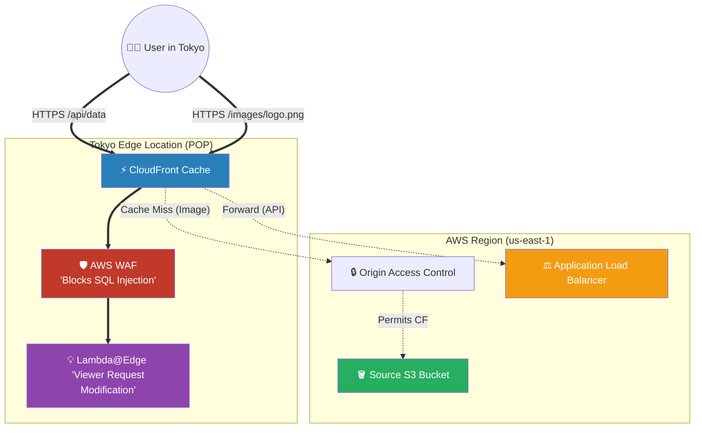

# 🚀 AWS Interview Cheat Sheet: AMAZON CLOUDFRONT (Q630–Q675)

*This master reference sheet covers Amazon CloudFront comprehensively, detailing all 26 edge delivery, streaming, caching, and troubleshooting questions.*

---

## 📊 The Master CloudFront Distribution Architecture

---

## 6️⃣3️⃣0️⃣ Q630: Can you provide an example scenario where CloudFront can be useful?
- **Short Answer:** A global web application hosted out of a single S3 Bucket in Virginia. By placing CloudFront in front, a user in Tokyo doesn't physically request the image from Virginia (which takes 200ms). Instead, they fetch the image from the Tokyo Edge Cache (taking 15ms), drastically improving the load speed of the application.

## 6️⃣3️⃣1️⃣ & Q670: How can CloudFront be used to improve the security of a web application?
- **Short Answer:** 
  1) **AWS WAF:** CloudFront natively runs AWS Web Application Firewall directly at the Edge. You can block SQL injection or malicious IP addresses globally before the payload ever reaches your EC2 servers.
  2) **DDoS Protection:** Because CloudFront uses AWS's massive global network, it automatically absorbs massive SYN Flood attacks natively via AWS Shield Standard.

## 6️⃣3️⃣2️⃣ & Q645: How can CloudFront be used for media and video streaming?
- **Short Answer:** CloudFront elegantly supports highly performant real-time streaming protocols like HTTP Live Streaming (HLS), Dynamic Adaptive Streaming over HTTP (DASH), and Microsoft Smooth Streaming. 
- **Production Scenario:** Architects seamlessly integrate CloudFront directly with **AWS Elemental MediaPackage** to securely broadcast live sporting events natively to millions of global viewers simultaneously.

## 6️⃣3️⃣3️⃣ & Q641: How can CloudFront be used to reduce the load on an origin server and reduce costs?
- **Short Answer:** Without a CDN, every user globally forces the central origin server to process requests and pay heavy Internet Egress Data Transfer fees. CloudFront heavily caches static assets physically at 400+ Edge Locations. The origin mathematically never sees these requests, brutally slashing EC2 CPU load and drastically reducing AWS Egress data costs.

## 6️⃣3️⃣4️⃣ & Q646: How can CloudFront be used to improve the performance of APIs or Dynamic Content?
- **Short Answer:** Even if your API data cannot be cached (e.g., live stock prices), routing dynamic traffic through CloudFront is massively beneficial. The HTTP packets enter the AWS backbone network directly at the local Edge Location in Tokyo and ride the uncongested, fiber-optic AWS private backbone straight to Virginia, bypassing the jittery public internet.

## 6️⃣3️⃣5️⃣ & Q648: How does CloudFront work with SSL certificates?
- **Short Answer:** CloudFront handles SSL/TLS termination at the Edge to encrypt traffic seamlessly. 
- **Interview Edge:** *"This is a strictly enforced architectural trap. Because CloudFront is a global service managed out of Virginia, any Amazon Certificate Manager (ACM) certificate utilized for CloudFront MUST mathematically be deployed strictly inside the **`us-east-1` (N. Virginia)** region, regardless of where your backend EC2 servers live!"*

## 6️⃣3️⃣6️⃣ Q636: How can CloudFront be used with Lambda@Edge?
- **Short Answer:** Lambda@Edge allows you to physically deploy Node.js or Python code directly into the 400+ Edge Locations globally. It intercepts the HTTP request *before* it hits the cache, allowing you to rewrite HTTP Headers dynamically, implement A/B testing, or decode a JWT authentication token precisely at the Edge.

## 6️⃣3️⃣7️⃣ Q637: How can CloudFront be used with Origin Groups?
- **Short Answer:** Origin Groups theoretically provide **High-Availability Active/Passive Failover**. You attach a Primary S3 bucket (in Virginia) and a Secondary S3 bucket (in Ireland) perfectly into an Origin Group. If the Virginia bucket throws an `HTTP 503` or timeouts, the CloudFront Edge Location instantaneously logically retries the exact same request automatically against the Ireland bucket invisibly to the user.

## 6️⃣3️⃣8️⃣ Q638: How can CloudFront be used to serve content from multiple origins?
- **Short Answer:** By architecting **Cache Behaviors** within a single distribution. You configure the `/*` default Cache Behavior to dynamically route all `.jpg` files to an S3 Bucket, while simultaneously configuring a secondary Cache Behavior matching `/api/*` to bypass caching entirely and forward traffic dynamically directly to an Application Load Balancer.

## 6️⃣3️⃣9️⃣ & Q649: How can CloudFront reduce latency for Mobile Devices?
- **Short Answer:** By utilizing CloudFront's **Device Detection** HTTP headers (e.g., `CloudFront-Is-Mobile-Viewer`). CloudFront mathematically senses the device type and dynamically routes the request to an origin server structured specifically to dispense lightweight, compressed images strictly for mobile viewports.

## 6️⃣4️⃣0️⃣ & Q644: Can CloudFront be used for website hosting with Custom Domains?
- **Short Answer:** Absolutely. You use CloudFront as the global frontend to securely host an S3 Static Website. You map a Route 53 CNAME/Alias record precisely to the CloudFront Distribution ID and attach your `us-east-1` ACM certificate to use your custom `www.example.com` domain.

## 6️⃣4️⃣2️⃣ Q642: Can CloudFront be used to deliver content securely across multiple regions?
- **Short Answer:** CloudFront is inherently a global security boundary. It enforces modern TLS 1.3 encryption explicitly from the Viewer to the Edge Location, and fundamentally maintains a secondary TLS encrypted tunnel directly from the Edge Location strictly down to the Origin Server.

## 6️⃣4️⃣3️⃣ Q643: How does CloudFront integrate with other AWS services?
- **Short Answer:** Natively integrates globally as the frontend CDN for Amazon S3, Amazon EC2, Application Load Balancers, API Gateway, and AWS Elemental MediaStore.

## 6️⃣4️⃣7️⃣ Q647: How can CloudFront be used to improve website performance for global users?
- **Short Answer:** CloudFront caches content mathematically locally at Edge Locations physically located in major cities worldwide, aggressively bypassing international public internet hops.

## 6️⃣7️⃣1️⃣ Q671: What are some common issues that can occur with CloudFront?
- **Short Answer:** The single most common access control issue is verifying the S3 Bucket strictly trusts CloudFront mechanically while aggressively blocking the public internet.
- **Interview Edge:** *"Historically, Architects locked down S3 buckets utilizing an **Origin Access Identity (OAI)**. However, AWS officially deprecated OAI. A modern Lead Architect explicitly implements **Origin Access Control (OAC)**. OAC natively supports AWS KMS-encrypted S3 buckets, whereas legacy OAI violently failed when interacting with heavily encrypted objects."*

## 6️⃣7️⃣2️⃣ Q672: How can CloudFront cache behavior be tuned?
- **Short Answer:** Instead of manipulating messy legacy HTTP `Cache-Control` TTL headers at the web application layer, modern CloudFront explicitly utilizes **Cache Policies**. A Cache Policy strictly mandates exactly which specific Query Strings (e.g., `?user_id=123`) or Cookies are mathematically mathematically factored into generating the unique Cache Key.

## 6️⃣7️⃣3️⃣ Q673: How can CloudFront SSL/TLS certificate errors be diagnosed and resolved?
- **Short Answer:** 
  1) Verify the ACM certificate physically resides exclusively in `us-east-1`.
  2) Ensure the certificate physically covers the exact domain (or wildcard) you are utilizing in Route 53 (e.g. `*.example.com`).
  3) Verify the Origin Server possesses a valid, strictly non-expired certificate (CloudFront will brutally throw an HTTP 502 Bad Gateway if the EC2 backend certificate has expired).

## 6️⃣7️⃣4️⃣ & Q675: How are Access Logs used for resolving performance issues?
- **Short Answer:** Standard CloudFront Access Logs stream globally directly into a centralized Amazon S3 Bucket in `.gz` format. For advanced enterprise troubleshooting, Architects launch **Amazon Athena** to seamlessly execute standard SQL queries directly against the compressed S3 logs logically to mathematically isolate precisely which Edge Location is radically experiencing high `x-edge-result-type` MISS ratios or unexpected `5xx` Origin Errors.
