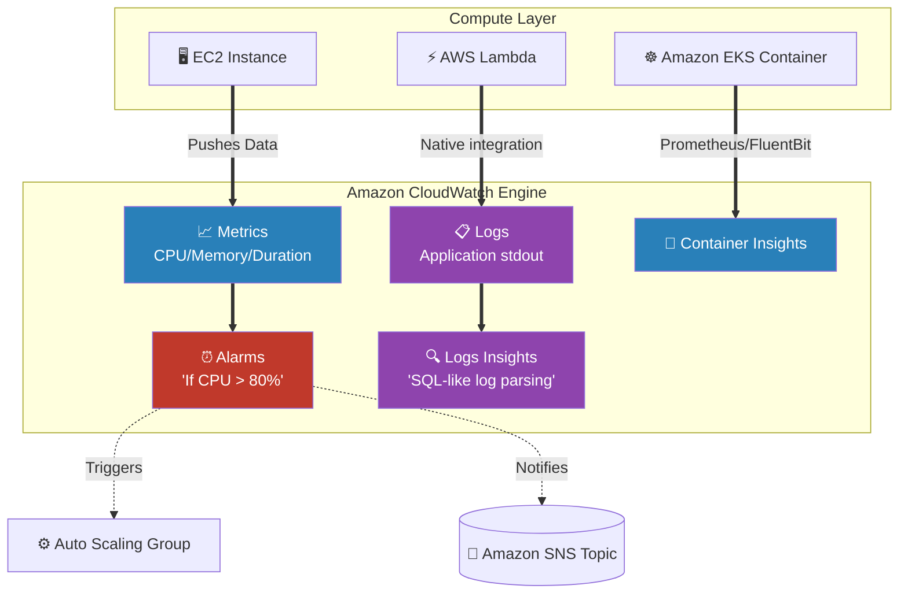

# 🚀 AWS Interview Cheat Sheet: AMAZON CLOUDWATCH (Q690–Q700)

*This master reference sheet begins Phase 13: Monitoring & Operations, focusing exclusively on Amazon CloudWatch—the neurological center of AWS observability.*

---

## 📊 The Master AWS Observability Architecture

---

## 6️⃣9️⃣0️⃣ & Q691: What is Amazon CloudWatch and what are Metrics?
- **Short Answer:** Amazon CloudWatch is the centralized operational monitoring service for the entire AWS ecosystem. 
- **Metrics:** A time-ordered set of numerical data points. By default, AWS services natively push Standard Metrics (CPU, Disk I/O, Network In/Out) to CloudWatch exactly every 5 minutes. (Architects can enable **Detailed Monitoring** to force 1-minute granularity).

## 6️⃣9️⃣8️⃣ Q698: What is the exact difference between CloudWatch Logs and CloudTrail logs?
- **Short Answer:** *This is one of the most repeatedly asked questions in an AWS Interview.*
- **Interview Edge:** 
  - **CloudWatch** is strictly for **Performance and Application Observability**. It asks: *"Is the server CPU spiking? What did the Java application output to the console?"*
  - **AWS CloudTrail** is strictly for **Governance and Security Auditing**. It asks: *"Which specific IAM User physically executed the API command to delete the production database at 3:14 AM?"*

## 6️⃣9️⃣2️⃣ & Q694: What are CloudWatch Logs and CloudWatch Logs Insights?
- **Short Answer:** 
  - **CloudWatch Logs:** Collects the raw text output (stdout/stderr) from your applications. For example, every single `print()` statement in an AWS Lambda function lands instantly in a CloudWatch Log Group.
  - **Logs Insights:** If you have 50 GB of gigabyte text logs from yesterday, you physically cannot read them manually. Logs Insights provides a highly advanced, SQL-like querying language allowing an Architect to dynamically search, filter via Regex, and mathematically aggregate massive amounts of log data in seconds (e.g., finding the top 10 IP addresses producing HTTP 500 errors).

## 6️⃣9️⃣3️⃣ Q693: How can CloudWatch alarms be used to monitor resources?
- **Short Answer:** You physically bind an Alarm algorithmically to a Metric. If the specific Metric crosses a strict threshold (e.g., `CPU > 80% for 3 consecutive 1-minute periods`), the Alarm changes state from `OK` to `ALARM`.
- **Architectural Action:** The alarm systematically dispatches a notification entirely automatically (via Amazon SNS to email/Slack) or aggressively triggers a physical automated action (like destroying an EC2 instance or triggering an Auto Scaling Group scale-out).

## 6️⃣9️⃣5️⃣ Q695: What is CloudWatch Container Insights?
- **Short Answer:** EC2 metrics are simple, but managing Kubernetes (EKS) or Docker (ECS) involves hundreds of ephemeral, microscopic pods spinning up and dying constantly. **Container Insights** natively aggregates CPU, memory, and network metrics specifically at the Microservice cluster, node, pod, and container levels directly into automated dashboard visualizations.

## 6️⃣9️⃣6️⃣ & Q697: How is CloudWatch used for Cost Optimization and Troubleshooting?
- **Short Answer:** 
  1) **Cost Optimization:** An Architect utilizes CloudWatch metrics to locate EC2 instances that mathematically have exactly `0%` CPU utilization over a 14-day trailing period, proving they are completely idle "zombie" servers wasting budget.
  2) **Performance Tuning:** Correlating application slowness with the exact second a database's **ReadIOPS** metric flat-lines, directly proving that the application needs a Redis caching layer to survive the traffic load.

## 6️⃣9️⃣9️⃣ Q699: How can CloudWatch be used for security monitoring?
- **Short Answer:** While CloudTrail audits the APIs, CloudWatch directly monitors the network. You can configure VPC Flow Logs to physically stream directly into a CloudWatch Log Group. You then construct a **Metric Filter** to algorithmically parse the network logs in real-time. If the filter mathematically detects more than 100 `REJECT` packets (indicating an active port-scanning hacking attempt), it triggers a CloudWatch Alarm to lock down the subnet.

## 7️⃣0️⃣0️⃣ Q700: How can CloudWatch be used with AWS Lambda functions?
- **Short Answer:** Serverless architecture explicitly relies entirely on CloudWatch because you have exactly zero access to the underlying hardware. CloudWatch automatically tracks three fundamental Lambda metrics: **Invocations** (How many times it ran), **Duration** (How many milliseconds it took, which dictates your AWS bill), and **Errors** (If the code crashed). Alarms are constructed to alert developers precisely when Lambda function performance degrades below designated thresholds.
