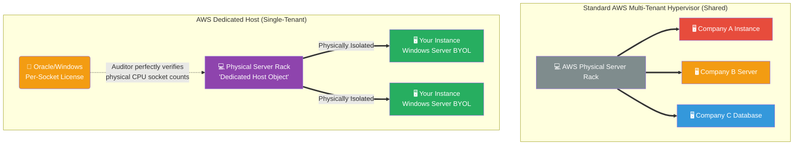

# 🚀 AWS Interview Cheat Sheet: EC2 DEDICATED HOSTS (Q375–Q384)

*This master reference sheet covers EC2 Dedicated Hosts—the physical hardware compliance tier designed explicitly to satisfy extreme physical isolation requirements and ruthless enterprise software licensing audits.*

---

## 📊 The Master Dedicated Host Compliance Architecture

---

## 3️⃣7️⃣5️⃣ Q375: What is an EC2 Dedicated Host?
- **Short Answer:** A Dedicated Host is an entire, physical AWS server rack strictly allocated for your singular AWS account to use. Instead of virtual machines organically floating around shared hypervisors alongside other AWS customers, you legally rent the underlying bare-metal hardware and drop your private EC2 instances directly onto it.

## 3️⃣7️⃣6️⃣ Q376: What are the benefits of using EC2 Dedicated Hosts?
- **Short Answer:** 
  1) **BYOL (Bring Your Own License):** The absolute primary use case. Legacy enterprise software (like classic Windows Server, Oracle, or SQL Server) is notoriously licensed strictly by the number of physical CPU sockets. On a shared cloud, you cannot count physical sockets. A Dedicated Host provides absolute visibility into the physical hardware, allowing you to legally use your existing licenses and save millions of dollars instantly.
  2) **Extreme Compliance:** Completely satisfies paranoid government or medical clients who legally mandate that their data absolutely cannot process on a silicon chip currently running code for a different company.

## 3️⃣7️⃣7️⃣ Q377: Can you launch different instance types on an EC2 Dedicated Host?
- **Short Answer:** Historically no, but functionally yes on modern hardware. If the physical Dedicated Host utilizes the AWS Nitro System architecture, you can actively launch multiple differently sized instance types (e.g., `m5.large` alongside `m5.4xlarge`) on that exact same physical host simultaneously, as long as they belong strictly to the same physical Instance Family (`m5`).

## 3️⃣7️⃣8️⃣ Q378: Can you launch different sizes of instances on an EC2 Dedicated Host?
- **Short Answer:** Yes. AWS officially added support for *heterogeneous instance sizing* on Nitro-based Dedicated Hosts. You can mix and match instance sizes, provided the total sum of their vCPUs mathematically does not exceed the underlying physical core capacity of the metal server.

## 3️⃣7️⃣9️⃣ Q379: Can you launch instances from different regions on an EC2 Dedicated Host?
- **Short Answer:** No. Because a Dedicated Host is fundamentally a physical rack of metal bolted into a structural floor, it is rigidly tied to a specific AWS Region and a specific Availability Zone (AZ). 

## 3️⃣8️⃣0️⃣ Q380: Can you launch instances from different accounts on an EC2 Dedicated Host?
- **Short Answer:** A single Dedicated Host physically belongs to a single AWS account. However, you can elegantly use **AWS Resource Access Manager (RAM)** to legally share that physical Dedicated Host out to other Spoke AWS Accounts within your central AWS Organization. 

## 3️⃣8️⃣1️⃣ Q381: How can you monitor your EC2 Dedicated Host usage?
- **Short Answer:** You utilize Amazon CloudWatch to track host utilization (how many vCPUs are actively consumed vs sitting idle). AWS AWS dynamically generates `DedicatedHostId` metrics so you can analytically track the exact hardware saturation to ensure you aren't paying for a massive empty server.

## 3️⃣8️⃣2️⃣ Q382: What is the difference between a Dedicated Host Reservation and a Standard Reserved Instance?
- **Short Answer:** 
  1) A **Standard Reserved Instance** applies a massive financial discount to a specific virtual machine type (e.g., one virtual `m5.large`).
  2) A **Dedicated Host Reservation** applies a massive financial discount specifically to the *entire underlying physical server rack* regardless of how many (or how few) nested virtual machines you actually slice it up into.

## 3️⃣8️⃣3️⃣ Q383: Can you use EC2 Dedicated Hosts with other pricing models?
- **Short Answer:** You can legally utilize On-Demand pricing natively on the host, and you can absolutely apply AWS Savings Plans to it.
- ***CRITICAL ARCHITECTURAL CORRECTION:* ** *Note: The originally drafted answer states you can use Spot instances on a Dedicated Host. This is a fatal FinOps software error.* You **cannot** run Spot Instances on a Dedicated Host. AWS Spot relies strictly on AWS aggressively liquidating *shared* multi-tenant capacity. AWS mathematically forbids provisioning volatile Spot capacity onto an isolated Single-Tenant Dedicated Host.
- **Interview Edge:** *"If an interviewer attempts to mix Spot architecture with Dedicated physical hardware, explicitly shut it down. They are perfectly mutually exclusive."*

## 3️⃣8️⃣4️⃣ Q384: How can you optimize the use of EC2 Dedicated Hosts?
- **Short Answer:** The cardinal sin of a Dedicated Host is leaving it empty. Because you pay the exact same enormous hourly flat rate for the physical hardware whether it hosts 0 instances or 100 instances, optimization relies completely on utilizing **AWS License Manager** to automatically tightly pack as many virtual servers onto the metal host as mathematically possible before provisioning a second empty host.
