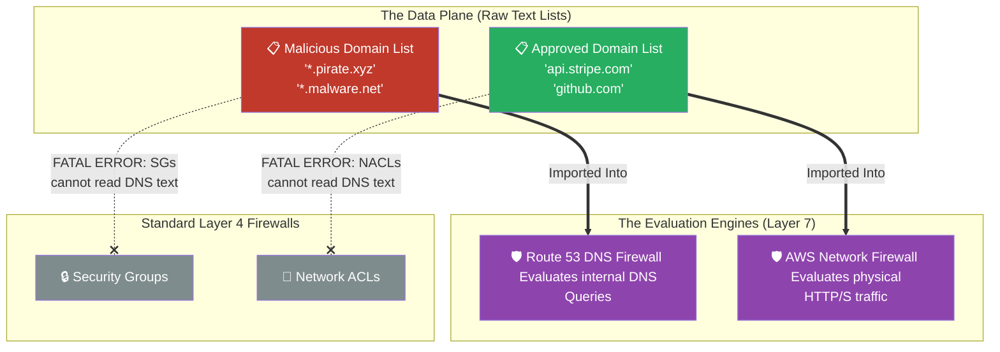

# 🚀 AWS Interview Cheat Sheet: DOMAIN LISTS (Q213–Q222)

*This master reference sheet covers "Domain Lists", essentially the raw text files containing the URLs (FQDNs) that power higher-level security features like the Route 53 DNS Firewall and AWS Network Firewall.*

---

## 📊 The Master Domain List (WAF / Network Firewall) Architecture

---

## 2️⃣1️⃣3️⃣ Q213: What are Domain Lists in AWS?
- **Short Answer:** Domain Lists are foundational data arrays (often maintained via AWS Firewall Manager) containing collections of Fully Qualified Domain Names (e.g., `amazonaws.com`, `*.hacker.ru`). These lists are the core building blocks injected into deeper security engines like Route 53 DNS Firewalls, AWS WAF, or AWS Network Firewalls to facilitate Layer 7 routing intelligence.
- **Production Scenario:** A SecOps engineer maintains a `.txt` file containing 5,000 known ransomware URLs. Instead of manually updating 50 different firewalls, they upload the text file as an AWS Domain List, dynamically propagating the threat signatures across the entire AWS Organization.
- **Interview Edge:** *"A Domain List itself does absolutely nothing. Think of it like a magazine containing bullets. It has no stopping power until you physically load it into a 'weapon'—like the DNS Firewall or AWS Network Firewall."*

## 2️⃣1️⃣4️⃣ Q214: Can you use Domain Lists to block access to known malicious domains?
- **Short Answer:** Yes. You create a Domain List containing the malicious `.com` addresses and apply that list to a Layer 7 evaluation engine like AWS Network Firewall or DNS Firewall.
- ***CRITICAL ARCHITECTURAL CORRECTION:* ** *Note: The original answer mentions applying lists to Security Groups and NACLs. This is mathematically impossible.* **Security Groups and Network ACLs operate fiercely at Layer 4 (Network/Transport). They ONLY understand raw IPv4/IPv6 address numbers.** They are permanently blind to textual Domain Names. You *must* apply Domain Lists exclusively to Layer 7 firewalls (DNS Firewall, AWS WAF, Network Firewall).
- **Interview Edge:** *"If an interviewer asks how you add a Domain Name to a Security Group, it is a trap. You explicitly state: 'You cannot. SGs and NACLs strictly process raw IP CIDR blocks. If I need to block a Domain Name, I must elevate the architecture to AWS Network Firewall.'"*

## 2️⃣1️⃣5️⃣ Q215: Can you use Domain Lists to allow access to specific domains only?
- **Short Answer:** Yes. By injecting a Domain List containing strictly approved domains into an AWS Network Firewall and setting a blanket `DENY *` rule beneath it, you create an impenetrable Walled Garden.
- **Production Scenario:** A fleet of PCI-compliant EC2 servers requires internet egress to process credit cards via `api.stripe.com`. Because Stripe's actual IP addresses violently change every few minutes via their CDN, the Architect cannot use a static Security Group. Instead, the Architect uses a Domain List loaded into AWS Network Firewall allowing purely `api.stripe.com`, ensuring unbreakable egress compliance despite the fluctuating IP addresses.
- **Interview Edge:** *"This is the primary enterprise use-case for Domain Lists: securing outbound connections to dynamic 3rd-party SaaS APIs whose underlying IP addresses mutate constantly."*

## 2️⃣1️⃣6️⃣ Q216: How can you create a Domain List in AWS?
- **Short Answer:** Open the VPC Console -> Navigate to **DNS Firewall** or **AWS Network Firewall** -> Click **Domain Lists** -> Click **Add domain list**. You can either manually paste the domains, upload a bulk text file (`.txt`), or utilize an auto-updating AWS Managed Domain List.
- **Production Scenario:** Writing a Python Lambda function that organically syncs an open-source Threat Intelligence Feed every 2 hours, aggressively updating the Domain List text automatically via the `UpdateFirewallDomains` API call.

## 2️⃣1️⃣7️⃣ Q217: Can you use Domain Lists to block traffic from specific IP addresses?
- **Short Answer:** No. Domain Lists are strictly built for parsing structural Layer 7 URLs (e.g., `www.example.com`) and wildcard strings (`*.example.com`). They explicitly do not parse raw IP addresses (`192.168.1.1`).

## 2️⃣1️⃣8️⃣ Q218: Can you use Domain Lists to block traffic to specific IP addresses?
- **Short Answer:** No. Again, the purpose of a Domain List is strictly URL evaluation. If an application attempts a raw IP routing connection to an external address, a Domain List is entirely blind to it.

## 2️⃣1️⃣9️⃣ Q219: Can you use Domain Lists to block traffic to specific ports?
- **Short Answer:** No. Domains are textual routing mappings. Port mappings (e.g., Port 22, Port 80, Port 443) are Layer 4 TCP/UDP constructs managed directly by SGs, NACLs, or stateful rules inside the Network Firewall.

## 2️⃣2️⃣0️⃣ Q220: Can you use Domain Lists to block traffic between VPCs?
- **Short Answer:** No. VPC-to-VPC lateral traffic (via Transit Gateways or Peering) relies structurally on raw subnet Route Tables and Security Group IP evaluations. Domain Lists are overwhelmingly utilized for egress internet traffic or inbound WAF filtering, not lateral local traffic.

## 2️⃣2️⃣1️⃣ Q221: Can you apply a Domain List to multiple Amazon VPCs?
- **Short Answer:** Yes, flawlessly, by utilizing **AWS Firewall Manager**.
- **Production Scenario:** AWS Firewall Manager acts as the orchestrator. You create a unified Security Policy at the AWS Organizations root, attach the single master Domain List to it, and AWS natively injects the rule infrastructure simultaneously into all 5,000 sub-VPCs owned by the corporate entity.
- **Interview Edge:** *"Without AWS Firewall Manager, applying a Domain List to 50 VPCs would require 50 independent, fragile manual configuration acts. Firewall Manager enforces 'Configuration as Code' governance dynamically at scale."*

## 2️⃣2️⃣2️⃣ Q222: How can you monitor the traffic blocked by Domain Lists?
- **Short Answer:** You monitor this via the logging configurations of the engine *hosting* the Domain List. If the list is loaded into AWS Network Firewall, you enable **Network Firewall Alert Logs** to CloudWatch. If loaded into DNS Firewall, you review **Route 53 Resolver Query Logs**.
- **Production Scenario:** Piping Network Firewall logs natively into Amazon Kinesis, which dumps the massive JSON payloads into an S3 bucket for long-term audit storage and Amazon Athena SQL analytics.
- **Interview Edge:** *"Because a Domain List is just a passive object, it generates zero logs itself. You fundamentally trace the metrics created by the active firewall executing the list."*
