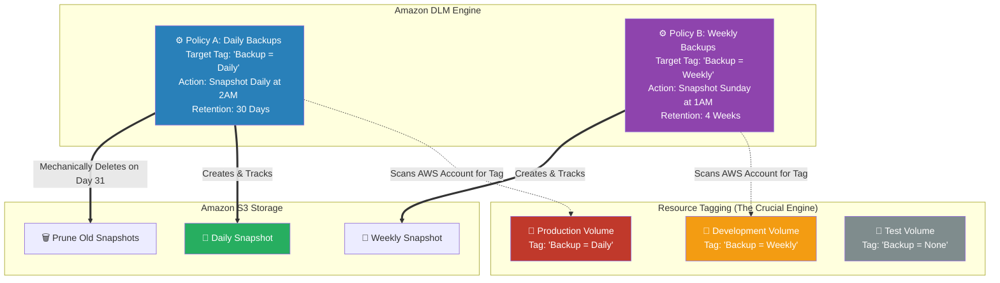

# 🚀 AWS Interview Cheat Sheet: EBS LIFECYCLE MANAGER (Q473–Q478)

*This master reference sheet covers Amazon Data Lifecycle Manager (DLM)—the native automation engine ensuring continuous EBS snapshot compliance without requiring manual infrastructure scripts.*

---

## 📊 The Master Data Lifecycle Manager (DLM) Architecture

---

## 4️⃣7️⃣3️⃣ Q473: What is the Elastic Block Store (EBS) Lifecycle Manager?
- **Short Answer:** It is officially named **Amazon Data Lifecycle Manager (Amazon DLM)**. DLM is a fully managed AWS service that programmatically automates the creation, retention (storage timeline), and mechanical deletion of EBS snapshots entirely based on predefined automation schedules to satisfy extreme disaster recovery (DR) and compliance mandates.
- **Production Scenario:** A hospital compliance law mandates that database backups must be retained exactly for 7 years and then legally destroyed. A DevOps engineer configures an Amazon DLM policy to natively take the snapshot daily and mathematically wipe it from the S3 backend on exactly day 2,555 to prevent compliance violations.

## 4️⃣7️⃣4️⃣ Q474: How can you troubleshoot an issue with the EBS Lifecycle Manager that is not creating snapshots according to your policy?
- **Short Answer:** 
  1) **Resource Tag Mismatches:** DLM strictly operates using Target Tags. If the Policy targets Volumes tagged `Env:Prod`, but the developer misspelled the tag as `env:prod` (lowercase), DLM structurally ignores the volume.
  2) **IAM Execution Roles:** The absolute most common failure. DLM requires a specific IAM Role computationally assigned to the policy granting precisely the `ec2:CreateSnapshot` permission. If that role lacks permissions, the automated cron job silently fails in the background.

## 4️⃣7️⃣5️⃣ Q475: How can you set up a policy in the EBS Lifecycle Manager to create snapshots at regular intervals?
- **Short Answer:** You map out an explicit DLM Schedule. You program a cron-like interval (e.g., Every 12 hours starting at 02:00 UTC), define precisely how many copies to financially retain (e.g., retain exactly 30 snapshots—when snapshot 31 is physically created, DLM mechanically deletes snapshot 1 to save S3 storage costs), and aggressively target the Resource Tags to apply the policy.

## 4️⃣7️⃣6️⃣ Q476: Can you apply different policies to different volumes using the EBS Lifecycle Manager?
- **Short Answer:** Yes, entirely utilizing the **Target Tags** architecture.
- **Interview Edge:** *"This is a classic 'separation of concerns' architectural question. You absolutely do not create one massive DLM policy for everything. You create a 'Tier-1-Platinum' DLM policy that targets the tag `BackupLevel: Platinum` for 1-hour intervals on Production databases, and a completely separate 'Tier-3-Bronze' policy for 1-week intervals targeting Dev servers."*

## 4️⃣7️⃣7️⃣ Q477: How can you troubleshoot an issue with the EBS Lifecycle Manager that is causing snapshots to be deleted prematurely?
- **Short Answer:** Premature deletion structurally only happens if the **Retention Rule** is fatally misconfigured. If the DLM policy is explicitly programmed to "Retain 7 Snapshots", but it is taking a snapshot *every single hour*, the snapshot created at 8:00 AM will mechanically be destroyed at 3:00 PM on the exact same day. You must recalculate the retention math.

## 4️⃣7️⃣8️⃣ Q478: Can you use the EBS Lifecycle Manager to create a snapshot of a specific file or directory on an EBS volume?
- **Short Answer:** **Absolutely not.** 
- **Interview Edge:** *"This is a massive logic trap. EBS inherently is **Block Storage**, not File Storage. The Data Lifecycle Manager has absolutely zero visibility into the Windows NTFS or Linux EXT4 file system structure inside the virtual machine. It can only blindly physically snapshot the underlying 1s and 0s of the raw block volume. If you need File-Level backup granularity, you must abandon EBS and utilize **Amazon EFS** or **Amazon FSx** natively."*
