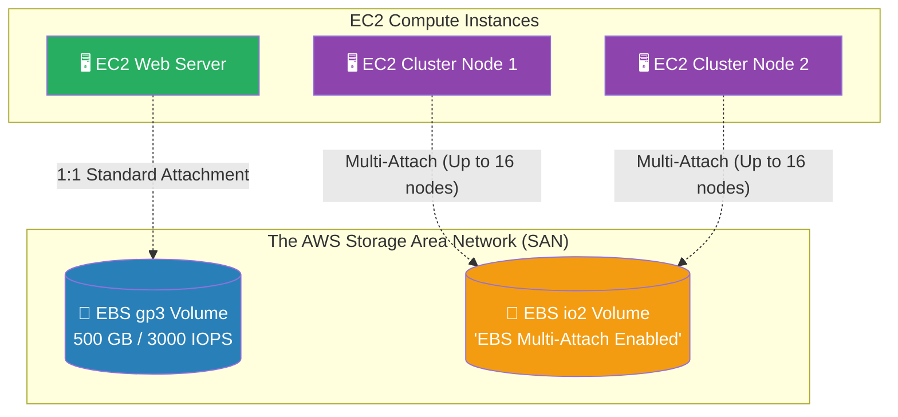

# 🚀 AWS Interview Cheat Sheet: ELASTIC BLOCK STORE (EBS) (Q451–Q465)

*This master reference sheet marks the beginning of AWS Storage, covering the foundational architecture of Amazon EBS—the highly durable, block-level Storage Area Network (SAN) physically attached to EC2 compute.*

---

## 📊 The Master EBS Volume Architecture

---

## 4️⃣5️⃣1️⃣ & Q459: What is Elastic Block Store (EBS) in AWS?
- **Short Answer:** Amazon EBS provides highly available, persistent, block-level cloud storage specifically designed to be attached as hard drives to Amazon EC2 virtual machines. The data strictly survives outside the lifecycle of the EC2 instance.
- **Interview Edge:** *"To prove architectural mastery, note that EBS operates strictly within a single Availability Zone (AZ). Because it is essentially a high-speed fiber-optic SAN cable, the storage must mechanically exist in the exact same physical datacenter facility as the EC2 compute instance it attaches to."*

## 4️⃣5️⃣2️⃣ & Q460: Can you increase the size of an EBS volume while an instance is running?
- **Short Answer:** **Yes, definitively with Zero Downtime.**
- ***CRITICAL ARCHITECTURAL CORRECTION:* ** *Note: The originally drafted answer for Q460 states "the instance must be stopped to do so". This is totally false.* Using the **Amazon EBS Elastic Volumes** feature, you can dynamically increase volume size, heavily increase IOPS performance, or even completely change the Volume Type (e.g., from legacy `gp2` to modern `gp3`) entirely on-the-fly without ever stopping or even rebooting the live Linux/Windows production instance.

## 4️⃣5️⃣4️⃣ Q454: Can you attach an EBS volume to multiple EC2 instances simultaneously?
- **Short Answer:** *CRITICAL ARCHITECTURAL CORRECTION:* **YES, using EBS Multi-Attach.**
- **Interview Edge:** *"The drafted answer claims you cannot do this. Historically, this was true. Today, it is absolutely false. AWS specifically created **EBS Multi-Attach**, which rigorously allows you to connect a single `io1` or `io2` Provisioned IOPS EBS volume to up to 16 separate Nitro-based EC2 instances concurrently within the same AZ. This is heavily tested for specialized clustered file systems (like Oracle RAC)."*

## 4️⃣5️⃣5️⃣ Q455: What is the difference between an EBS-backed and an instance-store-backed instance?
- **Short Answer:** 
  1) **EBS-Backed:** The root hard drive lives on a detached Network Storage Area Network (SAN). If you turn the server off, the data physically remains safe indefinitely.
  2) **Instance-Store-Backed:** The hard drive is physically slotted into the motherboards of the hypervisor rack itself. It provides astronomically faster disk speeds, but it is strictly **ephemeral**. If you stop the instance (or the hardware fails), the data is violently and permanently destroyed.

## 4️⃣5️⃣6️⃣ Q456: Can you increase the IOPS of an EBS volume while an instance is running?
- **Short Answer:** Yes. Through the EBS Elastic Volumes feature, you can natively edit the volume API and modify the IOPS scalar ceiling completely dynamically without stopping the attached EC2 workload. The hypervisor absorbs the performance increase mechanically over several minutes.

## 4️⃣6️⃣2️⃣ Q462: What is the maximum size of an EBS volume that can be attached to an instance?
- **Short Answer:** 
  - Standard maximum size for modern EBS volumes (`gp2`, `gp3`, `io1`, `io2`, `st1`, `sc1`) is definitively **64 TiB (Tebibytes)**. 
  - *Note: Standard Boot (Root) volumes heavily rely on operating system formatting (MBR vs GPT) and often cap mechanically at 16 TiB or 2 TiB depending on legacy OS limits.*

## 4️⃣6️⃣3️⃣ Q463: Can you take a snapshot of an EBS volume while an instance is running?
- **Short Answer:** Yes. The AWS hypervisor fundamentally issues a snapshot API command that cleanly intercepts the physical block-level I/O underneath the operating system.
- **Production Scenario:** While you theoretically *can* take a snapshot while running, a Senior Architect advises caution for intensive databases. AWS explicitly recommends unmounting the volume or mathematically pausing I/O on the database before executing the snapshot to ensure absolute "File System Consistency."

## 4️⃣5️⃣3️⃣, Q461, Q464, Q465: How do you troubleshoot EBS issues (Data loss, Slow performance, I/O errors)?
- **Short Answer:** 
  1) **Slow Performance (Q464):** Identify if the volume is heavily throttling on the physical "IOPS Credit Balance". Modernize the architecture by natively converting the drive to `gp3` (which grants a baseline of 3,000 IOPS decoupled from volume size) or provision `io2` for guaranteed throughput.
  2) **I/O Errors (Q461):** I/O errors commonly indicate severe underlying hardware degradation on the AWS SAN. The architecture mandate is to mechanically force a manual EBS Snapshot, immediately provision a brand-new EBS volume from that snapshot, and rapidly detach/discard the failing legacy volume.
  3) **Data Loss/Corruption (Q453/Q465):** Cloud data loss is strictly a customer-side responsibility. You must mathematically execute **AWS Backup** or Amazon Data Lifecycle Manager (DLM) chronologically to aggressively take automated snapshots. If corruption triggers, you structurally unmount the corrupted drive and mechanically restore the snapshot baseline to a fresh EBS allocation.
