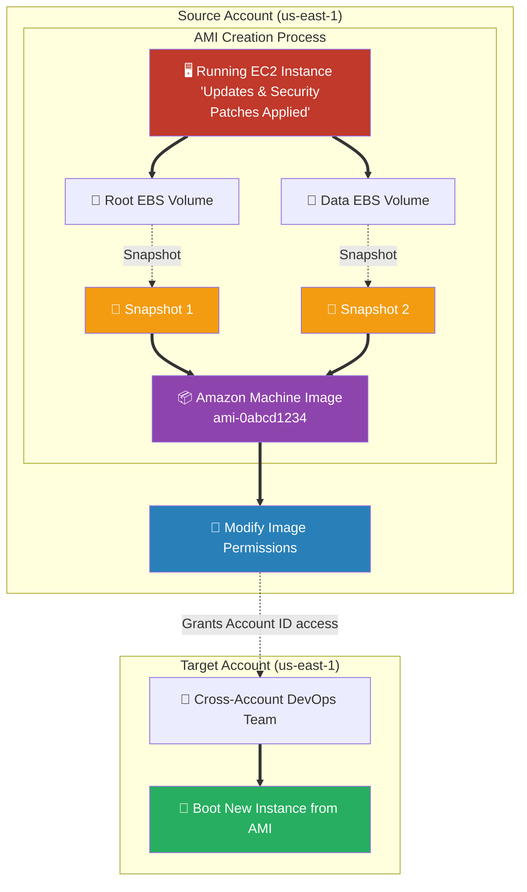

# 🚀 AWS Interview Cheat Sheet: EC2 AMIs (Q406–Q444)

*This master reference sheet covers Amazon Machine Images (AMIs), the fundamental immutable deployment artifacts representing the "Golden Copies" of Amazon EC2 servers.*

---

## 📊 The Master AMI Creation & Sharing Architecture

---

*Note: The user questions historically used the term "EC2 Image" and "AMI" interchangeably. They mathematically represent the identical concept.*

## 4️⃣0️⃣6️⃣ Q406 & Q416: What is an EC2 Image / AMI?
- **Short Answer:** An Amazon Machine Image (AMI) is a highly durable, pre-configured software template containing the exact operating system, application server, and baseline data required to physically boot an EC2 virtual machine. It essentially acts as a "Golden Master" backup or clone of a server.

## 4️⃣0️⃣7️⃣ Q407: What are some use cases for EC2 AMIs?
- **Short Answer:** 
  1) **Auto Scaling:** Booting identical copies of a web server dynamically during a traffic spike.
  2) **Disaster Recovery:** Copying your production golden AMI from `us-east-1` directly to `eu-west-1` to act as a failover backup.
  3) **Immutable Infrastructure:** Resolving security flaws by replacing servers with freshly updated AMIs rather than manually logging in to patch broken nodes.

## 4️⃣0️⃣8️⃣ & Q419: How do you create an EC2 Image / AMI?
- **Short Answer:** In the EC2 console, you select a structurally viable EC2 instance (either running or stopped) -> Click **Actions** -> **Image and templates** -> **Create image**. AWS autonomously pauses I/O, creates invisible EBS snapshots of the Root volume and any attached Data volumes, and mathematically binds them together into a new single `ami-` ID.

## 4️⃣0️⃣9️⃣ Q409: How can you launch an instance from an EC2 Image?
- **Short Answer:** You utilize the standard EC2 Launch Wizard. You explicitly select your private AMI from the "My AMIs" library natively instead of the AWS generic "Quick Start" AMIs, assign variable hardware configurations (like giving the clone 16 CPUs instead of the original's 2 CPUs), and launch.

## 4️⃣1️⃣0️⃣ & Q420: Can you copy an EC2 AMI to another region?
- **Short Answer:** Yes. AMIs are strictly regional constructs. You cannot boot an instance in Ohio using an Ireland AMI. Therefore, you must deliberately perform an "AMI Copy" API call, moving the underlying EBS snapshot data across the AWS global backbone to spawn a native clone of the AMI inside the destination region.

## 4️⃣1️⃣1️⃣, Q421 & Q432: Can you share an EC2 AMI with another AWS account?
- **Short Answer:** Yes. 
- ***CRITICAL ARCHITECTURAL CORRECTION:* ** *Note: The drafted answers state you must use AWS RAM.* You do **not** need AWS RAM to share AMIs cross-account natively. You simply navigate to **Modify Image Permissions** on the AMI directly and input the 12-digit AWS Account ID of the target developer account to securely whitelist their access. (AWS RAM is typically for physical networking constructs like Subnets and Transit Gateways).

## 4️⃣1️⃣2️⃣ Q412: Can you encrypt an EC2 Image?
- **Short Answer:** Yes, utilizing AWS KMS (Key Management Service). 
- **Interview Edge:** *"If an original AMI is completely unencrypted, you cannot violently force the exact same AMI to become encrypted in place. You must perform an 'AMI Copy' action, and during the physical copy timeline, instruct AWS to actively encrypt the *new* clone using a KMS key."*

## 4️⃣1️⃣3️⃣ Q413: Can you automate the creation of EC2 Images?
- **Short Answer:** Absolutely. Modern DevOps pipelines mathematically mandate this using **EC2 Image Builder** (AWS's native automated baking pipeline), or historically utilizing **HashiCorp Packer** to automatically script the installation of software and systematically output a fresh Jenkins-built AMI.

## 4️⃣1️⃣4️⃣ Q414: Can you delete an EC2 Image?
- **Short Answer:** Yes, by issuing the **Deregister AMI** command. 
- **Interview Edge:** *"A massive trap! Deregistering the AMI does **not** delete the underlying physical storage costing you money. The actual petabytes of data live in EBS Snapshots. To stop the billing, you must first Deregister the AMI, and then mechanically manually delete the orphaned EBS Snapshot."*

## 4️⃣1️⃣5️⃣ & Q424: Can you modify an EC2 Image after it has been created?
- **Short Answer:** No. By law of architectural best practices, AMIs are fundamentally **Immutable**. Once the artifact is registered, it cannot be hacked open and patched. If you need a patch, you launch the AMI, patch the live operating system, and "Bake" an entirely new AMI version.

## 4️⃣1️⃣7️⃣, Q423, Q425, Q427, Q429, Q431, Q433: How do you troubleshoot AMIs causing instance failures/crashes/network issues?
- **Short Answer:**
  1) **Permissions:** Verify the IAM Role/User executing the launch has KMS decrypt permissions (if the AMI is encrypted).
  2) **Drivers:** Very old AMIs might mechanically lack the modern ENA (Elastic Network Adapter) drivers or NVMe storage drivers to physically boot onto the modern AWS Nitro Hypervisor.
  3) **Resolution:** If the AMI is broken or missing patches, you cannot troubleshoot the AMI artifact itself. You must launch the instance, attempt recovery mode, fix the Linux/Windows OS natively, and bake a new AMI.

## 4️⃣2️⃣2️⃣ Q422: What is the difference between a public and private AMI?
- **Short Answer:** A Private AMI is heavily locked to your specific 12-digit AWS Account ID (and any accounts you natively explicitly share it with). A Public AMI is universally searchable by the 100+ million global AWS customers in the Community AMI marketplace (highly dangerous unless completely sanitized of enterprise secrets!).

## 4️⃣2️⃣6️⃣ Q426: Can you launch an instance from a deleted AMI?
- **Short Answer:** No. Once the AMI is explicitly Deregistered, Auto Scaling Groups utilizing that AMI immediately begin mechanically failing to boot replacement capacity. 

## 4️⃣2️⃣8️⃣ Q428: Can you create an AMI from an instance that is not running?
- **Short Answer:** Yes. You can explicitly create an AMI from an instance in the "Stopped" state.
- **Interview Edge:** *"If you create an AMI from an actively running instance, AWS mechanically issues a violent instantaneous reboot natively over the OS to flush the memory to disk to guarantee data consistency. If you cannot afford the 30-second website downtime, you must explicitly check the **NoReboot** flag during the AMI API call, which bakes the image without pausing the server (but risks minor file-system corruption)."*

## 4️⃣3️⃣0️⃣ Q430: What is the recommended approach for updating an AMI with security patches?
- **Short Answer:** The **Golden Image Pipeline**. You boot the previous golden image once a month autonomously, command AWS Systems Manager Run Command to natively inject `yum update` or `apt-get upgrade` commands to dynamically grab the newest zero-day patches, and then mechanically bake a freshly serialized AMI ID.

## 4️⃣4️⃣4️⃣ Q444: Can you create an AMI from an instance that has attached EBS volumes?
- **Short Answer:** Yes. The native AWS virtualization API actively pauses I/O across the entire mathematical server block map. It concurrently takes snapshots of the primary Root volume (`/dev/sda1`) AND all attached Data volumes (`/dev/sdb`), storing the entire massive multidisk array reliably inside the single resulting AMI ID registration.
