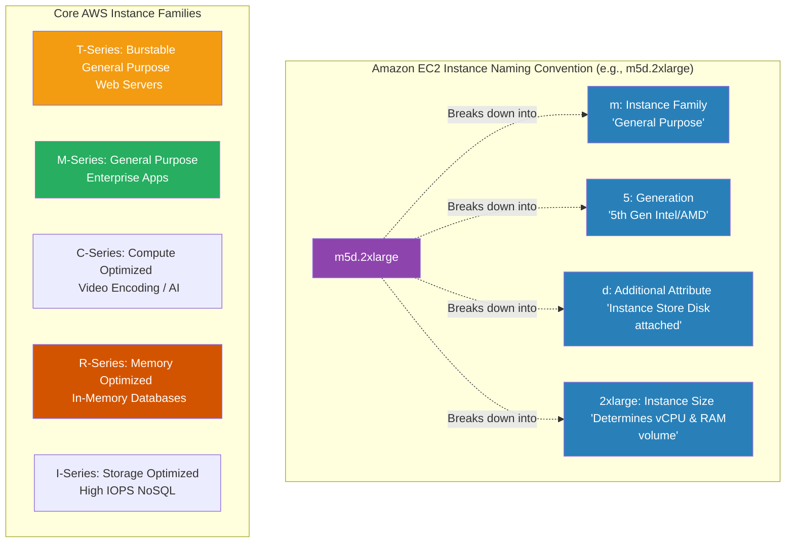

# 🚀 AWS Interview Cheat Sheet: EC2 INSTANCES & TYPES (Q319–Q338)

*This master reference sheet shifts into AWS Compute, covering the architectural fundamentals of Amazon Elastic Compute Cloud (EC2)—from structural sizing and families to metadata services and burstable CPU economics.*

---

## 📊 The Master EC2 Instance Type Architecture

---

## 3️⃣1️⃣9️⃣ Q319: What is the difference between an instance store and an EBS-backed instance?
- **Short Answer:** 
  1) **Instance Store:** Physically attached to the underlying hypervisor hardware rack. It offers insane, ultra-high IOPS performance, but it is strictly **ephemeral**. If you stop or terminate the instance, the data is physically destroyed forever.
  2) **EBS-Backed:** Storage resides on a highly available, decoupled Network Storage Area Network (SAN). It is highly durable and survives instance stops/restarts legally unharmed.

## 3️⃣2️⃣0️⃣ Q320: How do you connect to an EC2 instance?
- **Short Answer:** Traditionally, you use SSH (Port 22) for Linux instances natively using `.pem` private keys, or RDP (Port 3389) for Windows instances to access the desktop GUI. 
- **Interview Edge:** *"In a modern enterprise architecture, SSH and RDP are considered legacy security risks. A Senior Architect mandates the use of **AWS Systems Manager (SSM) Session Manager**, which securely tunnels into the operating system directly through the AWS API without requiring open inbound security group ports or the distribution of SSH keys."*

## 3️⃣2️⃣1️⃣ Q321: How do you resize an EC2 instance?
- **Short Answer:** You execute a "Vertical Scale". You historically must **Stop** the instance (EBS-backed only; you cannot resize an instance store instance), navigate to **Instance Settings -> Change instance type**, explicitly select the newly desired larger/smaller size, and **Start** the instance back up to boot it onto a new physical hardware frame.

## 3️⃣2️⃣2️⃣ Q322: What is the difference between a reserved instance and an on-demand instance?
- **Short Answer:** On-Demand allows you to provision and destroy compute rigidly by the second with zero upfront commitment (maximum flexibility, maximum price). A Reserved Instance (RI) locks you into a highly rigid 1-year or 3-year billing contract in exchange for massive billing discounts (up to 72% off).

## 3️⃣2️⃣3️⃣ Q323: What is an instance profile in AWS?
- **Short Answer:** An Instance Profile is the absolute structural container that safely passes an IAM Role mathematically into an EC2 instance. It is attached at launch, allowing the raw operating system/application code to inherently assume inherited permissions to securely call AWS APIs (like writing to an S3 bucket or DynamoDB table) without explicitly hardcoding vulnerable long-term AWS access keys into the codebase.

## 3️⃣2️⃣4️⃣ Q324: How do you create an EC2 instance using a custom AMI?
- **Short Answer:** An Amazon Machine Image (AMI) is a frozen snapshot of an operating system. To deploy a custom one, you navigate to the EC2 Launch Wizard, explicitly click the **My AMIs** tab instead of the Quick Start tab, select your pre-baked custom golden image, configure the hardware sizing, and click Launch.

## 3️⃣2️⃣5️⃣ Q325: How do you create a load balancer for EC2 instances?
- **Short Answer:** Navigate strictly to the **EC2 -> Load Balancers** pane. Select the structural type (Application Load Balancer for HTTP Layer 7, or Network Load Balancer for TCP Layer 4), define the listeners (e.g., Port 443), select the structural Target Group containing your Auto Scaling EC2 instances, and deploy.

## 3️⃣2️⃣6️⃣ Q326: What is an EC2 security group in AWS?
- **Short Answer:** A Security Group is a fundamentally stateful, instance-level virtual firewall.
- ***CRITICAL ARCHITECTURAL CORRECTION:* ** *Note: The originally drafted answer states you can specify which IP addresses are "allowed or denied". This is a lethal AWS knowledge trap.* Security Groups mathematically **do not possess Deny rules**. They operate strictly on a "Default Deny" architecture. You can exclusively establish `ALLOW` rules. If an interviewer asks how to "Deny" an IP using a Security Group, the correct answer is: "You can't. I must use a Network ACL to explicitly deny an IP."

## 3️⃣2️⃣7️⃣ Q327: How do you automate the deployment of EC2 instances?
- **Short Answer:** Modern deployment heavily leverages Infrastructure as Code (IaC). AWS CloudFormation mathematically defines the infrastructure as YAML/JSON. AWS Elastic Beanstalk automates standard web server fleet provisioning. Beyond AWS native tools, HashiCorp Terraform is the industry-standard dominant tool for orchestrating EC2 lifecycle management via code pipelines.

## 3️⃣2️⃣8️⃣ Q328: What is an EC2 instance metadata service?
- **Short Answer:** The Instance Metadata Service (IMDS) is a local, unauthenticated REST API physically accessible only from *inside* the EC2 instance at the strict link-local IPv4 address `http://169.254.169.254/latest/meta-data/`. An application can query this local API to discover mathematical details about its own host infrastructure (its Instance ID, its VPC subnet, or actively grab its temporary IAM Role security credentials).

## 3️⃣2️⃣9️⃣ Q329: What is an instance type in AWS?
- **Short Answer:** An instance type explicitly defines the exact physical hardware profile assigned to the EC2 virtual machine—dictating the precise allocation of vCPUs, gigabytes of RAM, underlying hypervisor architecture (Graviton ARM vs Intel x86), and the physical networking bandwidth (Gbps) piped to the server.

## 3️⃣3️⃣0️⃣ Q330: What are the different types of EC2 instances in AWS?
- **Short Answer:** Amazon strictly categorizes compute broadly into 5 physical workload verticals: **General Purpose (M, T), Compute Optimized (C), Memory Optimized (R, X), Storage Optimized (I, D), and Accelerated Computing / GPU (P, G).**

## 3️⃣3️⃣1️⃣ Q331: What is the difference between a general purpose and a memory optimized EC2 instance?
- **Short Answer:** A General Purpose instance (e.g., `m5`) maintains a balanced 1:4 ratio mathematically (1 vCPU for every 4GB of RAM), perfect for standard monolithic application servers. A Memory Optimized instance (e.g., `r5`) pushes a heavy 1:8 ratio (1 vCPU for every 8GB of RAM), structurally engineered for insanely heavy in-memory architectures like huge Redis caches or massive SAP HANA relational databases.

## 3️⃣3️⃣2️⃣ Q332: What is the difference between an on-demand and a spot instance in AWS?
- **Short Answer:** On-Demand guarantees your server will run continuously without AWS interfering, charging a premium flat rate. A Spot Instance allows you to mathematically bid on spare, unused AWS datacenter capacity at up to a 90% discount. However, it is fundamentally highly volatile: if AWS abruptly needs that capacity back, it executes a 2-minute warning and violently terminates your physical server.

## 3️⃣3️⃣3️⃣ Q333: How do you choose the right instance type for your workload?
- **Short Answer:** You evaluate the exact mathematical bottleneck natively impacting the application (Is it pegging 100% CPU? Is it exhausting physical RAM? Does it demand 20Gbps networking?). 
- **Interview Edge:** *"AWS Trusted Advisor is outdated for this specific task. The premier AWS architectural tool to state in an interview is **AWS Compute Optimizer**, which actively analyzes 14 days of your EC2 CloudWatch metrics using extreme Machine Learning algorithms to explicitly recommend downsizing or shifting physical instance families."*

## 3️⃣3️⃣4️⃣ Q334: How do you monitor the performance of your EC2 instances?
- **Short Answer:** You natively leverage **Amazon CloudWatch**, which transparently pulls hypervisor-level metrics completely out-of-the-box (CPU Utilization, Network In/Out, Disk Reads/Writes). 
- **Interview Edge:** *"It is essential to note that CloudWatch mathematically cannot see 'inside' the operating system. Out of the box, it cannot track RAM exhaustion or available partition disk space mathematically. You strictly must install the **CloudWatch Unified Agent** onto the OS to push RAM metrics out to AWS."*

## 3️⃣3️⃣5️⃣ Q335: What is an EC2 instance family in AWS?
- **Short Answer:** Families structurally identify the exact compute profile and processor generation explicitly.
- ***CRITICAL ARCHITECTURAL CORRECTION:* ** *Note: The originally drafted answer stated: "For example, the M5 instance family is a family of memory-optimized instances." THIS IS FALSE.* The **M** in M5 stands mathematically for **M**ainline/Multipurpose—it is the flagship **General Purpose** family. The **R** family (R5) stands for **R**AM—that is the **Memory-Optimized** family. (Saying M5 is Memory Optimized in an interview will cost you the job).

## 3️⃣3️⃣6️⃣ Q336: What is the difference between an instance size and an instance family in AWS?
- **Short Answer:** The **Family** establishes the hardware structural class (e.g., `c5` dictates the physical Intel CPU is rigorously compute-heavy). The **Size** establishes the massive volume multiplier of hardware you are actually leasing (e.g., `.large` gives you 2 CPUs, while `.4xlarge` multiplies scaling up to 16 CPUs on that identical hardware generation framework).

## 3️⃣3️⃣7️⃣ Q337: What is an EC2 burstable instance type?
- **Short Answer:** The `T-Series` (e.g., `t3` or `t4g`). AWS inherently starves the CPU baseline down explicitly to save you money (e.g., restricting CPU to 20% artificially). When the instance requires heavy processing, it physically consumes "CPU Credits" to mathematically shatter that artificial ceiling and "burst" up to 100% CPU usage until the credits run out.

## 3️⃣3️⃣8️⃣ Q338: What is an EC2 instance profile? *(Note: Question structurally duplicated from Q323)*
- **Short Answer:** Once again, it is the exact logical IAM wrapper implicitly acting as a secure container to mathematically attach a dynamic AWS IAM Role to an actively running EC2 underlying host, allowing software applications to perform deep API calls into the AWS ecosystem (S3, Secrets Manager) using temporary, auto-rotating security credentials accessible via the IMDS metadata path.
