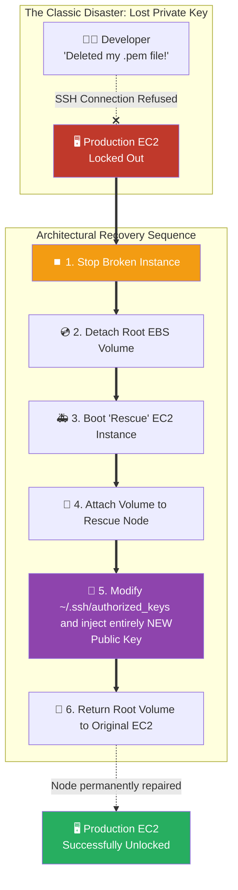

# 🚀 AWS Interview Cheat Sheet: EC2 KEY PAIRS (Q493–Q497)

*This master reference sheet covers EC2 Key Pairs—the asymmetric cryptography foundational baseline for secure remote shell access into Amazon EC2 virtual machines.*

---

## 📊 The Master Key Pair Recovery Architecture

---

## 4️⃣9️⃣3️⃣ Q493: Can you explain what AWS key pairs are and how they are used for network security?
- **Short Answer:** AWS Key Pairs strictly utilize **Asymmetric RSA or ED25519 Cryptography**. They natively replace vulnerable plaintext passwords. The system computationally generates two mathematically linked keys: a **Public Key** (which AWS actively injects into the Linux `~/.ssh/authorized_keys` file directly at launch), and a **Private Key** (e.g., `mykey.pem`) which is strictly downloaded onto the user's laptop. When logging in, the SSH protocol cryptographically proves the user holds the matching Private Key without ever transmitting the key over the internet.

## 4️⃣9️⃣4️⃣ Q494: What are some best practices for managing AWS key pairs?
- **Short Answer:** 
  1) Absolutely never commit `.pem` files to a GitHub repository.
  2) Strictly enforce `chmod 400` on the private key file locally to categorically prevent other OS users from reading it.
- **Interview Edge:** *"The drafted answer claims 'Key pairs can be managed centrally using AWS IAM'. **This is false.** IAM natively does not manage physical RSA Key Pairs. The ultimate enterprise best practice is to entirely **eliminate Key Pairs completely** by natively utilizing **AWS Systems Manager (SSM) Session Manager** or **EC2 Instance Connect (EIC)**. These modern services utilize temporary, IAM-authenticated 60-second SSH tokens to tunnel into the server, entirely obliterating the need to ever distribute static Key Pairs to developers."*

## 4️⃣9️⃣5️⃣ Q495: How do you troubleshoot issues with AWS key pairs?
- **Short Answer:** If you fundamentally cannot SSH into an instance using your Key Pair:
  1) **Permissions:** The `.pem` file permissions are too open. An SSH client mechanically refuses to use a key if it possesses `chmod 777` permissions.
  2) **Username:** Ensure you are passing the exact default OS username (e.g., `ec2-user` for Amazon Linux, `ubuntu` for Ubuntu, `admin` for Debian).
  3) **Security Group:** Verbose SSH logs will instantly reveal if the connection is "Timing Out" (meaning the Security Group is blocking Port 22 natively) versus "Permission Denied" (meaning the Network is open, but the `.pem` key mathematically failed authentication).

## 4️⃣9️⃣6️⃣ Q496: Can you provide an example of a real-time scenario where AWS key pairs could be used for network security?
- **Short Answer:** Standard Linux Bastion Hosts (Jump Boxes). An enterprise places a heavily fortified Bastion Host securely inside a Public Subnet. Developers across the globe utilize their heavily guarded Private Keys to SSH securely into the Bastion Host over the public internet. From there, they utilize a *secondary* internal Key Pair to pivot from the Bastion directly into the deeply isolated internal Private Subnet database tiers.

## 4️⃣9️⃣7️⃣ Q497: What are some common issues that can arise when managing AWS key pairs, and how can they be addressed?
- **Short Answer:** The single most famous, ubiquitous issue in AWS history: **A developer loses their Private Key.** 
- **Interview Edge:** *"If an interviewer asks how to recover an instance whose key was lost, explicitly map out the **Volume Detach Recovery Strategy**. You absolutely must Stop the locked instance -> Detach the Root EBS volume -> Attach the volume as a secondary drive to a temporary running 'Rescue' instance -> Mount the drive -> Manually overwrite the `.ssh/authorized_keys` file with a completely fresh Public Key -> Unmount and re-attach the volume back to the original instance. It proves you understand Linux volumes and AWS virtualization perfectly."*
