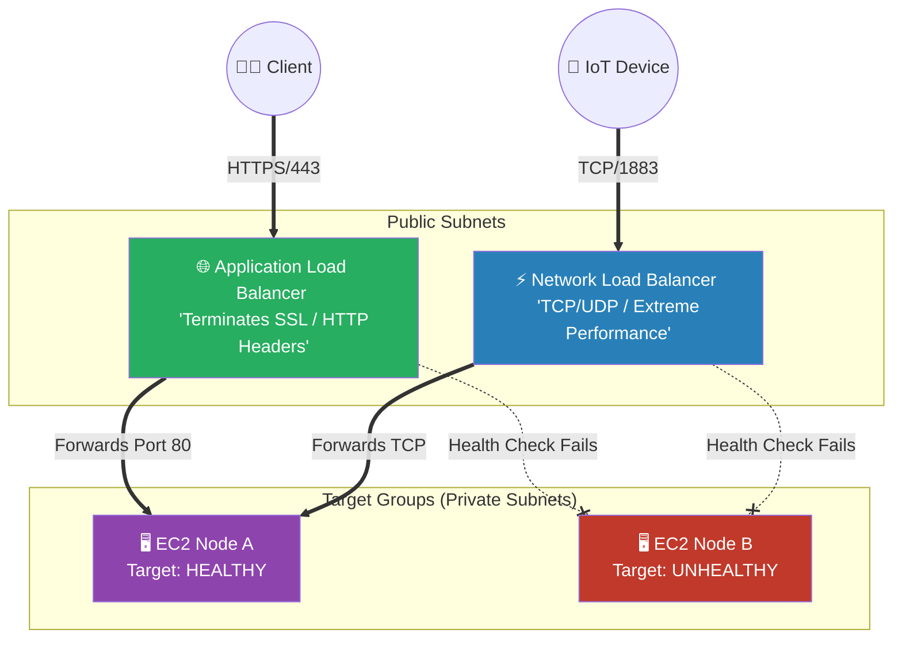

# 🚀 AWS Interview Cheat Sheet: ELASTIC LOAD BALANCING (Q503–Q510)

*This master reference sheet covers Elastic Load Balancing (ELB), specifically diving into the Application Load Balancer (ALB) and Network Load Balancer (NLB) troubleshooting patterns.*

---

## 📊 The Master Load Balancing Architecture

---

## 5️⃣0️⃣3️⃣ & Q504: What are some common issues with ELBs and how do you troubleshoot them?
- **Short Answer:** 
  1) **502 Bad Gateway:** The ALB successfully reached the EC2 Target Group, but the internal application mathematically returned malformed data or actively slammed the TCP connection shut.
  2) **504 Gateway Timeout:** The EC2 Target Group correctly established the connection, but physically took too long (e.g., waiting 60+ seconds for a database query) to return a web response, causing the ALB to snap the connection.
  3) **Instances OutOfService:** Ensure the Security Group structurally attached to the EC2 instances explicitly allows inbound HTTP/TCP traffic directly from the ALB's Security Group ID.

## 5️⃣0️⃣5️⃣ Q505: How can you ensure that traffic is evenly distributed across instances behind an ELB?
- **Short Answer:** 
  1) Ensure **Cross-Zone Load Balancing** is enabled.
  2) Instead of strictly relying on Round Robin (which blindly alternates servers), utilize the **Least Outstanding Requests** algorithm on the ALB routing rules. This mathematically forces the ALB to dynamically route the next HTTP request to the exact EC2 instance currently processing the lowest number of active connections.

## 5️⃣0️⃣6️⃣ Q506: What is session stickiness and how can it be used with an ELB?
- **Short Answer:** Session Stickiness (Session Affinity) forces an Application Load Balancer to persistently route requests from a specific client laptop directly to the exact same backend EC2 instance indefinitely. 
- **Production Scenario:** This is structurally mandatory for legacy Stateful architectures (e.g., an old PHP monolith that physically stores shopping cart data on the local server RAM instead of a central Redis cache). The ALB mathematically injects an `AWSELB` tracking cookie into the client's browser to map them to the underlying EC2 instance ID.

## 5️⃣0️⃣7️⃣ Q507: What are some common SSL/TLS certificate issues with an ELB and how can they be resolved?
- **Short Answer:** The primary issue is a complete browser block stating the connection is not private.
- **Architectural Solution:** A Senior Architect entirely abandons manually rotating proprietary SSL certificates. Instead, they dynamically map the Load Balancer Listener to **AWS Certificate Manager (ACM)**. ACM mathematically generates a free, geometrically secure wildcard certificate and entirely magically auto-renews that certificate every 13 months perfectly automatically with absolutely zero developer intervention.

## 5️⃣0️⃣8️⃣ & Q509: What are some potential issues when using a Network Load Balancer (NLB) and how do you troubleshoot them?
- **Short Answer:** NLBs operate flawlessly at Layer 4 (TCP/UDP), pushing millions of packets per second. If traffic mathematically fails to route:
- **Interview Edge:** *"Historically, NLBs mathematically did not possess Security Groups, meaning you had to fiercely lock down the EC2 Target Groups to allow all internet IP traffic in. However, in **August 2023**, AWS officially natively added classic Security Groups directly onto the NLB architecture! An interviewer asking this is testing if your knowledge is updated. You must explicitly state: 'I will check the newly supported NLB Security Groups to ensure TCP ports are open, and then execute VPC Flow Logs to trace the physical packet drops.'"*

## 5️⃣1️⃣0️⃣ Q510: What is cross-zone load balancing and how can it be used with an ELB?
- **Short Answer:** Cross-Zone Load Balancing legally allows the ELB nodes placed inside `us-east-1a` to directly forward traffic structurally to EC2 instances deeply buried in `us-east-1b`. This violently evens out the cluster mathematics if one AZ has 10 servers but the other AZ only has 2 servers.
- **FinOps Edge:** *"Be extremely careful explaining this. On an **ALB**, Cross-Zone load balancing is mathematically forced securely ON by default, and inter-AZ data transfer is **100% Free**. On an **NLB**, Cross-Zone load balancing is explicitly forced OFF by default. If you turn it on, AWS immediately starts violently billing you for every single gigabyte of regional cross-AZ data transfer!"*
