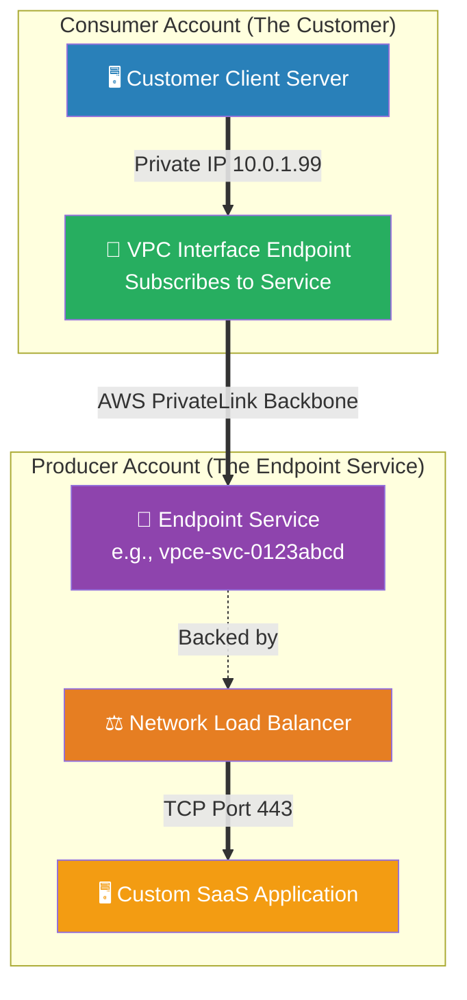

# 🚀 AWS Interview Cheat Sheet: ENDPOINT SERVICES (Q105–Q114)

*This master reference sheet covers "Endpoint Services" (the Provider side of AWS PrivateLink). While VPC Endpoints allow you to consume an AWS service, Endpoint Services allow YOU to become the AWS Service provider and sell/secure your own applications to other VPCs privately.*

---

## 📊 The Master Provider vs. Consumer (PrivateLink) Architecture

---

## 1️⃣0️⃣5️⃣ Q105: What are Endpoint Services in AWS?
- **Short Answer:** Endpoint Services (powered by AWS PrivateLink) allow you to host your own application in your VPC, explicitly configure it as a "Provider Service", and then allow other AWS accounts to connect to it privately as if it were a native AWS service.
- **Production Scenario:** You build a high-performance cyber-security scanning API. You want to sell it to massive banking clients, but the banks refuse to send their data over the public internet. By turning your API into an **Endpoint Service**, the banks can connect to you natively over the AWS intranet backbone via PrivateLink.
- **Interview Edge:** *"A 'VPC Endpoint' is the Consumer. An 'Endpoint Service' is the Provider. When you create an Endpoint Service, you are essentially monetizing your own VPC application over PrivateLink."*

## 1️⃣0️⃣6️⃣ Q106: What are the benefits of using Endpoint Services in AWS?
- **Short Answer:** 1) Enhanced security (traffic never touches the internet). 2) Zero overlapping CIDR issues (the connection is proxied). 3) Massive cost-savings on NAT bandwidth. 4) The ability to monetize SaaS products via the AWS Marketplace natively integrated with PrivateLink.
- **Production Scenario:** Two companies merge. Their networks both use the `10.0.0.0/16` CIDR block. VPC Peering is mathematically impossible. The Architect deploys an Endpoint Service on Company A, and an Endpoint on Company B—resolving the overlapping IP routing nightmare instantly.
- **Interview Edge:** *"I deploy Endpoint Services specifically to avoid VPC Peering limitations. Because PrivateLink translates traffic implicitly at the interface level, it completely ignores overlapping IPv4 subnets."*

## 1️⃣0️⃣7️⃣ Q107: What are some common Endpoint Services in AWS?
- **Short Answer:** Common native AWS services that act as Endpoint Services include EFS, SageMaker, Redshift, Active Directory, and DocumentDB. Crucially, thousands of third-party SaaS products on the **AWS Private Marketplace** (like Snowflake, Datadog, or MongoDB Atlas) also operate strictly as Endpoint Services.
- **Production Scenario:** A data team needs to submit machine-learning algorithms to Amazon SageMaker Studio from an utterly disconnected, internet-vacuumed subnet.
- **Interview Edge:** *"Technically, almost every single Interface Endpoint you consume in AWS is connecting to an 'Endpoint Service' hosted by AWS under the hood. The genius of PrivateLink is that AWS uses the exact same technology to host its services that it gives us to host ours."*

## 1️⃣0️⃣8️⃣ Q108: How do you create an Endpoint Service in AWS?
- **Short Answer:** 1) You must deploy an **Internal Network Load Balancer (NLB)** or Gateway Load Balancer attached to your application servers. 2) Open the VPC Console -> Click **Endpoint Services** -> Click **Create Endpoint Service**. 3) Select the NLB you just built. 4) Click Create.
- **Production Scenario:** Writing a Terraform blueprint where the `aws_vpc_endpoint_service` resource strictly requires the `network_load_balancer_arn` of the internal TCP load balancer.
- **Interview Edge:** *"You physically cannot create an Endpoint Service using an Application Load Balancer (ALB). PrivateLink operates strictly at Layer 4 (TCP/UDP), which statically requires an NLB as the backing target."*

## 1️⃣0️⃣9️⃣ Q109: How do you configure Endpoint Service policies in AWS?
- **Short Answer:** You navigate to the Endpoint Service in the VPC Console, select the **Permissions** tab, and explicitly specify which external AWS Account IDs, Organization ARNs, or IAM Users are legally permitted to find and connect to your service.
- **Production Scenario:** A company builds an internal HR microservice. The Architect adds the specific AWS Account IDs of their European and Asian subsidiary branches to the API permissions, instantly blocking the rest of the world from "discovering" the Endpoint Service.
- **Interview Edge:** *"Endpoint Service security is a two-step handshake. Not only does the provider have to whitelist the consumer's Account ID in the Permissions tab, but once the consumer attempts to connect, the Provider must actively accept the incoming connection request."*

## 1️⃣1️⃣0️⃣ Q110: Can you update the configuration of an Endpoint Service in AWS?
- **Short Answer:** Yes. You can dynamically modify the accepted routing domains, accept/reject connection requests, toggle the "Require Acceptance" handshake flag, and update the associated Load Balancers.
- **Production Scenario:** An Endpoint Service receives too much spam traffic from an unverified AWS account. The Provider Administrator dynamically updates the endpoint's state, forcefully rejecting the active connection and disconnecting the consumer live.
- **Interview Edge:** *"Updating an Endpoint Service is highly dynamic. You can hot-swap the backing NLB infrastructure seamlessly without the downstream Customers (Consumers) experiencing any DNS or IP disruption."*

## 1️⃣1️⃣1️⃣ Q111: How do you delete an Endpoint Service in AWS?
- **Short Answer:** Open the VPC Console -> Navigate to **Endpoint services** -> Select the service -> Click **Actions** -> **Delete endpoint service**. 
- **Production Scenario:** Sunsetting a legacy SaaS product. When the Provider deletes the Endpoint Service, all downstream Consumers instantly lose connectivity, and their local Interface Endpoints transition to a permanent "Deleted" or "Rejected" state.
- **Interview Edge:** *"Before I delete an active Endpoint Service, I always gracefully coordinate with the consumers. Simply deleting the service blind operates identically to pulling a physical network cable out of the customer's server rack."*

## 1️⃣1️⃣2️⃣ Q112: Can you access Endpoint Services from outside of your VPC?
- **Short Answer:** *By default no, but with advanced architecture, yes.* If you are just a standard consumer, you can only access the service natively inside the VPC via your created interface endpoint.
- **Production Scenario:** An on-premise physical data center connects to your AWS VPC via AWS Direct Connect. Because PrivateLink drops a physical ENI into your subnet, the on-premise data center can route data over Direct Connect directly to the Endpoint Service's local `10.x.x.x` Private IP address.
- **Interview Edge:** *"This is the foundational difference between VPC Peering and PrivateLink. You cannot route on-premise traffic over a VPC Peer. But because PrivateLink operates via a tangible interface (ENI), it seamlessly integrates with on-premises VPNs and Direct Connects."*

## 1️⃣1️⃣3️⃣ Q113: How do you configure DNS for Endpoint Services in AWS?
- **Short Answer:** When a Consumer creates an Endpoint to connect to your service, AWS automatically generates a massive, ugly regional DNS name (e.g., `vpce-0123...amazonaws.com`). To make it human-readable, you configure **Private Hosted Zones** in Amazon Route 53 to mask that ugly DNS name with something clean like `api.mycorporateapp.internal`.
- **Production Scenario:** A Provider creates a health-check service. They do not want clients hard-coding the ugly `vpce` DNS names. The Provider verifies domain ownership with AWS, enabling Private DNS, automatically routing `health.mycompany.com` seamlessly into the PrivateLink tunnel.
- **Interview Edge:** *"Without Route 53 Private Hosted Zones, interacting with Endpoint Services via raw IP addresses or default AWS DNS names causes immediate SSL/TLS certificate validation failures, because the SSL cert expects the original domain name."*

## 1️⃣1️⃣4️⃣ Q114: How do you troubleshoot issues with Endpoint Services in AWS?
- **Short Answer:** 1) Check the **Connection Handshake** (Did the Provider actually click "Accept" on the incoming endpoint request?). 2) Check **Security Groups** on the Consumer's ENI (Are the ports matching the NLB?). 3) Check **Target Group Health** on the Provider's NLB (Are the EC2 instances actually passing health checks?).
- **Production Scenario:** A customer complains they cannot reach your Endpoint Service API. The Architect checks CloudWatch metrics on the Network Load Balancer and realizes the backend EC2 server crashed, meaning the NLB inherently dropped the PrivateLink connection because there was no healthy compute target.
- **Interview Edge:** *"Troubleshooting PrivateLink is uniquely challenging because visibility is split across two completely different AWS accounts. The Consumer can only troubleshoot their ENI Security Group, while the Provider must troubleshoot the NLB metrics and VPC Flow Logs."*
