# 🚀 AWS Interview Cheat Sheet: AMAZON S3 GLACIER (Q743–Q760)

*This master reference sheet continues Phase 12: Object Storage. It covers Amazon S3 Glacier, the ultimate cold-storage tier engineered for compliance, legal holds, and data archiving.*

---

## 📊 The Master Glacier Asynchronous Retrieval Architecture

```mermaid
graph TD
    User((👨‍💻 Compliance Officer))
    
    subgraph "Amazon S3 Glacier"
        Vault[🗄️ Glacier Vault <br/> 'Locked via WORM Policy']
        Job[⚙️ Retrieval Job <br/> Takes 3-5 Hours]
    end
    
    subgraph "Temporary Staging"
        SNS[(📧 Amazon SNS <br/> JobComplete Notification)]
        Download[⬇️ Downloadable Output <br/> Valid for 24 hours]
    end
    
    User ==>|1. InitiateJob API| Vault
    Vault -. "Asynchronously processes" .-> Job
    Job ==>|2. Finishes 4 hours later| SNS
    SNS -. "Alerts Officer" .-> User
    Job ==> Download
    User ==>|3. GetJobOutput API| Download
    
    style Vault fill:#34495e,color:#fff
    style Job fill:#8e44ad,color:#fff
    style SNS fill:#e67e22,color:#fff
    style Download fill:#27ae60,color:#fff
```

---

## 7️⃣4️⃣3️⃣ & Q753 & Q757: What is Amazon S3 Glacier and how does it differ from Standard S3?
- **Short Answer:** Amazon S3 Glacier is a legally compliant, secure, and extremely low-cost cloud storage service for data archiving. 
- **Interview Edge:** *"Standard S3 provides synchronous, sub-millisecond retrieval. Glacier is mathematically fundamentally different—it is strictly an **Asynchronous** storage engine. You physically cannot download a file from Glacier in real-time. If you request a file, Glacier initiates a server-side Job that takes 3 to 5 hours to physically extract the data from cold tape drives before it becomes available for download."*

## 7️⃣4️⃣9️⃣ & Q748 & Q760: How do you retrieve data and what are the Retrieval Tiers?
- **Short Answer:** Because Glacier is asynchronous, retrieving data is a strict two-step process: 1) Call `InitiateJob` to request the data. 2) Wait for the SNS notification, then call `GetJobOutput` to physically download it.
- **The Three Tiers:**
  - **Expedited:** 1 to 5 minutes (Highest cost, used in extreme emergencies).
  - **Standard:** 3 to 5 hours (Default).
  - **Bulk:** 5 to 12 hours (Lowest cost, used for restoring petabytes of data).

## 7️⃣4️⃣5️⃣ Q745: What is the maximum size of an object in Glacier?
- **Short Answer:** 40 Terabytes per Archive.
- **Architectural Distinction:** *"While Amazon S3 limits a single object to exactly 5TB, the raw Amazon S3 Glacier API structurally mathematically allows a single Archive uploaded directly to a Glacier Vault to be up to **40 Terabytes** in size. However, if you are transitioning data into Glacier via an S3 Lifecycle Rule, the 5TB S3 limit still functionally applies."*

## 7️⃣5️⃣8️⃣ Q758: What is a Glacier Vault Lock policy?
- **Short Answer:** This is heavily tested in AWS Security/Compliance interviews. A Vault Lock physically enforces **WORM (Write Once, Read Many)** compliance. 
- **Production Scenario:** Financial institutions are legally required by the SEC to store trading logs for 7 years without tampering. An Architect writes a Vault Lock Policy explicitly denying the `glacier:DeleteArchive` API. Once the lock is initiated and confirmed, it is mathematically **Immutable**. Even the Root AWS Account Administrator physically cannot delete the vault or the data until the 7-year timer expires.

## 7️⃣4️⃣6️⃣ & Q747 & Q754: What is a Vault and how do you upload data?
- **Short Answer:** A Vault is the Glacier equivalent of an S3 Bucket. 
- **Interview Edge:** *"There is a massive UI trap here. You physically **cannot** upload a file to a Glacier Vault using the AWS Web Console. The AWS Console only allows you to CREATE the vault. Actually uploading data directly to a Vault requires executing CLI commands or writing Python SDK code to perform Multipart Uploads. (Alternatively, the modern approach is to just upload to an S3 Bucket via the console and use an S3 Lifecycle Rule to blindly push it down to Glacier)."*

## 7️⃣5️⃣0️⃣ Q750: What is a Glacier Data Retrieval Policy?
- **Short Answer:** Because Glacier charges heavy fees for retrieving massive amounts of data, a hijacked account triggering a 50-Petabyte retrieval could bankrupt a company overnight. An Architect explicitly configures a **Data Retrieval Policy** at the AWS Account level to strictly cap egress. For example, setting it to `Free Tier Only` legally restricts the account to only ever retrieving 10GB per month, blocking any catastrophic billing spikes.

## 7️⃣5️⃣6️⃣ Q756: What are best practices for Amazon S3 Glacier?
- **Short Answer:** 
  1) Never use Glacier for data you might need in under 5 minutes.
  2) Always use **S3 Lifecycle Rules** instead of building custom API scripts to manage cold data movement.
  3) Use **SNS Topic Integration** on the Vault so the system automatically emails you the exact second an asynchronous retrieval job finishes, rather than constantly pinging the API to check the job status.

## 7️⃣5️⃣9️⃣ Q759: How can you encrypt data stored in Amazon S3 Glacier?
- **Short Answer:** Data at rest inside Amazon S3 Glacier is mathematically **encrypted by default** using Advanced Encryption Standard (AES-256) keys managed physically by AWS. You natively cannot turn this encryption off. For extreme security, Architects encrypt the file on their own local laptops (Client-Side Encryption) before executing the upload API.
