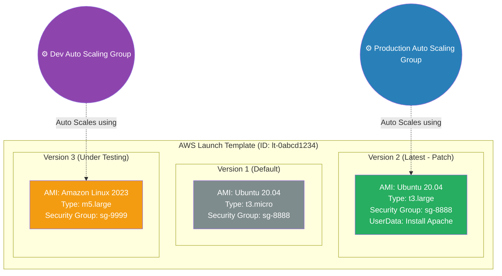

# 🚀 AWS Interview Cheat Sheet: LAUNCH TEMPLATES (Q339–Q347)

*This master reference sheet covers AWS Launch Templates, the modern, version-controlled standard for programmatically codifying Amazon EC2 architecture and Auto Scaling provisioning logic.*

---

## 📊 The Master Launch Template Architecture (Versioning)

---

## 3️⃣3️⃣9️⃣ Q339: What is an AWS Launch Template?
- **Short Answer:** A Launch Template is a fully immutable configuration object stored natively within the EC2 dashboard that mathematically defines exactly how an EC2 instance should be provisioned. It strictly hardcodes the AMI ID, Hardware Instance Type, SSH Key Pair, VPC Subnets, Security Groups, IAM Instance Profiles, and User Data execution scripts, saving engineers from manually selecting these 20 disparate settings every time they launch a server.
- **Production Scenario:** A developer wants to spin up a quick test node. Instead of navigating the massive 8-step EC2 launch wizard and accidentally deploying it into the wrong public subnet without encryption, they simply select the pre-approved "Corporate-Gold-Template" and click Launch.

## 3️⃣4️⃣0️⃣ Q340: What are the benefits of using AWS Launch Templates?
- **Short Answer:** 
  1) **Standardization:** It ruthlessly enforces structural enterprise configurations (forcing all instances to launch with strict EBS KMS encryption, for example).
  2) **Versioning:** You can maintain multiple historic versions of the same template ID.
  3) **Auto Scaling Engine:** It is the exclusive deployment engine that enables Auto Scaling Groups to intelligently mix both Spot and On-Demand instances in the exact same fleet natively.

## 3️⃣4️⃣1️⃣ Q341: How do you create a Launch Template in AWS?
- **Short Answer:** You navigate to **EC2 -> Launch Templates** -> click **Create launch template**. You input the fundamental configuration blocks (Amazon Machine Image, hardware sizing, storage volumes, and network settings). You can strategically leave certain fields entirely "blank" (unspecified), which forces the user launching the instance to provide that specific parameter at runtime.

## 3️⃣4️⃣2️⃣ Q342: How do you update a Launch Template in AWS?
- **Short Answer:** You physically do not "update" a Launch Template in AWS. A Launch Template version is perfectly immutable. To change a setting, you select the template and click **Modify template (Create new version)**. 
- **Interview Edge:** *"This is the hallmark of modern immutable infrastructure. AWS protects your scaling groups by making the previous versions untouchable. If you create 'Version 2' with a broken Linux bootstrap script that crashes your Auto Scaling Group, you simply command the ASG to abruptly roll back to 'Version 1' and everything instantly recovers."*

## 3️⃣4️⃣3️⃣ Q343: What is the difference between a Launch Template and a Launch Configuration in AWS?
- **Short Answer:** A Launch Configuration is the legacy, deprecated predecessor format. A Launch Configuration is strictly un-versioned (you cannot change it; you must delete it and create an entirely new one from scratch). A Launch Template actively supports native Versioning, supports Advanced T2/T3 Unlimited Burstable configurations, supports combining Spot/On-Demand sizing policies, and is the absolute mandated gold standard going forward.
- **Interview Edge:** *"If an interviewer asks which one you use, state aggressively: 'I strictly utilize Launch Templates. AWS officially deprecated Launch Configurations in 2023, and they are no longer an acceptable architectural pattern for modern Auto Scaling Groups.'"*

## 3️⃣4️⃣4️⃣ Q344: How do you use a Launch Template to launch EC2 instances?
- **Short Answer:** 
  1) **Manually:** In the EC2 console, highlight the Launch Template, click **Actions -> Launch instance from template**, define how many copies you want, and hit Launch.
  2) **Via Auto Scaling (ASG):** The single most common use case. You fundamentally tie the Launch Template ID directly to an Auto Scaling Group, and the ASG autonomously calls the template sequentially to spawn nodes during a traffic spike.

## 3️⃣4️⃣5️⃣ Q345: What is the difference between an on-demand instance and a spot instance when launching instances using a Launch Template?
- **Short Answer:** A Launch Template allows you to configure extreme cost-saving scaling rules. You can instruct the Auto Scaling Group, utilizing the Launch Template, to maintain a solid "Baseline" of 5 unbreakable On-Demand instances, but if CPU load spikes unexpectedly, the ASG will dynamically burst and spawn volatile 90%-discount Spot Instances using that exact same Launch Template configuration.

## 3️⃣4️⃣6️⃣ Q346: How do you automate the launch of EC2 instances using a Launch Template?
- **Short Answer:** You fundamentally integrate the Launch Template exclusively with **AWS Auto Scaling Groups (ASG)**. You configure target tracking policies (e.g., "Keep Fleet CPU at 50%"). If the CPU hits 80%, the ASG mechanically triggers an API call that reads the Launch Template and seamlessly provisions 3 new EC2 instances to absorb the traffic load.

## 3️⃣4️⃣7️⃣ Q347: Can you specify instance metadata and user data when launching instances using a Launch Template?
- **Short Answer:** Yes. The "Advanced Details" pane of a Launch Template allows you to pass in **User Data**.
- **Interview Edge:** *"User Data is arguably the most powerful field in the Launch Template. It is a shell script (Bash for Linux, PowerShell for Windows) that executes completely legally as root/administrator exactly ONE time during the absolute initial boot cycle of the physical instance. We utilize it heavily to download the latest GitHub application code or execute Puppet/Chef bootstrapping commands so the instance is 100% production-ready the second it natively comes online."*
