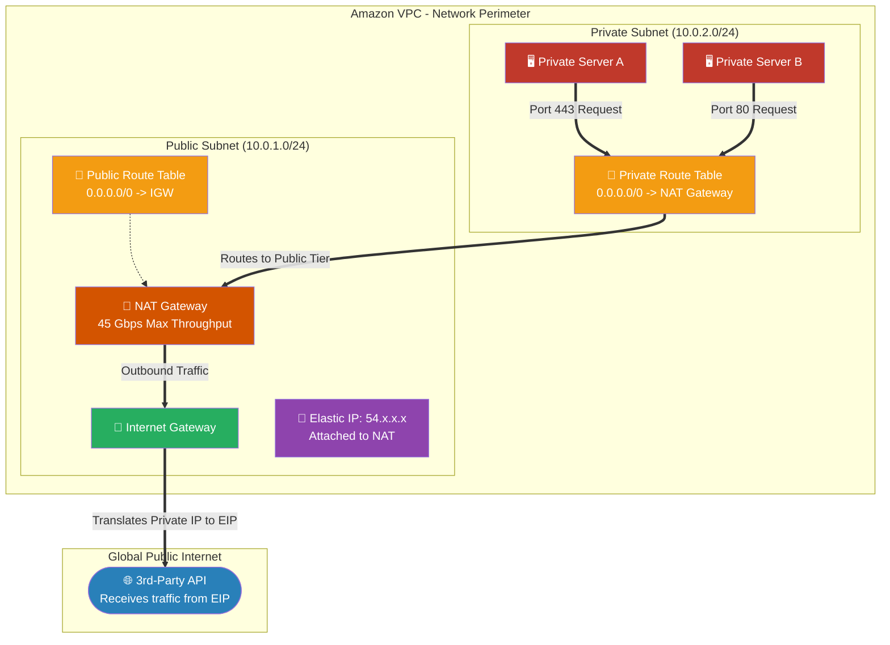

# 🚀 AWS Interview Cheat Sheet: NAT GATEWAYS (Q115–Q134)

*This master reference sheet covers the entire lifecycle, architecture, and troubleshooting mechanics of AWS NAT Gateways, ensuring private instances can securely access the internet without exposure.*

---

## 📊 The Master NAT Gateway Routing Architecture

---

## 1️⃣1️⃣5️⃣ Q115: What is a NAT Gateway in AWS?
- **Short Answer:** A Network Address Translation (NAT) Gateway is a highly available, AWS-managed service utilized to allow EC2 instances securely hidden in Private Subnets to connect outbound to the internet (for patches/updates), whilst completely preventing the public internet from initiating an inbound connection back to those instances.
- **Production Scenario:** A backend MySQL database needs to download an Ubuntu security patch. Because it sits in a Private Subnet, it uses the NAT Gateway to securely pull the patch from the web without being exposed.
- **Interview Edge:** *"A NAT Gateway operates as a secure, one-way mirror. It allows outbound egress, but acts as a mathematical un-routable brick wall for inbound ingress."*

## 1️⃣1️⃣6️⃣ Q116: How does a NAT Gateway work in AWS?
- **Short Answer:** It utilizes standard Port Address Translation (PAT). When a private instance (`10.0.1.55`) sends a request to the internet, the NAT Gateway rips off the private source IP, replaces it with its own public Elastic IP address, forwards the request, receives the response, and translates it back to the original private instance.
- **Production Scenario:** 50 private worker nodes all need to hit the Stripe Payment API simultaneously. To Stripe, it looks like a single server is making 50 requests because the NAT Gateway masks all 50 private IPs behind its single Elastic IP.
- **Interview Edge:** *"A NAT Gateway is effectively a managed proxy. It strips the internal RFC 1918 Private IP address from the packet header and dynamically stamps the Elastic IP onto the outbound packet."*

## 1️⃣1️⃣7️⃣ Q117: What are the benefits of using a NAT Gateway in AWS?
- **Short Answer:** 1) Total private isolation. 2) Fully managed High-Availability (no EC2 scaling required). 3) Up to 100 Gbps (recently upgraded by AWS from 45 Gbps) of burstable bandwidth. 4) Zero maintenance (no OS patching required).
- **Production Scenario:** Moving away from a legacy architecture where DevOps had to actively maintain autoscaling groups of Linux EC2 instances running `iptables` just to route outbound traffic.
- **Interview Edge:** *"NAT Gateway entirely eliminates the operational overhead of the older 'NAT Instance' architecture by abstracting the compute layer completely."*

## 1️⃣1️⃣8️⃣ Q118: How do you create a NAT Gateway in AWS?
- **Short Answer:** Open the VPC Console -> Navigate to **NAT Gateways** -> Click **Create NAT Gateway** -> Specify a Name -> Select a **Public Subnet** -> Allocate/Select an **Elastic IP** -> Click **Create**.
- **Production Scenario:** Provisioning core infrastructure via Terraform. You must write an explicit `depends_on = [aws_internet_gateway.igw]` rule, because a NAT Gateway requires an IGW to exist before it can successfully provision.
- **Interview Edge:** *"The absolute most critical step in creation is placement. You MUST deploy the NAT Gateway physically into a Public Subnet, never a Private Subnet."*

## 1️⃣1️⃣9️⃣ Q119: How do you associate a NAT Gateway with a private subnet in AWS?
- **Short Answer:** Open the VPC Console -> Navigate to **Route Tables** -> Select the Route Table currently associated with your *Private Subnet* -> Click **Edit routes** -> Add `0.0.0.0/0` with the Target set to the `nat-xxxxxxxx` specific ID -> Save.
- **Production Scenario:** An Architect builds a new data-tier subnet. To grant it internet egress without exposing it, they simply associate it with the existing Private Route Table that already targets the NAT Gateway.
- **Interview Edge:** *"You don't associate a NAT Gateway directly to a subnet. You manipulate the Subnet's Route Table to point internet-bound traffic at the NAT Gateway."*

## 1️⃣2️⃣0️⃣ Q120: Can you modify the configuration of a NAT Gateway in AWS?
- **Short Answer:** No. NAT Gateways are entirely immutable infrastructure. You cannot change its Elastic IP, Subnet, or VPC once it is created.
- **Production Scenario:** A company realizes they placed their NAT Gateway in the wrong Availability Zone. They cannot "move" it; they must create a new one in the correct AZ, update the route tables to point to the new one, and delete the old one.
- **Interview Edge:** *"Because NAT Gateways are immutable, replacing them causes a momentary drop in stateful connections. All active downloads tearing through the old NAT will instantly sever when you swap the Route Table."*

## 1️⃣2️⃣1️⃣ Q121: Can a NAT Gateway in AWS handle traffic from multiple subnets?
- **Short Answer:** Yes. A single NAT Gateway can easily handle outbound routing for dozens of Private Subnets simultaneously, as long as all those subnets share Route Tables pointing to that single NAT.
- **Production Scenario:** An enterprise has 5 Application Subnets and 5 Database subnets. To save money, the Architect points all 10 Route Tables at a single NAT Gateway.
- **Interview Edge:** *"While one NAT Gateway can serve an entire VPC, it becomes a single point of AZ-failure. In a true enterprise Highly Available architecture, I deploy one NAT Gateway per physical Availability Zone."*

## 1️⃣2️⃣2️⃣ Q122: How do you troubleshoot issues with a NAT Gateway in AWS?
- **Short Answer:** 1) Verify the NAT is physically in a Public Subnet (checking its Route Table for an IGW). 2) Ensure the Private Subnet Route Table actually points back to the NAT. 3) Check Subnet NACLs to ensure ephemeral return ports (1024-65535) are open. 4) Use VPC Flow Logs to track `REJECT` patterns.
- **Production Scenario:** Private instances can ping internal servers but can't reach Google. The Architect checks the NAT Gateway's Route Table and discovers a junior engineer accidentally deleted the IGW route, blinding the entire gateway.
- **Interview Edge:** *"90% of NAT Gateway failures are structurally caused by incorrect routing, not bandwidth or AWS service failures. Always trace the Route Table logic first."*

## 1️⃣2️⃣3️⃣ Q123: Can you use a NAT Gateway in AWS to access resources in another VPC?
- **Short Answer:** No. A NAT Gateway's sole mechanical purpose is internet egress. It translates private IPs to a public Elastic IP. If you want to access resources in another VPC, you use VPC Peering or a Transit Gateway, which maintains private `10.x.x.x` IP connections.
- **Production Scenario:** Trying to connect VPC A to VPC B. You wouldn't route traffic out of VPC A's NAT over the public internet and back into VPC B's IGW; you would just privately peer them.
- **Interview Edge:** *"A NAT Gateway fundamentally rips packet headers and replaces them with a Public IP. If your goal is lateral VPC movement, NAT breaks the private routing topology entirely."*

## 1️⃣2️⃣4️⃣ Q124: How do you optimize the performance of a NAT Gateway in AWS?
- **Short Answer:** Because NAT Gateway is fully managed, you cannot select "instance sizes." You optimize by deploying them Multi-AZ (to prevent cross-AZ data transfer costs) and by utilizing VPC Endpoints for native AWS services (like S3/DynamoDB) to keep massive data loads off the NAT entirely.
- **Production Scenario:** A company is paying $5,000 a month in NAT Gateway data processing fees because their EC2 instances are pushing Petabytes of logs to CloudWatch. The Architect deploys a CloudWatch Interface Endpoint (PrivateLink), completely bypassing the NAT and slashing the bill.
- **Interview Edge:** *"The ultimate way to 'optimize' a NAT Gateway is to route traffic completely around it using Gateway and Interface VPC Endpoints wherever legally applicable."*

## 1️⃣2️⃣5️⃣ Q125: How does a NAT Gateway differ from a NAT instance in AWS?
- **Short Answer:** A **NAT Gateway** is a fully managed AWS service (scales up to 100 Gbps, highly available, zero patching). A **NAT Instance** is just a standard EC2 Amazon Machine Image (AMI) running Linux `iptables` that you manually deploy, patch, and manage yourself, limited strictly by the network bandwidth of the EC2 instance type.
- **Production Scenario:** Upgrading an outdated 2016-era AWS environment. The Architect deletes the old `t2.micro` NAT Instances and replaces them with native NAT Gateways to satisfy compliance mandates for managed infrastructure.
- **Interview Edge:** *"You only ever use a NAT Instance today if you are running an incredibly tiny hobby project trying to stay strictly within the AWS free tier. For production, NAT Instances are considered dead architecture."*

## 1️⃣2️⃣6️⃣ Q126: Can you use a NAT Gateway in AWS for incoming traffic?
- **Short Answer:** Absolutely not. NAT Gateways are deliberately engineered to be egress-only. If the internet tries to hit the NAT Gateway's Elastic IP directly, the NAT drops the packets instantaneously.
- **Production Scenario:** An engineer attempts to host a web server behind a NAT Gateway. It mathematically cannot work. To handle incoming traffic to private instances, use an Application Load Balancer (ALB) positioned in a Public Subnet.
- **Interview Edge:** *"NAT Gateway is a structural firewall by design. Because it only tracks outbound-initiated network states, inbound-initiated requests have no mapping in its translation table and die immediately."*

## 1️⃣2️⃣7️⃣ Q127: How do you manage the Elastic IP addresses used by a NAT Gateway in AWS?
- **Short Answer:** You allocate an Elastic IP from your AWS account and bind it to the NAT Gateway exactly upon creation. Because the NAT Gateway is immutable, you cannot swap the Elastic IP out. AWS manages the actual packet translation underneath the hood.
- **Production Scenario:** A corporate firewall requires your AWS application to have exactly 3 static IP addresses. You allocate 3 Elastic IPs, create 3 NAT Gateways (one per AZ), and hand those 3 EIPs to the corporate security team.
- **Interview Edge:** *"The Elastic IP is permanently bound to the lifecycle of that specific NAT Gateway. If the Elastic IP gets compromised or needs to be changed, you must destroy the entire NAT Gateway."*

## 1️⃣2️⃣8️⃣ Q128: What happens if the Elastic IP address associated with a NAT Gateway in AWS is disassociated or deleted?
- **Short Answer:** You physically cannot disassociate an Elastic IP from an active NAT Gateway. AWS locks the resource. To delete the EIP, you must first completely delete the entire NAT Gateway, wait for the deletion state to finalize, and only then will AWS unlock the EIP for release.
- **Production Scenario:** Running `terraform destroy` on an EIP resource fails with a dependency error because Terraform is trying to delete the IP before the NAT Gateway has finished terminating.
- **Interview Edge:** *"AWS implements a hard topological lock. A NAT Gateway fundamentally cannot exist without an Elastic IP, therefore the API outright refuses any attempt to detach it."*

## 1️⃣2️⃣9️⃣ Q129: Can a NAT Gateway in AWS be used with a VPN connection?
- **Short Answer:** While mechanically possible to route VPN traffic through a NAT Gateway, it is a massive architectural anti-pattern and often causes asymmetrical routing failures and severe performance degradation.
- **Production Scenario:** Connecting an on-premise office to AWS. You would route traffic through a Virtual Private Gateway (VGW) directly into the Private Subnet Route Table, entirely bypassing the NAT Gateway.
- **Interview Edge:** *"VPNs require native IP-to-IP routing to maintain the IPSec encrypted tunnel. Forcing that tunnel through a NAT Gateway strips the headers and destroys the cryptographic signatures, breaking the connection."*

## 1️⃣3️⃣0️⃣ Q130: How do you monitor the usage and performance of a NAT Gateway in AWS?
- **Short Answer:** Using **Amazon CloudWatch** natively. AWS automatically provides metrics including `BytesOutToDestination`, `ActiveConnectionCount`, `ErrorPortAllocation`, and `PacketsDropCount`.
- **Production Scenario:** An Architect creates a CloudWatch Alarm that triggers a PagerDuty alert if the `ErrorPortAllocation` metric spikes, which indicates the NAT Gateway has exhausted its 55,000 simultaneous connection limit to a single destination.
- **Interview Edge:** *"The most critical metric is `ErrorPortAllocation`. A single NAT Gateway can only support ~55k concurrent connections to a single unique IP. If a massive microservice fleet hits one external API simultaneously, the NAT will silently drop traffic due to port exhaustion."*

## 1️⃣3️⃣1️⃣ Q131: Can you use a NAT Gateway in AWS with IPv6 addresses?
- **Short Answer:** No. NAT Gateways are strictly designed to translate IPv4 addresses. 
- **Production Scenario:** Deploying a massive dual-stack architecture. The NAT Gateway handles all IPv4 outbound traffic, while an Egress-Only Internet Gateway (EIGW) handles all IPv6 outbound traffic.
- **Interview Edge:** *"IPv6 addresses are globally routable by definition and do not require Network Address Translation. Therefore, an IPv6 NAT Gateway makes no topological sense. You use an EIGW instead."*

## 1️⃣3️⃣2️⃣ Q132: How do you manage the availability of a NAT Gateway in AWS?
- **Short Answer:** AWS autonomously manages High Availability (HA) *within the specific Availability Zone* where the NAT Gateway is deployed. However, it does not survive AZ-level failures organically.
- **Production Scenario:** A fire destroys `us-east-1a`. The NAT Gateway inside `us-east-1a` dies. Any private subnets in `us-east-1b` routing through that NAT instantly lose internet access. To achieve true HA, the Architect deploys multiple NAT Gateways (one physically in every AZ) and routes each AZ independently.
- **Interview Edge:** *"A NAT Gateway is highly available, but it is fundamentally ZONAL, not REGIONAL. If you put all your eggs in one NAT Gateway and that AZ goes down, your entire VPC loses internet egress."*

## 1️⃣3️⃣3️⃣ Q133: What is the maximum throughput of a NAT Gateway in AWS?
- **Short Answer:** A NAT Gateway starts baseline at 5 Gbps, and dynamically auto-scales burst capacity. Historically AWS capped this at 45 Gbps, but they recently upgraded the hard upper limit to **100 Gbps** per NAT Gateway.
- **Production Scenario:** Pushing massive machine learning training datasets across the internet. The NAT Gateway organically detects the traffic spike and scales its underlying hypervisor footprint instantly from 5 Gbps to 100 Gbps without any user intervention.
- **Interview Edge:** *"While it scales to 100 Gbps, be extremely wary of the billing implications. Moving 100 Gigabits per second through a NAT Gateway costs roughly $4.50 per Gigabyte. At max throughput, a NAT Gateway can bankrupt a company in hours."*

## 1️⃣3️⃣4️⃣ Q134: How do you delete a NAT Gateway in AWS?
- **Short Answer:** Open the VPC Console -> Navigate to **NAT Gateways** -> Select the NAT Gateway -> Click **Actions** -> choose **Delete NAT gateway**.
- **Production Scenario:** Tearing down a test environment to stop the $0.045/hour underlying uptime cost. 
- **Interview Edge:** *"Deleting a NAT takes several minutes because AWS must gracefully bleed out the active TCP connections. Furthermore, deleting the NAT does NOT automatically release the underlying Elastic IP. You must manually go to the Elastic IPs console and release the EIP separately, or you will continue getting billed for an 'idle' IP."*
