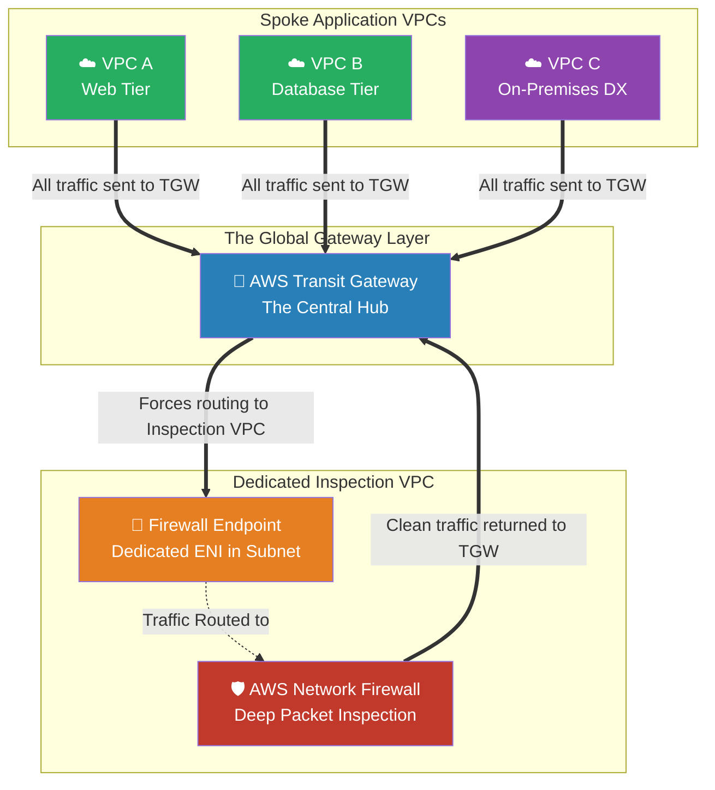

# 🚀 AWS Interview Cheat Sheet: NETWORK FIREWALL (Q223–Q232)

*This master reference sheet covers the AWS Network Firewall—a state-of-the-art, managed, stateful intrusion prevention system (IPS) and deep packet inspection (DPI) engine that operates far beyond the mathematical limitations of standard Security Groups.*

---

## 📊 The Master Network Firewall (Centralized Inspection) Architecture

---

## 2️⃣2️⃣3️⃣ Q223: What is Network Firewall in AWS?
- **Short Answer:** AWS Network Firewall is a fully managed, stateful, Layer 3 to Layer 7 next-generation firewall and intrusion prevention system (IPS) specifically engineered for your VPCs. It dynamically inspects traffic matching complex rule signatures (like the Suricata IPS rule engine) to actively detect and drop malicious exploits in real-time before they reach your servers.
- **Production Scenario:** A company deploys AWS Network Firewall at the very edge of their VPC. When an external bad actor attempts to exploit an 'Apache Log4j' vulnerability, the Network Firewall's Suricata IPS engine recognizes the malicious payload signature in the HTTP header and drops the packet.
- **Interview Edge:** *"Security Groups evaluate 'Where' the packet comes from. AWS Network Firewall evaluates 'What' is actually inside the packet deeply using Suricata-compatible Intrusion Prevention algorithms."*

## 2️⃣2️⃣4️⃣ Q224: How can you use Network Firewall in AWS?
- **Short Answer:** You deploy a **Firewall Endpoint** into a dedicated sub-network within your VPC. You then explicitly manipulate your VPC Route Tables so that all traffic entering the Internet Gateway (IGW) or Transit Gateway traverses *into* the Firewall Endpoint first, gets scrubbed clean, and then continues to the intended EC2 destination.
- **Production Scenario:** An Architect alters the VPC Ingress Route Table so that traffic coming from the internet doesn't go straight to the Web Subnet. Instead, the route structurally forces traffic to the `vpce-firewall` Interface.
- **Interview Edge:** *"A Network Firewall does not attach directly to instances like a Security Group. It acts as a physical 'bump in the wire'. You fundamentally must commandeer VPC routing tables to force data packets through it."*

## 2️⃣2️⃣5️⃣ Q225: What is a Firewall Policy in Network Firewall?
- **Short Answer:** The Firewall Policy is the master configuration object containing all the actual intelligence. It combines **Stateless Rule Groups** (for dropping obvious bad IPs instantly without computational overhead) and **Stateful Rule Groups** (for Deep Packet Inspection, domain filtering, and Suricata IPS signatures). 
- **Production Scenario:** A SecOps engineer creates a Firewall Policy that first applies a stateless rule dropping all traffic from known botnet IPs (fastest execution), followed by a stateful rule inspecting all remaining HTTP traffic for SQL Injection signatures.
- **Interview Edge:** *"The policy intrinsically executes stateless rules before stateful rules. Because stateful deep-packet inspection is highly computationally expensive, a Senior Architect aggressively leverages stateless drops first to preserve raw firewall throughput."*

## 2️⃣2️⃣6️⃣ Q226: Can you use Network Firewall to block traffic from specific IP addresses?
- **Short Answer:** Yes. You inject standard 5-tuple rules (Source IP, Source Port, Destination IP, Destination Port, Protocol) directly into the Firewall Policy to ruthlessly drop traffic from explicit Source IPs at the network border.

## 2️⃣2️⃣7️⃣ Q227: Can you use Network Firewall to block traffic to specific IP addresses?
- **Short Answer:** Yes. By filtering targeting the Destination IP address tuple in outbound evaluation rules, ensuring servers mathematically cannot connect to blacklisted remote addresses.

## 2️⃣2️⃣8️⃣ Q228: Can you use Network Firewall to block traffic to specific ports?
- **Short Answer:** Yes. You can granularly restrict traffic to non-standard TCP/UDP ports structurally enforcing strict port hygiene (e.g., dropping all outbound Port 22 SSH traffic regardless of destination).

## 2️⃣2️⃣9️⃣ Q229: Can you use Network Firewall to block traffic between VPCs?
- **Short Answer:** Yes. When paired with an AWS Transit Gateway, the Network Firewall acts as the central inspection checkpoint. If VPC 'A' tries to speak to VPC 'B', the Transit Gateway routes the traffic directly into the Inspection VPC where the Network Firewall explicitly permits or denies the cross-VPC communication.
- **Production Scenario:** An Enterprise uses a "Centralized Inspection Architecture". No Spoke VPC can talk natively to another Spoke VPC. Every lateral API call is forced up through the Transit Gateway, scrubbed by the Network Firewall, and then pushed back down.
- **Interview Edge:** *"This is the ultimate 'Zero Trust' network architecture. By forcing east-west inter-VPC traffic through a central Network Firewall, a breached frontend VPC is physically prevented from infecting the backend database VPCs."*

## 2️⃣3️⃣0️⃣ Q230: How can you monitor the traffic blocked by Network Firewall?
- **Short Answer:** AWS Network Firewall seamlessly emits dual-stream logging: **Alert Logs** (which specifically record packets that triggered a Drop/Block rule action) and **Flow Logs** (which record every single connection handled). These pipe directly into CloudWatch, S3, or Amazon Kinesis.
- **Production Scenario:** Streaming Network Firewall Alert JSON logs to a centralized SecOps S3 bucket so the SIEM (Security Information and Event Management) platform can automatically generate compliance reports on active intrusion attempts.

## 2️⃣3️⃣1️⃣ Q231: Can you use Network Firewall to protect on-premises networks?
- **Short Answer:** Yes. By terminating your AWS Direct Connect or Site-to-Site VPN physically onto an AWS Transit Gateway, you can mandate that all traffic bleeding from the corporate on-premises data center must be routed directly into the AWS Network Firewall before it is allowed to touch a single AWS Cloud resource.
- **Production Scenario:** A hospital has an insecure legacy, on-premises data center. The Cloud Architect cannot trust the traffic coming over the Direct Connect fiber. They deploy an AWS Network Firewall to aggressively sanitize all inbound physical traffic before it hits the Cloud EMR databases.
- **Interview Edge:** *"AWS Network Firewall effectively replaces millions of dollars of legacy physical Cisco/Palo Alto firewall hardware appliances by executing Deep Packet Inspection natively at the AWS network edge."*

## 2️⃣3️⃣2️⃣ Q232: Can you use Network Firewall to protect traffic between AWS accounts?
- **Short Answer:** Yes. Because Network Firewall integrates completely via AWS Transit Gateway (which organically glues thousands of independent AWS accounts together via TGW Attachments), the centralized firewall inspects TCP behavior without caring what AWS Account ID the sender or receiver belongs to.
- **Production Scenario:** A Developer Account (`Account A`) tries to query a Production Account (`Account B`). The Transit Gateway intercepts the packet, routes it to the SecOps Account (`Account C`) where the AWS Network Firewall is hosted, scrubs it, and determines if the inter-account behavior is allowed.
- **Interview Edge:** *"Using AWS Network Firewall combined with AWS RAM (Resource Access Manager) and Transit Gateway establishes the legendary 'Inspection VPC' pattern, fundamentally separating the Cloud Compute boundary from the Cloud Security boundary."*
